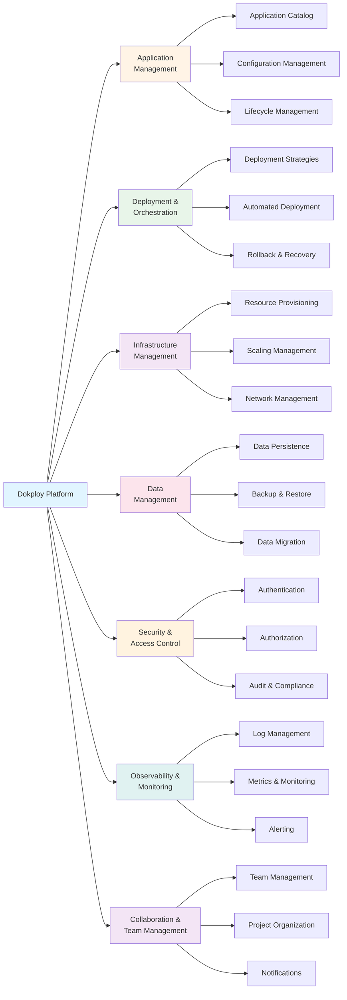
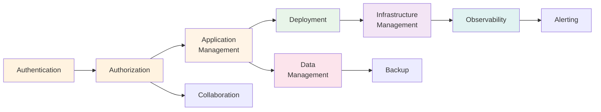

# Business Capability Model

**Document Type**: Business Architecture  
**Status**: Draft  
**Version**: 1.0  
**Last Updated**: 2024-12-30  
**Owner**: Architecture Team  

---

## Purpose

This document defines the business capabilities that Dokploy provides to its users. A business capability represents what the platform must be able to do to deliver value, independent of how it's implemented. This model helps align technical architecture with business outcomes.

---

## Capability Hierarchy

---

## Level 1: Core Capabilities

### 1. Application Management
**Definition**: Ability to define, configure, and manage application deployments throughout their lifecycle.

**Business Value**: 
- Centralized application portfolio management
- Consistent configuration across environments
- Reduced deployment errors

**Key Outcomes**:
- Create and catalog applications
- Configure application settings
- Manage application lifecycle (create, update, delete, pause)

### 2. Deployment & Orchestration
**Definition**: Automated deployment of applications with various strategies and orchestration patterns.

**Business Value**:
- Faster time to market
- Zero-downtime deployments
- Automated rollback on failure

**Key Outcomes**:
- Deploy applications from Git or Docker images
- Execute rolling updates
- Rollback to previous versions

### 3. Infrastructure Management
**Definition**: Management of underlying compute, network, and storage resources.

**Business Value**:
- Efficient resource utilization
- Cost optimization
- Scalability on demand

**Key Outcomes**:
- Provision containers and services
- Scale horizontally and vertically
- Manage networking and load balancing

### 4. Data Management
**Definition**: Persistent data storage, backup, and migration capabilities.

**Business Value**:
- Data durability and availability
- Disaster recovery readiness
- Data portability

**Key Outcomes**:
- Provision databases (PostgreSQL, MySQL, MongoDB, Redis)
- Automated backups
- Data migration and seeding

### 5. Security & Access Control
**Definition**: Authentication, authorization, and compliance capabilities.

**Business Value**:
- Protect sensitive resources
- Meet compliance requirements
- Audit trail for accountability

**Key Outcomes**:
- Authenticate users (local, OIDC)
- Enforce role-based access control
- Audit all actions

### 6. Observability & Monitoring
**Definition**: Visibility into system and application behavior through logs, metrics, and traces.

**Business Value**:
- Faster troubleshooting
- Proactive issue detection
- Performance optimization insights

**Key Outcomes**:
- Stream real-time logs
- Collect and visualize metrics
- Alert on anomalies

### 7. Collaboration & Team Management
**Definition**: Tools for teams to work together on projects and applications.

**Business Value**:
- Improved team productivity
- Clear ownership and responsibility
- Streamlined workflows

**Key Outcomes**:
- Organize applications into projects
- Manage team members and roles
- Notify team of events

---

## Level 2: Sub-Capabilities

### 1.1 Application Catalog
**Description**: Repository of all applications managed by the platform.

**Functions**:
- List all applications
- Search and filter applications
- View application details
- Tag and categorize applications

**Supporting Components**:
- Next.js UI: Application list view
- PostgreSQL: Applications table
- API: GET /api/applications

**Maturity**: Core (v1.0)

---

### 1.2 Configuration Management
**Description**: Manage application settings, environment variables, and secrets.

**Functions**:
- Set environment variables
- Manage secrets (API keys, passwords)
- Configure resource limits (CPU, memory)
- Set health check parameters
- Configure networking (ports, domains)

**Supporting Components**:
- Next.js UI: Configuration forms
- PostgreSQL: Config storage
- Docker Swarm: Secrets management
- API: PUT /api/applications/{id}/config

**Maturity**: Core (v1.0)

---

### 1.3 Lifecycle Management
**Description**: Control application state and lifecycle transitions.

**Functions**:
- Create new applications
- Start/stop applications
- Restart applications
- Delete applications
- Clone applications

**Supporting Components**:
- Next.js API: Lifecycle controllers
- Docker Swarm: Service management
- PostgreSQL: State tracking
- API: POST/DELETE /api/applications/{id}/lifecycle

**Maturity**: Core (v1.0)

---

### 2.1 Deployment Strategies
**Description**: Various methods for deploying application updates.

**Functions**:
- **Rolling Update**: Update replicas one at a time
- **Blue-Green**: Switch traffic between two versions
- **Canary**: Gradual traffic shift to new version
- **Recreate**: Stop old, start new (downtime)

**Supporting Components**:
- Docker Swarm: Update strategies
- Traefik: Traffic routing
- Next.js API: Deployment orchestration

**Maturity**: 
- Rolling Update: Core (v1.0)
- Blue-Green: Enhanced (v2.0)
- Canary: Enhanced (v2.0)
- Recreate: Core (v1.0)

---

### 2.2 Automated Deployment
**Description**: Trigger deployments automatically from various sources.

**Functions**:
- Git webhook integration (GitHub, GitLab, Bitbucket)
- Container registry webhooks (Docker Hub)
- CI/CD pipeline integration
- Scheduled deployments (cron)
- Manual trigger

**Supporting Components**:
- Next.js API: Webhook receivers
- Background workers: Build jobs
- PostgreSQL: Deployment queue
- API: POST /api/applications/{id}/deploy

**Maturity**:
- Git webhooks: Core (v1.0)
- Manual trigger: Core (v1.0)
- CI/CD integration: Enhanced (v1.5)
- Scheduled: Enhanced (v2.0)

---

### 2.3 Rollback & Recovery
**Description**: Revert to previous working version on failure.

**Functions**:
- Automatic rollback on health check failure
- Manual rollback to specific version
- View deployment history
- Compare versions

**Supporting Components**:
- Docker Swarm: Service update rollback
- PostgreSQL: Deployment history
- Next.js UI: Rollback controls
- API: POST /api/applications/{id}/rollback

**Maturity**: Core (v1.0)

---

### 3.1 Resource Provisioning
**Description**: Provision compute resources for applications.

**Functions**:
- Create Docker services
- Set resource reservations (guaranteed resources)
- Set resource limits (maximum resources)
- Assign to specific nodes (placement constraints)

**Supporting Components**:
- Docker Swarm: Service creation
- Next.js API: Provisioning logic
- API: POST /api/applications

**Maturity**: Core (v1.0)

---

### 3.2 Scaling Management
**Description**: Scale applications horizontally (replicas) or vertically (resources).

**Functions**:
- Manual scaling (set replica count)
- Auto-scaling based on metrics (CPU, memory)
- Scale to zero (pause)
- Load balancing across replicas

**Supporting Components**:
- Docker Swarm: Replica management
- Traefik: Load balancing
- Metrics collector: Auto-scaling triggers
- API: POST /api/applications/{id}/scale

**Maturity**:
- Manual scaling: Core (v1.0)
- Auto-scaling: Enhanced (v2.0)

---

### 3.3 Network Management
**Description**: Configure networking, domains, and load balancing.

**Functions**:
- Assign custom domains
- Configure TLS/SSL certificates (Let's Encrypt)
- Set up load balancing
- Manage overlay networks
- Configure port mappings

**Supporting Components**:
- Traefik: Reverse proxy, TLS termination
- Docker Swarm: Overlay networks
- Let's Encrypt: Certificate automation
- API: POST /api/domains

**Maturity**: Core (v1.0)

---

### 4.1 Data Persistence
**Description**: Provision and manage databases and persistent storage.

**Functions**:
- Deploy PostgreSQL databases
- Deploy MySQL databases
- Deploy MongoDB databases
- Deploy Redis instances
- Manage Docker volumes
- Configure connection strings

**Supporting Components**:
- Docker Swarm: Stateful services
- Docker Volumes: Persistent storage
- Next.js API: Database provisioning
- API: POST /api/databases

**Maturity**: Core (v1.0)

---

### 4.2 Backup & Restore
**Description**: Automated backup and recovery of data.

**Functions**:
- Schedule automated backups (daily, weekly)
- Manual on-demand backups
- Restore from backup point
- Export/import data
- Backup to S3-compatible storage

**Supporting Components**:
- Cron jobs: Scheduled backups
- PostgreSQL: pg_dump utility
- S3 client: Remote storage
- API: POST /api/databases/{id}/backup

**Maturity**:
- Manual backup: Core (v1.0)
- Scheduled backup: Enhanced (v1.5)
- S3 integration: Enhanced (v1.5)

---

### 4.3 Data Migration
**Description**: Migrate data between environments or platforms.

**Functions**:
- Import data from external sources
- Export data for migration
- Run database migrations (schema changes)
- Seed initial data

**Supporting Components**:
- Migration scripts
- Next.js API: Migration controllers
- API: POST /api/databases/{id}/migrate

**Maturity**: Enhanced (v1.5)

---

### 5.1 Authentication
**Description**: Verify user identity through various methods.

**Functions**:
- Local username/password authentication
- OIDC/OAuth2 integration (Google, GitHub, Keycloak)
- Multi-factor authentication (future)
- Session management
- Password reset

**Supporting Components**:
- Next.js: NextAuth.js
- PostgreSQL: User credentials
- OIDC Provider: External identity
- API: POST /api/auth/login

**Maturity**:
- Local auth: Core (v1.0)
- OIDC: Core (v1.0)
- MFA: Future (v3.0)

---

### 5.2 Authorization
**Description**: Control access to resources based on roles and permissions.

**Functions**:
- Role-Based Access Control (RBAC)
- Project-level permissions
- Resource-level permissions
- Team membership management
- Permission inheritance

**Supporting Components**:
- PostgreSQL: Roles and permissions tables
- Next.js API: Authorization middleware
- Row-Level Security: Database policies

**Maturity**: Core (v1.0)

---

### 5.3 Audit & Compliance
**Description**: Track and log all actions for security and compliance.

**Functions**:
- Log all user actions
- Log all system events
- Query audit logs
- Export audit reports
- Alert on suspicious activity

**Supporting Components**:
- PostgreSQL: Audit logs table
- Next.js API: Audit logging
- Full-text search: Log queries
- API: GET /api/audit-logs

**Maturity**: Core (v1.0)

---

### 6.1 Log Management
**Description**: Collect, store, and query application and system logs.

**Functions**:
- Stream real-time logs (WebSocket)
- Search logs (full-text search)
- Filter logs by time, level, service
- Download logs
- Set log retention policies

**Supporting Components**:
- Docker: Container log driver
- PostgreSQL: Log storage (optional)
- Next.js API: Log streaming
- WebSocket: Real-time updates
- API: GET /api/applications/{id}/logs

**Maturity**: Core (v1.0)

---

### 6.2 Metrics & Monitoring
**Description**: Collect and visualize system and application metrics.

**Functions**:
- Collect resource metrics (CPU, memory, disk, network)
- Collect application metrics (requests, errors, latency)
- Display dashboards (Grafana integration)
- Historical metrics (time-series database)
- Custom metrics

**Supporting Components**:
- Prometheus: Metrics collection
- Grafana: Visualization
- Node exporter: System metrics
- Application: /metrics endpoint
- API: GET /api/metrics

**Maturity**:
- Basic metrics: Core (v1.0)
- Grafana integration: Enhanced (v1.5)
- Custom metrics: Enhanced (v2.0)

---

### 6.3 Alerting
**Description**: Notify users of issues and anomalies.

**Functions**:
- Define alert rules (threshold-based)
- Multi-channel notifications (email, Slack, webhook)
- Alert history
- Alert acknowledgment
- On-call scheduling

**Supporting Components**:
- Prometheus: Alert rules
- Alertmanager: Alert routing
- SMTP: Email notifications
- Webhook: Custom integrations
- API: POST /api/alerts

**Maturity**:
- Basic alerts: Enhanced (v1.5)
- Multi-channel: Enhanced (v2.0)
- On-call: Future (v3.0)

---

### 7.1 Team Management
**Description**: Organize users into teams with shared access.

**Functions**:
- Create teams
- Add/remove team members
- Assign team roles
- Team-level permissions

**Supporting Components**:
- PostgreSQL: Teams and members tables
- Next.js UI: Team management
- API: POST /api/teams

**Maturity**: Core (v1.0)

---

### 7.2 Project Organization
**Description**: Group related applications into projects.

**Functions**:
- Create projects
- Assign applications to projects
- Project-level settings
- Project templates

**Supporting Components**:
- PostgreSQL: Projects table
- Next.js UI: Project views
- API: POST /api/projects

**Maturity**: Core (v1.0)

---

### 7.3 Notifications
**Description**: Keep team members informed of events and changes.

**Functions**:
- Deployment notifications
- Alert notifications
- Activity feed
- In-app notifications
- Email notifications
- Webhook notifications

**Supporting Components**:
- WebSocket: Real-time updates
- SMTP: Email delivery
- PostgreSQL: Notification queue
- API: GET /api/notifications

**Maturity**:
- In-app: Core (v1.0)
- Email: Enhanced (v1.5)
- Webhook: Enhanced (v1.5)

---

## Capability Maturity Model

### Maturity Levels

| Level | Description | Characteristics |
|-------|-------------|-----------------|
| **Core** | Essential, must-have | Launch blocker, v1.0 requirement |
| **Enhanced** | Important, high value | Post-launch, v1.5-2.0 |
| **Advanced** | Nice-to-have, power users | v2.0+ |
| **Future** | Planned, not committed | v3.0+, roadmap item |

### Capability Maturity Matrix

| Capability | Core | Enhanced | Advanced | Future |
|------------|------|----------|----------|--------|
| **Application Management** | Catalog, Config, Lifecycle | Templates, Cloning | Multi-region | - |
| **Deployment** | Rolling, Manual | Git webhooks, CI/CD | Blue-Green, Canary | Progressive delivery |
| **Infrastructure** | Provisioning, Scaling | Auto-scaling | Multi-cloud | Edge deployment |
| **Data Management** | Provisioning, Basic backup | Scheduled backup, S3 | Point-in-time recovery | Multi-region replication |
| **Security** | Local auth, OIDC, RBAC | Audit reports | SSO (SAML, LDAP) | MFA, Certificate management |
| **Observability** | Logs, Basic metrics | Grafana, Alerting | Distributed tracing | APM integration |
| **Collaboration** | Teams, Projects | Activity feed, Notifications | Real-time collab | Video chat, AI assist |

---

## Capability Dependencies

**Key Dependencies**:
- Authentication must exist before authorization
- Authorization required for all resource management
- Application management depends on authorization
- Deployment depends on application definitions
- Infrastructure provisioning required for deployment
- Data management parallel to application management
- Observability can be added incrementally

---

## Capability Roadmap

### Phase 1: Core Platform (v1.0) - Q1 2025
**Focus**: Essential capabilities for basic PaaS functionality

**Capabilities**:
- ✅ Application catalog and lifecycle
- ✅ Basic configuration management
- ✅ Manual deployment (Docker, Git)
- ✅ Rolling updates
- ✅ Resource provisioning
- ✅ Manual scaling
- ✅ Network management (domains, TLS)
- ✅ Database provisioning (PostgreSQL, Redis)
- ✅ Local authentication
- ✅ OIDC integration
- ✅ RBAC
- ✅ Basic audit logging
- ✅ Log streaming
- ✅ Basic metrics
- ✅ Team and project management

### Phase 2: Enhanced Operations (v1.5) - Q2 2025
**Focus**: Automation and improved observability

**Capabilities**:
- Git webhook automation
- CI/CD integration
- Scheduled backups
- S3 backup storage
- Grafana integration
- Alerting (email, Slack)
- Activity feed
- Email notifications
- Data migration tools

### Phase 3: Advanced Features (v2.0) - Q3 2025
**Focus**: Advanced deployment and scaling

**Capabilities**:
- Auto-scaling
- Blue-green deployment
- Canary deployment
- Point-in-time recovery
- Custom metrics
- Distributed tracing
- Multi-channel alerting
- Real-time collaboration

### Phase 4: Enterprise (v3.0) - Q4 2025+
**Focus**: Enterprise-grade features

**Capabilities**:
- Multi-factor authentication
- SSO (SAML, LDAP)
- Certificate management
- Progressive delivery
- Multi-region support
- On-call scheduling
- APM integration
- AI-powered insights

---

## Business Capability to Component Mapping

| Capability | Primary Components | Supporting Components |
|------------|-------------------|----------------------|
| Application Catalog | Next.js UI, PostgreSQL | Search API, Tagging |
| Configuration Management | Next.js API, Docker Secrets | PostgreSQL, Validation |
| Deployment | Next.js API, Docker Swarm | Git, Docker Registry |
| Resource Provisioning | Docker Swarm | Next.js API, PostgreSQL |
| Scaling | Docker Swarm, Traefik | Metrics collector |
| Network Management | Traefik, Let's Encrypt | Docker overlay networks |
| Database Provisioning | Docker Swarm | PostgreSQL, Redis images |
| Backup & Restore | Cron, pg_dump | S3 client, PostgreSQL |
| Authentication | NextAuth.js | PostgreSQL, OIDC Provider |
| Authorization | Next.js middleware | PostgreSQL RLS |
| Audit Logging | PostgreSQL | Full-text search |
| Log Management | Docker logs | WebSocket, PostgreSQL |
| Metrics | Prometheus | Grafana, Exporters |
| Alerting | Alertmanager | SMTP, Webhooks |
| Team Management | Next.js UI, PostgreSQL | RBAC engine |

---

## Success Metrics by Capability

### Application Management
- **Metric**: Applications managed per user
- **Target**: 10+ per user (average)
- **Measurement**: PostgreSQL query

### Deployment
- **Metric**: Deployment success rate
- **Target**: >95%
- **Measurement**: Deployment logs

### Infrastructure
- **Metric**: Resource utilization
- **Target**: 70-85% (optimal range)
- **Measurement**: Prometheus metrics

### Security
- **Metric**: Authentication success rate
- **Target**: >99%
- **Measurement**: Auth logs

### Observability
- **Metric**: Mean time to detection (MTTD)
- **Target**: <5 minutes
- **Measurement**: Alert timestamp vs. issue timestamp

### Collaboration
- **Metric**: Team adoption rate
- **Target**: 80% of users in teams
- **Measurement**: User/team membership ratio

---

## Related Documents

- **Architecture Vision**: Overall goals and principles
- **Stakeholder Analysis**: Stakeholder needs mapped to capabilities
- **Value Stream Mapping**: Capabilities in action
- **PRD**: Detailed requirements for each capability
- **Component Diagram**: Technical implementation of capabilities

---

**Document Version**: 1.0  
**Last Updated**: 2024-12-30  
**Next Review**: 2025-03-30  
**Reviewed By**: Architecture Team, Product Team
