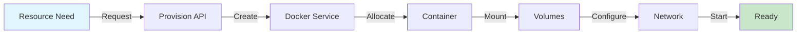
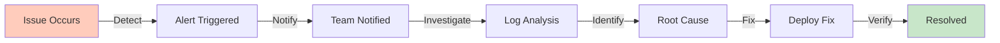
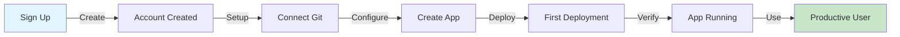
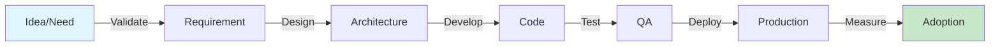

```mermaid
graph LR
    A[Code Change] -->|Push| B[Git Repository]
    B -->|Webhook| C[Dokploy Receives Event]
    C -->|Queue| D[Build Process]
    D -->|Image| E[Container Registry]
    E -->|Pull| F[Docker Swarm]
    F -->|Deploy| G[Running Container]
    G -->|Health Check| H[Traffic Routing]
    H -->|Live| I[Users Access App]
    
    style A fill:#e1f5ff
    style I fill:#c8e6c9
```

# Value Stream Mapping

**Document Type**: Business Architecture  
**Status**: Draft  
**Version**: 1.0  
**Last Updated**: 2024-12-30  
**Owner**: Architecture Team  

---

## Purpose

This document maps the end-to-end value streams that flow through Dokploy, from user need to delivered value. Value stream mapping helps identify bottlenecks, waste, and optimization opportunities in how the platform delivers value to stakeholders.

---

## Value Stream Overview

Dokploy delivers value through five primary value streams:

1. **Application Deployment**: From code to running application
2. **Infrastructure Provisioning**: From resource need to available capacity
3. **Incident Response**: From problem detection to resolution
4. **User Onboarding**: From new user to productive user
5. **Feature Development**: From idea to deployed feature

---

## Value Stream 1: Application Deployment

### Overview
**Trigger**: Developer has new code to deploy  
**Outcome**: Application running in production, accessible to users  
**Frequency**: 10-100+ times per day per team  
**Critical Success Factor**: Speed and reliability  

### Current State Map



### Detailed Steps

#### Step 1: Code Commit
- **Actor**: Developer
- **Actions**: 
  - Write code
  - Run local tests
  - Commit to Git
  - Push to repository
- **Duration**: 5-60 minutes (variable)
- **Value-Add**: Yes (creating feature/fix)
- **Wait Time**: 0

#### Step 2: Git Webhook Trigger
- **Actor**: Git provider (GitHub, GitLab)
- **Actions**:
  - Detect push event
  - Call Dokploy webhook endpoint
- **Duration**: 1-5 seconds
- **Value-Add**: No (waiting)
- **Wait Time**: 1-5 seconds
- **Automation**: Fully automated

#### Step 3: Webhook Receipt & Validation
- **Actor**: Dokploy API
- **Actions**:
  - Verify webhook signature
  - Parse payload
  - Identify target application
  - Queue deployment job
- **Duration**: 100-500ms
- **Value-Add**: Yes (security, routing)
- **Wait Time**: 0
- **Automation**: Fully automated

#### Step 4: Build Queuing
- **Actor**: Deployment queue
- **Actions**:
  - Add job to queue
  - Wait for worker availability
- **Duration**: 0-60 seconds (depends on queue depth)
- **Value-Add**: No (waiting)
- **Wait Time**: 0-60 seconds
- **Bottleneck**: High load periods

#### Step 5: Image Build
- **Actor**: Build worker
- **Actions**:
  - Clone repository
  - Detect build context (Dockerfile, Buildpack)
  - Build Docker image
  - Tag image
  - Push to registry
- **Duration**: 30 seconds - 10 minutes
- **Value-Add**: Yes (creating deployable artifact)
- **Wait Time**: 0
- **Automation**: Fully automated
- **Bottleneck**: Large dependencies, slow network

#### Step 6: Registry Push
- **Actor**: Docker Registry
- **Actions**:
  - Receive image layers
  - Store image
  - Confirm receipt
- **Duration**: 5-60 seconds
- **Value-Add**: No (storage)
- **Wait Time**: 0
- **Automation**: Fully automated

#### Step 7: Service Update
- **Actor**: Docker Swarm
- **Actions**:
  - Pull new image
  - Create new container
  - Start container
  - Wait for health check
  - Stop old container (rolling)
- **Duration**: 10-120 seconds
- **Value-Add**: Yes (deploying)
- **Wait Time**: Health check period (10-30s)
- **Automation**: Fully automated

#### Step 8: Traffic Routing
- **Actor**: Traefik
- **Actions**:
  - Detect new container
  - Update routing rules
  - Start routing traffic
- **Duration**: 1-5 seconds
- **Value-Add**: Yes (making available)
- **Wait Time**: 0
- **Automation**: Fully automated

#### Step 9: Verification
- **Actor**: Developer
- **Actions**:
  - Check deployment status
  - Verify application works
  - Monitor for errors
- **Duration**: 1-10 minutes
- **Value-Add**: Yes (quality assurance)
- **Wait Time**: 0

### Metrics

| Metric | Target | Current | Gap |
|--------|--------|---------|-----|
| **Lead Time** (commit to live) | <5 minutes | 2-15 minutes | Optimize build |
| **Process Time** (actual work) | ~2 minutes | ~2 minutes | ✅ |
| **Wait Time** (queuing, health checks) | <30 seconds | 0-90 seconds | Reduce queue |
| **Deployment Success Rate** | >95% | ~92% | Improve health checks |
| **Rollback Time** | <2 minutes | 1-3 minutes | ✅ |

### Value Stream Efficiency

```
Process Efficiency = Process Time / Lead Time
= 2 minutes / 8 minutes (average)
= 25%

Target: 40%+
```

### Waste Identification

**Type 1: Waiting**
- Queue wait time (0-60s)
- Health check wait (10-30s)
- **Improvement**: Increase worker pool, optimize health checks

**Type 2: Overprocessing**
- Rebuild unchanged dependencies every time
- **Improvement**: Layer caching, dependency caching

**Type 3: Defects**
- Failed deployments due to config errors
- **Improvement**: Pre-deployment validation, config templates

**Type 4: Transportation**
- Pushing large images to registry
- **Improvement**: Use smaller base images, multi-stage builds

### Improvement Opportunities

#### Quick Wins (Implement in v1.5)
1. **Build caching**: 40% faster builds
2. **Parallel builds**: Handle multiple simultaneous deployments
3. **Smarter health checks**: Reduce wait time by 50%
4. **Pre-flight validation**: Catch errors before deployment

#### Medium Term (v2.0)
1. **Predictive scaling**: Pre-scale before traffic spikes
2. **Progressive delivery**: Canary deployments for safer updates
3. **Build analytics**: Identify slow build steps

#### Long Term (v3.0)
1. **Edge deployment**: Deploy closer to users
2. **Smart caching**: AI-powered cache optimization

---

## Value Stream 2: Infrastructure Provisioning

### Overview
**Trigger**: Need for new compute/storage capacity  
**Outcome**: Resources available and ready for workloads  
**Frequency**: 5-20 times per week per team  
**Critical Success Factor**: Speed and cost-efficiency  

### Current State Map



### Detailed Steps

#### Step 1: Identify Need
- **Actor**: Developer/Team Lead
- **Actions**: Determine resource requirements
- **Duration**: 5-30 minutes
- **Value-Add**: Yes (planning)

#### Step 2: Configure Resource
- **Actor**: Developer
- **Actions**:
  - Open Dokploy UI
  - Select resource type (database, application)
  - Configure settings (size, replicas, etc.)
  - Review estimated cost
- **Duration**: 2-10 minutes
- **Value-Add**: Yes (configuration)

#### Step 3: Submit Request
- **Actor**: Dokploy API
- **Actions**:
  - Validate configuration
  - Check quotas
  - Authorize request
- **Duration**: 100-500ms
- **Value-Add**: Yes (validation)

#### Step 4: Provision Service
- **Actor**: Docker Swarm
- **Actions**:
  - Pull image
  - Create service
  - Schedule containers
  - Allocate resources
- **Duration**: 10-60 seconds
- **Value-Add**: Yes (provisioning)

#### Step 5: Configure Networking
- **Actor**: Docker Swarm + Traefik
- **Actions**:
  - Assign IP address
  - Configure DNS
  - Set up load balancing
  - Configure TLS
- **Duration**: 5-20 seconds
- **Value-Add**: Yes (networking)

#### Step 6: Storage Setup
- **Actor**: Docker Volumes
- **Actions**:
  - Create volume
  - Mount to container
  - Set permissions
- **Duration**: 1-10 seconds
- **Value-Add**: Yes (persistence)

#### Step 7: Health Verification
- **Actor**: Dokploy
- **Actions**:
  - Run health checks
  - Verify connectivity
  - Test access
- **Duration**: 5-30 seconds
- **Value-Add**: Yes (verification)

#### Step 8: Notify & Document
- **Actor**: Dokploy
- **Actions**:
  - Send notification to requester
  - Update inventory
  - Generate connection info
- **Duration**: 1-5 seconds
- **Value-Add**: Yes (communication)

### Metrics

| Metric | Target | Current | Gap |
|--------|--------|---------|-----|
| **Time to Available** | <2 minutes | 1-3 minutes | ✅ |
| **Configuration Errors** | <5% | ~8% | Improve validation |
| **Resource Utilization** | 70-85% | ~65% | Better sizing |
| **Cost per Resource** | Minimize | Baseline | Optimize |

### Improvement Opportunities

1. **Resource templates**: Pre-configured common setups
2. **Smart sizing**: ML-based resource recommendations
3. **Cost analytics**: Real-time cost tracking
4. **Auto-cleanup**: Remove unused resources

---

## Value Stream 3: Incident Response

### Overview
**Trigger**: Application error or outage detected  
**Outcome**: Service restored, root cause identified  
**Frequency**: 1-10 times per week (varies)  
**Critical Success Factor**: Mean time to resolution (MTTR)  

### Current State Map



### Detailed Steps

#### Step 1: Issue Detection
- **Actor**: Monitoring system
- **Actions**:
  - Health check fails
  - Error rate spike detected
  - Resource exhaustion
- **Duration**: 30 seconds - 5 minutes (detection lag)
- **Value-Add**: Yes (detection)
- **Bottleneck**: Alert delay

#### Step 2: Alert Generation
- **Actor**: Alerting system
- **Actions**:
  - Evaluate alert rules
  - Determine severity
  - Route to appropriate channel
- **Duration**: 5-30 seconds
- **Value-Add**: Yes (notification)

#### Step 3: Team Notification
- **Actor**: Notification system
- **Actions**:
  - Send email/Slack/webhook
  - Page on-call (critical issues)
- **Duration**: 1-5 minutes (includes human response time)
- **Value-Add**: No (waiting for human)
- **Bottleneck**: Human availability

#### Step 4: Initial Triage
- **Actor**: On-call engineer
- **Actions**:
  - Acknowledge alert
  - Assess severity
  - Determine if escalation needed
- **Duration**: 2-10 minutes
- **Value-Add**: Yes (assessment)

#### Step 5: Investigation
- **Actor**: Engineer
- **Actions**:
  - Review logs (Dokploy log viewer)
  - Check metrics (Grafana dashboards)
  - Review recent changes (deployment history)
  - Check resource utilization
- **Duration**: 5-30 minutes
- **Value-Add**: Yes (diagnosis)
- **Bottleneck**: Log accessibility, tool switching

#### Step 6: Root Cause Identification
- **Actor**: Engineer
- **Actions**:
  - Correlate symptoms
  - Identify root cause
  - Determine fix strategy
- **Duration**: 5-60 minutes (highly variable)
- **Value-Add**: Yes (diagnosis)

#### Step 7: Remediation
- **Actor**: Engineer
- **Actions**:
  - **Immediate**: Rollback, restart, scale up
  - **Short-term**: Config change, hotfix deployment
  - **Long-term**: Code fix, architecture change
- **Duration**: 1-30 minutes (immediate), hours-days (long-term)
- **Value-Add**: Yes (resolution)

#### Step 8: Verification
- **Actor**: Engineer
- **Actions**:
  - Verify metrics recovered
  - Check error rates
  - Confirm user impact resolved
- **Duration**: 5-15 minutes
- **Value-Add**: Yes (verification)

#### Step 9: Post-Mortem
- **Actor**: Team
- **Actions**:
  - Document incident
  - Identify prevention measures
  - Create follow-up tasks
- **Duration**: 30-60 minutes
- **Value-Add**: Yes (learning)

### Metrics

| Metric | Target | Current | Gap |
|--------|--------|---------|-----|
| **MTTD** (Mean Time to Detect) | <2 minutes | 1-5 minutes | Improve monitoring |
| **MTTR** (Mean Time to Resolve) | <30 minutes | 15-120 minutes | Varies widely |
| **False Positive Rate** | <10% | ~20% | Tune alerts |
| **Repeat Incidents** | <5% | ~12% | Better root cause analysis |

### Improvement Opportunities

#### v1.5 (Quick Wins)
1. **One-click rollback**: Reduce resolution time by 50%
2. **Integrated log viewer**: Eliminate tool switching
3. **Smart alerts**: Reduce false positives
4. **Runbooks**: Guided troubleshooting

#### v2.0 (Medium Term)
1. **AIOps**: Anomaly detection, predictive alerts
2. **Auto-remediation**: Automatic scaling, restarts
3. **Correlation engine**: Link related events
4. **Incident timeline**: Automatic chronology

#### v3.0 (Long Term)
1. **Self-healing**: Automatic issue resolution
2. **Chaos engineering**: Proactive resilience testing
3. **AI assistant**: Guided troubleshooting

---

## Value Stream 4: User Onboarding

### Overview
**Trigger**: New user signs up  
**Outcome**: User successfully deploys first application  
**Frequency**: Varies by growth (100s-1000s per month at scale)  
**Critical Success Factor**: Time to first value  

### Current State Map



### Detailed Steps

#### Step 1: Discovery & Sign Up
- **Actor**: Potential user
- **Actions**:
  - Find Dokploy (search, referral, etc.)
  - Visit website
  - Read documentation
  - Decide to try
  - Sign up (email, OAuth)
- **Duration**: 5-60 minutes
- **Value-Add**: Yes (discovery)
- **Bottleneck**: Documentation clarity

#### Step 2: Initial Setup
- **Actor**: New user
- **Actions**:
  - Complete registration
  - Verify email
  - Set password
  - Configure profile
- **Duration**: 2-5 minutes
- **Value-Add**: No (necessary friction)

#### Step 3: Environment Setup
- **Actor**: User
- **Actions**:
  - Install Dokploy (if self-hosted)
  - Or provision server
  - Configure DNS
  - Set up TLS
- **Duration**: 10-60 minutes
- **Value-Add**: Yes (preparation)
- **Bottleneck**: Technical complexity

#### Step 4: First Project Creation
- **Actor**: User
- **Actions**:
  - Create project
  - Invite team members (optional)
  - Set project settings
- **Duration**: 2-5 minutes
- **Value-Add**: Yes (organization)

#### Step 5: Connect Git Repository
- **Actor**: User
- **Actions**:
  - Authenticate with Git provider
  - Select repository
  - Configure webhook
- **Duration**: 3-10 minutes
- **Value-Add**: Yes (integration)
- **Bottleneck**: OAuth complexity

#### Step 6: Application Configuration
- **Actor**: User
- **Actions**:
  - Detect build settings (auto or manual)
  - Configure environment variables
  - Set resource limits
  - Configure domain
- **Duration**: 5-20 minutes
- **Value-Add**: Yes (configuration)
- **Bottleneck**: Too many options, unclear defaults

#### Step 7: First Deployment
- **Actor**: User + Dokploy
- **Actions**:
  - Trigger deployment
  - Watch build logs
  - Wait for completion
- **Duration**: 2-10 minutes
- **Value-Add**: Yes (deployment)
- **Bottleneck**: Build time, unclear errors

#### Step 8: Verification & Success
- **Actor**: User
- **Actions**:
  - Visit deployed application
  - Verify it works
  - Celebrate! 🎉
- **Duration**: 1-5 minutes
- **Value-Add**: Yes (verification)

#### Step 9: Explore & Learn
- **Actor**: User
- **Actions**:
  - Explore other features
  - Read advanced docs
  - Join community
- **Duration**: Ongoing
- **Value-Add**: Yes (education)

### Metrics

| Metric | Target | Current | Gap |
|--------|--------|---------|-----|
| **Time to First Deployment** | <30 minutes | 45-90 minutes | Simplify setup |
| **Setup Success Rate** | >80% | ~65% | Reduce friction |
| **Activation Rate** (deploy within 7 days) | >70% | ~55% | Improve onboarding |
| **Retention** (active after 30 days) | >60% | ~45% | Prove value faster |

### Improvement Opportunities

#### v1.0 (Launch)
1. **Quick start guide**: 5-minute deployment tutorial
2. **Sample applications**: Pre-configured examples
3. **One-click deploy**: Deploy from template
4. **Better error messages**: Help users fix issues

#### v1.5 (Enhanced)
1. **Interactive tutorial**: In-app guided setup
2. **Video walkthroughs**: Visual learning
3. **Auto-detection**: Detect framework, auto-configure
4. **Hosted demo**: Try without installing

#### v2.0 (Advanced)
1. **AI setup assistant**: Conversational setup
2. **Instant preview**: Deploy to preview environment
3. **Migration tools**: Import from Heroku, Vercel
4. **Onboarding analytics**: Identify drop-off points

---

## Value Stream 5: Feature Development

### Overview
**Trigger**: User need or strategic initiative  
**Outcome**: Feature deployed and adopted by users  
**Frequency**: Continuous (sprints)  
**Critical Success Factor**: Time to market, user adoption  

### Current State Map



### Detailed Steps

#### Step 1: Ideation & Validation
- **Actor**: Product team + users
- **Actions**:
  - Gather user feedback
  - Analyze usage data
  - Identify pain points
  - Prioritize features
- **Duration**: 1-7 days
- **Value-Add**: Yes (validation)

#### Step 2: Requirements Definition
- **Actor**: Product manager
- **Actions**:
  - Write user stories
  - Define acceptance criteria
  - Create mockups
  - Review with stakeholders
- **Duration**: 1-3 days
- **Value-Add**: Yes (definition)

#### Step 3: Architecture & Design
- **Actor**: Architects + engineers
- **Actions**:
  - Design solution
  - Create technical spec
  - Review alternatives
  - Get approval
- **Duration**: 1-5 days
- **Value-Add**: Yes (planning)

#### Step 4: Development
- **Actor**: Engineers
- **Actions**:
  - Write code
  - Local testing
  - Code review
  - Merge to main
- **Duration**: 2-10 days
- **Value-Add**: Yes (building)

#### Step 5: Testing
- **Actor**: QA + engineers
- **Actions**:
  - Unit tests
  - Integration tests
  - Manual testing
  - Security scanning
- **Duration**: 1-3 days
- **Value-Add**: Yes (quality)

#### Step 6: Documentation
- **Actor**: Technical writer + engineers
- **Actions**:
  - Update user docs
  - Create API docs
  - Write release notes
  - Update examples
- **Duration**: 1-2 days
- **Value-Add**: Yes (enablement)

#### Step 7: Release
- **Actor**: Release manager
- **Actions**:
  - Deploy to staging
  - Smoke testing
  - Deploy to production
  - Monitor for issues
- **Duration**: 2-4 hours
- **Value-Add**: Yes (delivery)

#### Step 8: Announcement
- **Actor**: Marketing + product
- **Actions**:
  - Write blog post
  - Social media announcement
  - Email newsletter
  - Update website
- **Duration**: 1-2 days
- **Value-Add**: Yes (awareness)

#### Step 9: Adoption & Feedback
- **Actor**: Users + team
- **Actions**:
  - Users try feature
  - Collect feedback
  - Monitor usage metrics
  - Iterate based on learnings
- **Duration**: Ongoing (2-4 weeks active monitoring)
- **Value-Add**: Yes (learning)

### Metrics

| Metric | Target | Current | Gap |
|--------|--------|---------|-----|
| **Lead Time** (idea to production) | <14 days | 14-30 days | Streamline process |
| **Cycle Time** (development to production) | <7 days | 5-14 days | ✅ |
| **Feature Adoption** (used within 30 days) | >40% | ~30% | Better communication |
| **User Satisfaction** | >4.5/5 | ~4.2/5 | Better quality |

### Improvement Opportunities

1. **Feature flags**: Gradual rollout, A/B testing
2. **Telemetry**: Automatic usage tracking
3. **In-app announcements**: Notify users of new features
4. **Feedback loops**: In-app feedback collection

---

## Cross-Stream Patterns

### Pattern 1: Automation
**Benefit**: Reduce manual steps, increase consistency  
**Implementation**: Webhooks, CI/CD, auto-scaling  
**Impact**: 50% reduction in manual tasks  

### Pattern 2: Observability
**Benefit**: Faster issue detection and resolution  
**Implementation**: Metrics, logs, traces, alerts  
**Impact**: 40% reduction in MTTR  

### Pattern 3: Self-Service
**Benefit**: Reduce bottlenecks, empower users  
**Implementation**: UI, API, documentation  
**Impact**: 10x increase in capacity  

### Pattern 4: Validation
**Benefit**: Catch errors early, reduce failures  
**Implementation**: Pre-flight checks, configuration validation  
**Impact**: 60% reduction in failed deployments  

---

## Value Stream Optimization Roadmap

### Phase 1: v1.0 (Foundation)
**Focus**: Core value streams functional
- ✅ Basic deployment pipeline
- ✅ Manual provisioning
- ✅ Basic monitoring
- ✅ Documentation

### Phase 2: v1.5 (Automation)
**Focus**: Reduce manual work
- Git webhooks
- Build caching
- Alert automation
- Quick-start templates

### Phase 3: v2.0 (Intelligence)
**Focus**: Smart optimization
- Auto-scaling
- Predictive alerts
- Smart caching
- AI-powered troubleshooting

### Phase 4: v3.0 (Self-Optimization)
**Focus**: Continuous improvement
- Self-healing systems
- Automatic optimization
- Proactive capacity management
- AI-driven onboarding

---

## Success Metrics Dashboard

### Overall Platform Health
- **Deployment Lead Time**: <5 minutes (avg)
- **Deployment Success Rate**: >95%
- **Platform Uptime**: >99.9%
- **MTTR**: <30 minutes

### User Experience
- **Time to First Deployment**: <30 minutes
- **User Activation Rate**: >70%
- **User Retention (30 days)**: >60%
- **NPS Score**: >40

### Efficiency
- **Process Efficiency**: >40%
- **Resource Utilization**: 70-85%
- **Cost per Deployment**: Minimize
- **Support Ticket Volume**: <10% of users/month

---

## Related Documents

- **Business Capability Model**: Capabilities that enable these value streams
- **Architecture Principles**: Principles guiding optimization decisions
- **Stakeholder Analysis**: Stakeholders impacted by each value stream
- **Deployment Diagram**: Technical infrastructure supporting value streams

---

**Document Version**: 1.0  
**Last Updated**: 2024-12-30  
**Next Review**: 2025-03-30  
**Reviewed By**: Architecture Team, Product Team, Operations Team
