# Data Flow Diagram

**Document Type**: Data Architecture  
**Status**: Draft  
**Version**: 1.0  
**Last Updated**: 2024-12-30  
**Owner**: Architecture Team  

---

## Purpose

This document illustrates how data moves through the Dokploy system, including request/response flows, background processing, integrations with external systems, caching strategies, and data transformation points. Understanding data flows is critical for optimizing performance, ensuring data integrity, and troubleshooting issues.

---

## Data Flow Architecture Overview

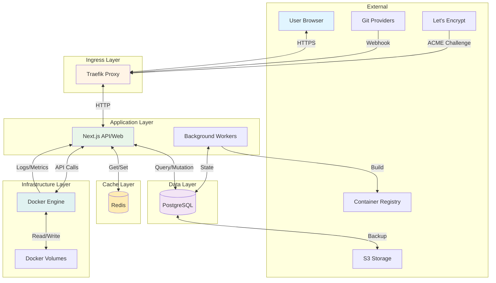

---

## Data Flow Patterns

### Pattern 1: User Request-Response Flow

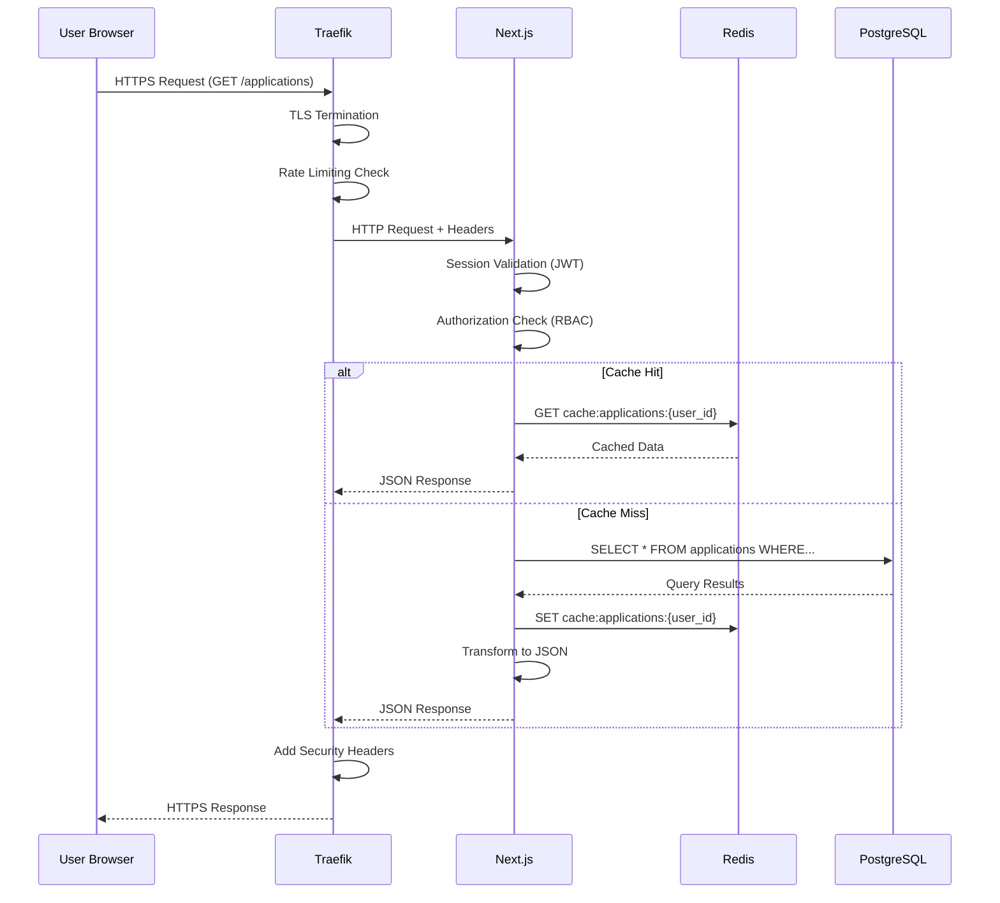

**Data Transformations**:
1. **TLS Decryption**: HTTPS → HTTP (Traefik)
2. **Session Decode**: JWT token → User object (Next.js)
3. **Database Query**: SQL → Result set (PostgreSQL)
4. **Serialization**: Database rows → JSON (Next.js)
5. **Cache Encoding**: JSON → Redis string (Redis)
6. **TLS Encryption**: HTTP → HTTPS (Traefik)

**Caching Strategy**:
- **TTL**: 5 minutes for list endpoints
- **Invalidation**: On create/update/delete operations
- **Key Pattern**: `cache:{resource}:{user_id}:{filter_hash}`

**Performance**:
- Cache hit: ~50ms
- Cache miss: ~200ms
- Database query optimization: Indexed queries

---

### Pattern 2: Deployment Flow

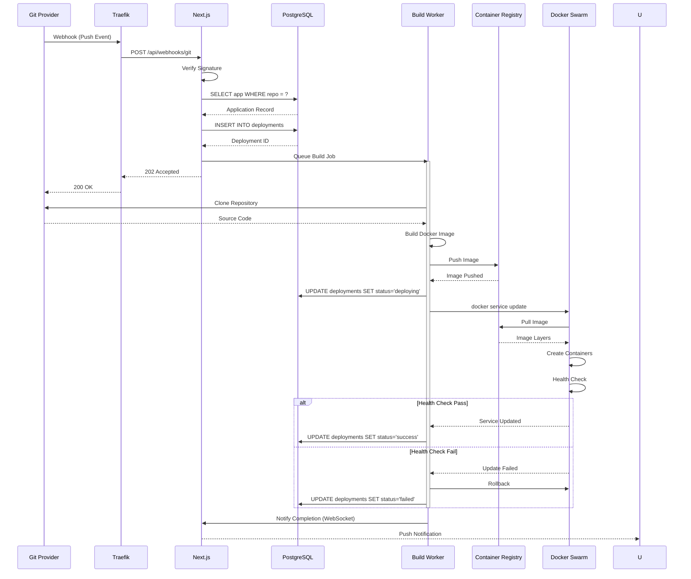

**Data Flows**:
1. **Webhook Payload**: Git provider → Next.js (JSON, ~1-5KB)
2. **Build Context**: Git → Worker (Source code, variable size)
3. **Docker Image**: Worker → Registry (Compressed layers, 50-500MB)
4. **Image Layers**: Registry → Docker (Pulled layers)
5. **State Updates**: Worker → PostgreSQL (Status changes)
6. **Real-time Notifications**: Next.js → User (WebSocket, ~100 bytes)

**Data Persistence**:
- **deployments** table: Status, logs, metadata
- **deployment_logs** table: Structured log entries
- **applications** table: Updated commit SHA

**Error Handling**:
- Failed builds: Logs stored, notification sent
- Network failures: Retry with exponential backoff
- Rollback: Revert to previous image tag

---

### Pattern 3: Authentication Flow

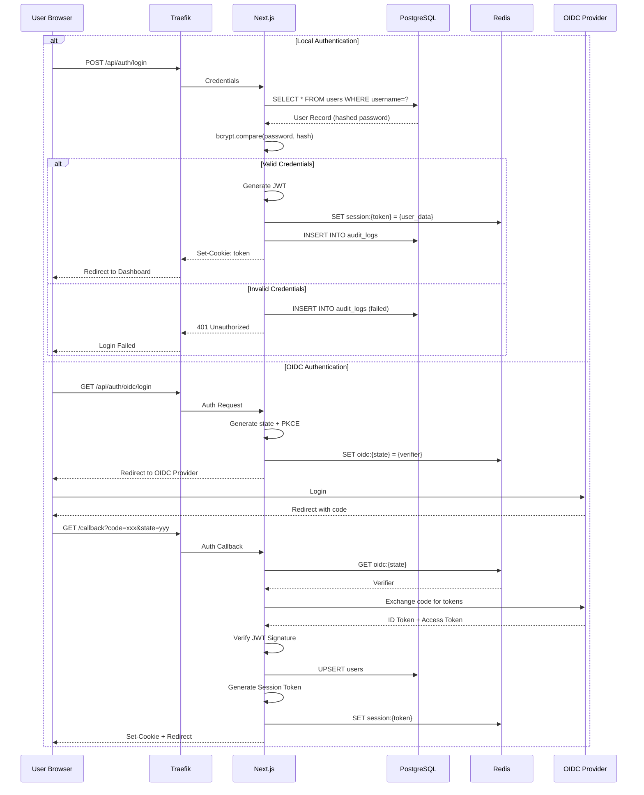

**Data Transformations**:
1. **Password Hashing**: Plain text → bcrypt hash (on registration)
2. **JWT Generation**: User object → Signed JWT token
3. **Session Storage**: User data → Redis JSON
4. **OIDC Token**: Authorization code → ID token (JWT)

**Data Security**:
- Passwords: Never stored plain text (bcrypt, cost 12)
- JWT: Signed with HS256/RS256
- Session data: Encrypted in Redis
- OIDC state: Temporary, expires in 10 minutes

**Session Management**:
- TTL: 7 days (idle), 30 days (absolute)
- Storage: Redis (fast access)
- Invalidation: On logout, password change

---

### Pattern 4: Monitoring Data Flow

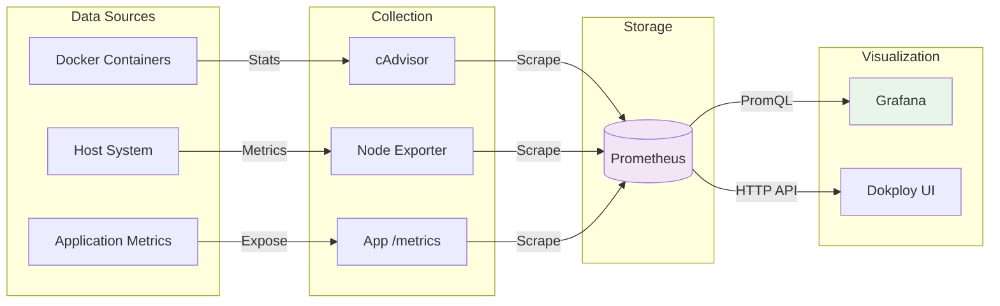

**Metrics Flow**:
1. **Container Metrics**: Docker API → cAdvisor (CPU, memory, network)
2. **System Metrics**: /proc, /sys → Node Exporter (disk, load, processes)
3. **Application Metrics**: App instrumentation → /metrics endpoint (custom metrics)
4. **Collection**: Prometheus scrapes every 15 seconds
5. **Storage**: Time-series data stored in Prometheus (15 days retention)
6. **Query**: PromQL queries → Grafana/Dokploy UI

**Log Flow**:
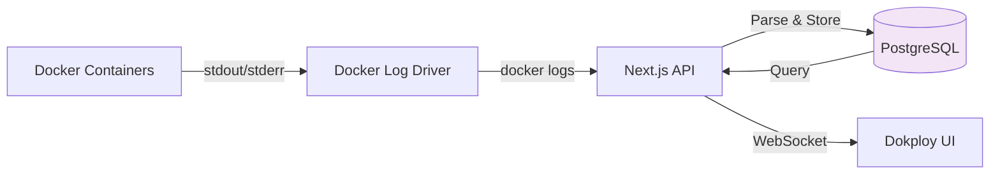

**Log Processing**:
- **Capture**: Docker captures stdout/stderr
- **Retrieval**: `docker logs` API call
- **Parsing**: Structured logging (JSON) parsed
- **Storage**: Recent logs in PostgreSQL (30 days)
- **Streaming**: Real-time via WebSocket

---

### Pattern 5: Database Backup Flow

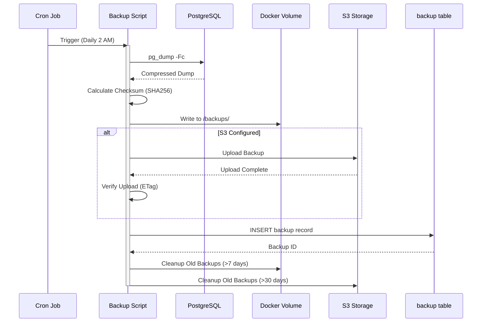

**Backup Data Flow**:
1. **Database Dump**: PostgreSQL → Compressed binary format (pg_dump -Fc)
2. **Local Storage**: Dump → Docker volume (/var/backups/)
3. **Remote Storage**: Local file → S3-compatible storage
4. **Metadata**: Backup info → backups table (PostgreSQL)

**Data Verification**:
- SHA256 checksum calculated
- S3 ETag verification
- Test restore monthly (automated)

**Retention Policy**:
- Local: 7 days (daily backups)
- S3: 30 days (daily) + 12 months (weekly)

---

### Pattern 6: TLS Certificate Flow

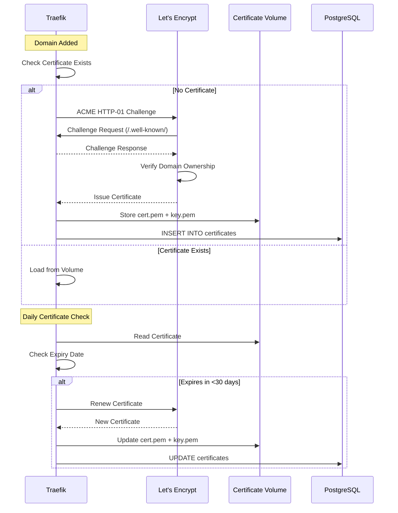

**Certificate Data**:
- **Certificate**: PEM format (~2KB)
- **Private Key**: Encrypted PEM (~2KB)
- **Chain**: Intermediate certificates
- **Metadata**: Expiry date, issuer, domains

**Storage**:
- **Primary**: Docker volume (file system)
- **Backup**: PostgreSQL certificates table (encrypted)

---

## Integration Data Flows

### GitHub/GitLab Integration

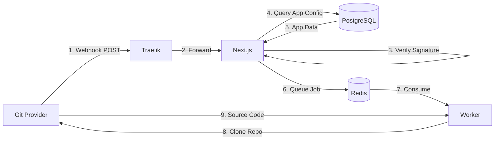

**Webhook Payload**:
```json
{
  "ref": "refs/heads/main",
  "repository": {
    "name": "myapp",
    "full_name": "user/myapp",
    "clone_url": "https://github.com/user/myapp.git"
  },
  "commits": [{
    "id": "abc123...",
    "message": "Fix bug",
    "author": { "name": "John Doe" }
  }]
}
```

**Verification**:
- GitHub: HMAC-SHA256 signature
- GitLab: Secret token comparison

### Docker Registry Integration

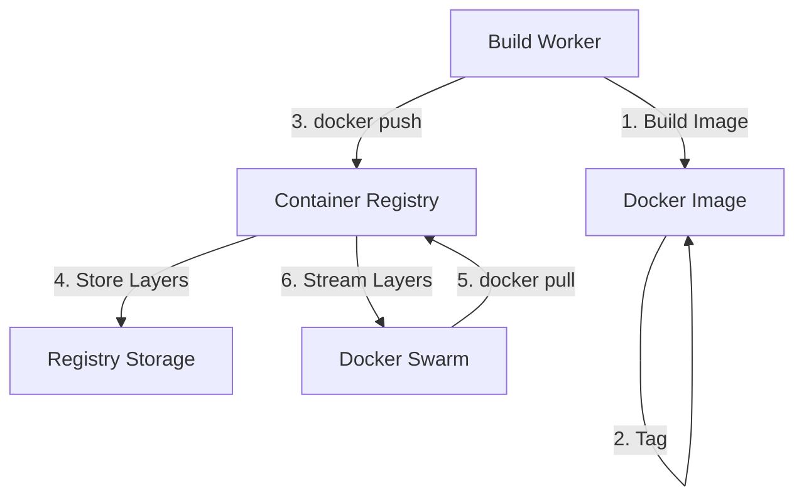

**Image Data**:
- **Layers**: Compressed tar archives (10-500MB each)
- **Manifest**: JSON describing layers (~1KB)
- **Config**: Image metadata (labels, env, etc., ~5KB)

**Optimization**:
- Layer caching reduces transfer
- Multi-stage builds reduce final size
- Registry mirror for frequently used images

---

## Data Transformation Points

### 1. Input Validation

**Location**: Next.js API routes  
**Purpose**: Ensure data integrity before processing

```typescript
// Example: Application creation
const createAppSchema = z.object({
  name: z.string().min(3).max(50).regex(/^[a-z0-9-]+$/),
  image: z.string().url(),
  replicas: z.number().int().min(0).max(100),
  envVars: z.record(z.string(), z.string())
});

// Transformation: Raw input → Validated object
const validated = createAppSchema.parse(requestBody);
```

**Validation Rules**:
- Application name: Alphanumeric, lowercase, hyphens
- Email: RFC 5322 format
- URLs: Valid HTTP/HTTPS
- Integers: Within acceptable ranges

### 2. Serialization/Deserialization

**JSON → Database** (Prisma ORM):
```typescript
// API Request Body (JSON)
{
  "name": "myapp",
  "envVars": {"PORT": "8080"}
}

// Database Row (PostgreSQL)
{
  id: UUID,
  name: "myapp",
  env_vars: {"PORT": "8080"}, // JSONB column
  created_at: TIMESTAMP
}
```

**Database → JSON Response**:
```typescript
// Database Row
{
  id: "550e8400-e29b-41d4-a716-446655440000",
  created_at: 2024-12-30T10:00:00.000Z
}

// API Response
{
  "id": "550e8400-e29b-41d4-a716-446655440000",
  "createdAt": "2024-12-30T10:00:00Z" // ISO 8601
}
```

### 3. Encryption/Decryption

**Sensitive Data Encryption**:

```typescript
// Plain text secret
const secret = "api_key_12345";

// Encrypted storage (AES-256-GCM)
const encrypted = encrypt(secret, key);
// Stored in database: "encrypted:v1:abc123..."

// Decryption on retrieval
const decrypted = decrypt(encrypted, key);
// Used in application: "api_key_12345"
```

**Encryption Points**:
- `env_vars.value` (when `is_secret=true`)
- `certificates.private_key`
- `databases.connection_string`
- Session tokens in Redis

**Key Management**:
- Encryption keys from Docker secrets
- Key rotation support (versioned encryption)
- Never logged or exposed in API

### 4. Format Conversions

**Docker API → Internal Format**:
```javascript
// Docker Swarm Service
{
  "ID": "abc123...",
  "Spec": {
    "Name": "myapp",
    "TaskTemplate": {
      "ContainerSpec": {
        "Image": "nginx:latest"
      }
    }
  }
}

// Internal Application Model
{
  "id": "uuid-here",
  "name": "myapp",
  "image": "nginx:latest",
  "status": "running",
  "replicas": 3
}
```

---

## Caching Strategy

### Cache Layers

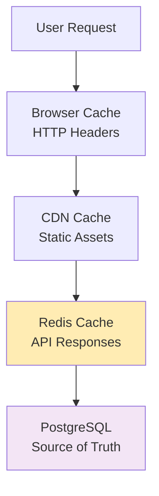

### Cache Configuration

| Resource | TTL | Invalidation | Key Pattern |
|----------|-----|--------------|-------------|
| Application list | 5 min | On mutation | `apps:{user_id}:{filters}` |
| Application detail | 2 min | On update | `app:{app_id}` |
| Deployment list | 1 min | On new deployment | `deploys:{app_id}` |
| User profile | 15 min | On profile update | `user:{user_id}` |
| Metrics | 30 sec | Time-based expiry | `metrics:{resource}:{time}` |

### Cache Invalidation

```typescript
// On application update
async function updateApplication(id: string, data: UpdateData) {
  // 1. Update database
  const updated = await prisma.application.update({
    where: { id },
    data
  });
  
  // 2. Invalidate caches
  await redis.del(`app:${id}`);
  await redis.del(`apps:${updated.projectId}:*`); // Pattern delete
  
  // 3. Publish invalidation event
  await redis.publish('cache:invalidate', { type: 'application', id });
  
  return updated;
}
```

---

## Data Quality and Consistency

### Validation Rules

**At API Layer**:
- Schema validation (Zod)
- Business rule validation
- Authorization checks

**At Database Layer**:
- Foreign key constraints
- Check constraints
- Unique constraints
- Not null constraints

### Error Handling

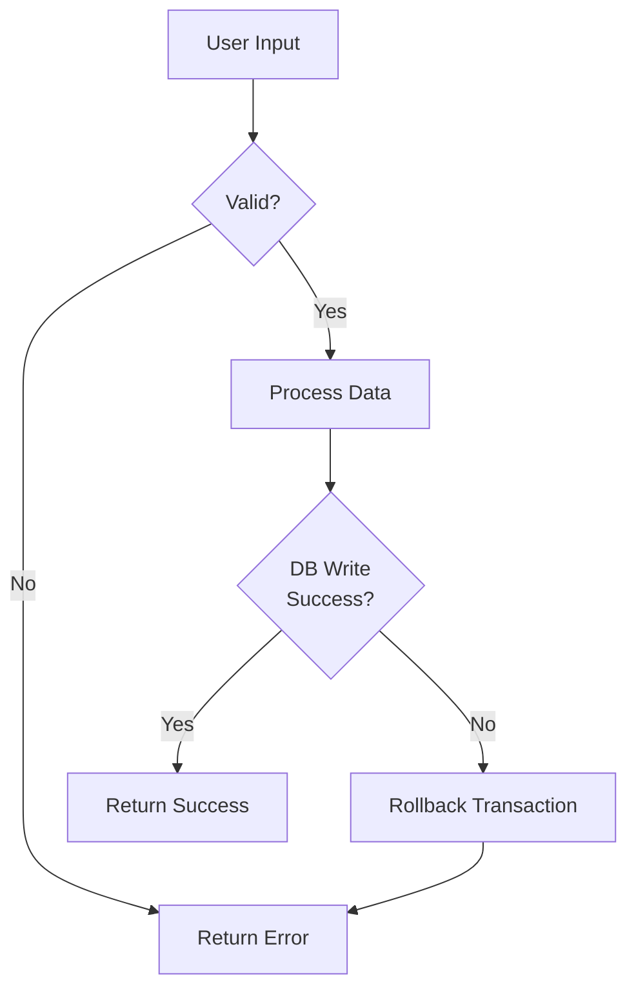

**Error Response Format**:
```json
{
  "error": {
    "code": "VALIDATION_ERROR",
    "message": "Application name must be alphanumeric",
    "details": {
      "field": "name",
      "constraint": "regex",
      "value": "My App!"
    }
  }
}
```

### Data Consistency

**Transaction Management**:
```typescript
// Atomic operation: Create application + deployment
await prisma.$transaction(async (tx) => {
  const app = await tx.application.create({ data: appData });
  const deployment = await tx.deployment.create({
    data: { applicationId: app.id, ...deployData }
  });
  return { app, deployment };
});
```

**Consistency Checks**:
- Application → Deployment (foreign key)
- User → Project (ownership)
- Project → Application (containment)

---

## Performance Optimization

### Query Optimization

**Indexed Queries**:
```sql
-- Find user's applications (indexed on owner_id)
SELECT * FROM applications 
WHERE project_id IN (
  SELECT id FROM projects WHERE owner_id = ?
);

-- Execution plan uses index
-- Index: idx_projects_owner (owner_id)
-- Index: idx_applications_project (project_id)
```

**Pagination**:
```typescript
// Cursor-based pagination (efficient)
const applications = await prisma.application.findMany({
  take: 20,
  skip: cursor ? 1 : 0,
  cursor: cursor ? { id: cursor } : undefined,
  where: { projectId },
  orderBy: { createdAt: 'desc' }
});
```

### Batch Processing

**Bulk Operations**:
```typescript
// Inefficient: N queries
for (const app of applications) {
  await updateStatus(app.id, 'running');
}

// Efficient: 1 query
await prisma.application.updateMany({
  where: { id: { in: applicationIds } },
  data: { status: 'running' }
});
```

---

## Data Flow Metrics

### Key Metrics

| Metric | Target | Current | Monitoring |
|--------|--------|---------|-----------|
| API Response Time (p95) | <200ms | ~150ms | Prometheus |
| Cache Hit Rate | >80% | ~85% | Redis INFO |
| Database Query Time (p95) | <50ms | ~35ms | PostgreSQL stats |
| Deployment Time | <5 min | 2-8 min | Deployment logs |
| Webhook Processing Time | <1s | ~400ms | Application logs |

### Monitoring Queries

```promql
# API response time (p95)
histogram_quantile(0.95, 
  rate(http_request_duration_seconds_bucket[5m])
)

# Cache hit rate
rate(redis_keyspace_hits_total[5m]) / 
(rate(redis_keyspace_hits_total[5m]) + rate(redis_keyspace_misses_total[5m]))

# Database connection pool
pg_stat_activity_count
```

---

## Related Documents

- **Data Model**: Entity definitions and relationships
- **Container Diagram**: Component interactions and boundaries
- **Security View**: Encryption and security controls
- **ADR-003**: PostgreSQL selection and configuration
- **Deployment Diagram**: Infrastructure and network topology

---

**Document Version**: 1.0  
**Last Updated**: 2024-12-30  
**Next Review**: 2025-03-30  
**Reviewed By**: Architecture Team, Data Team
