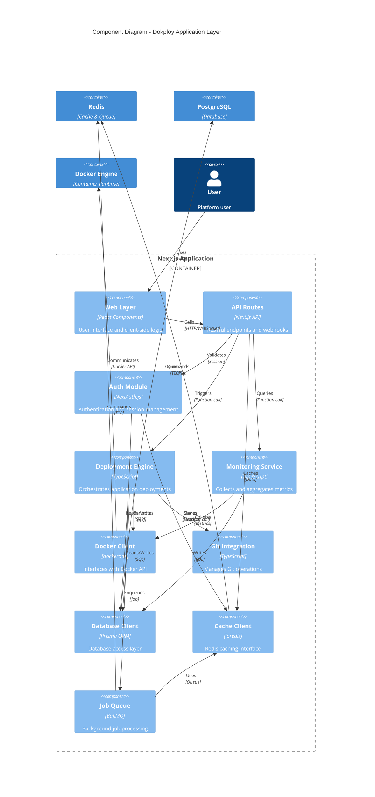
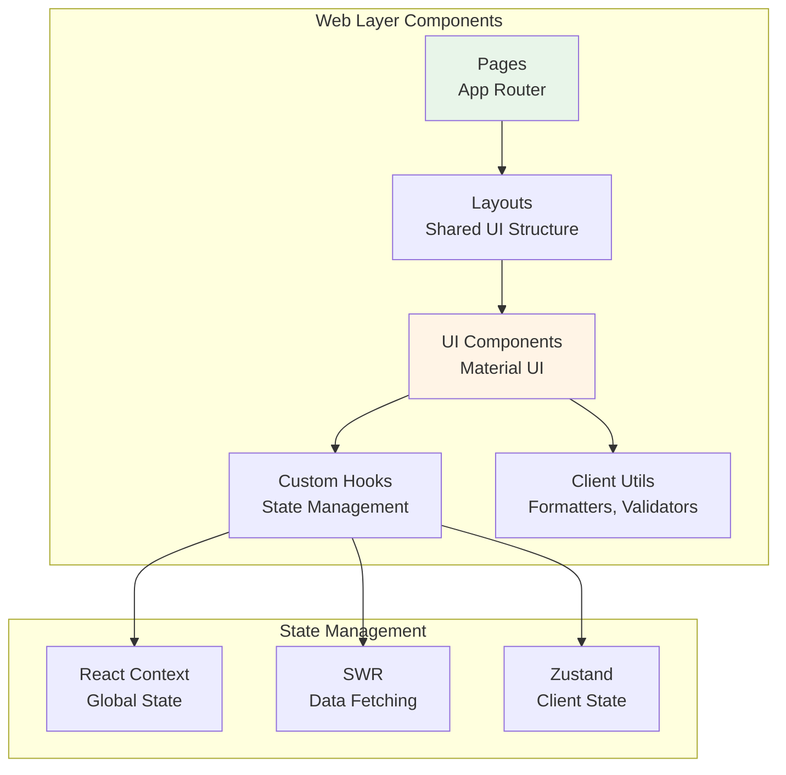
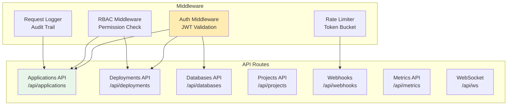
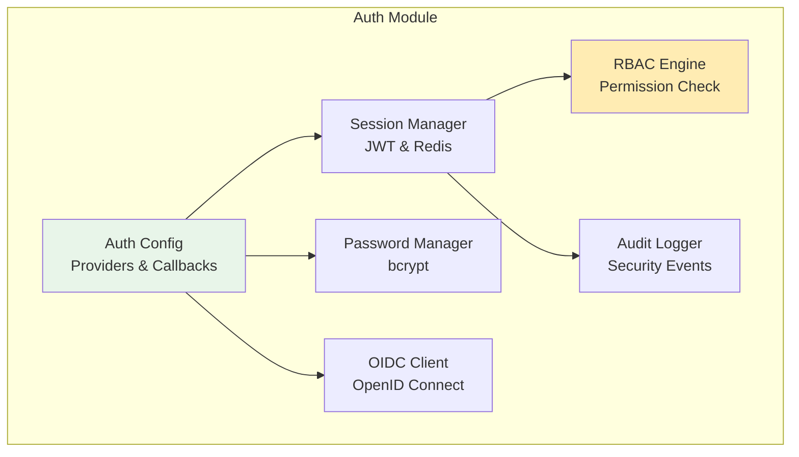
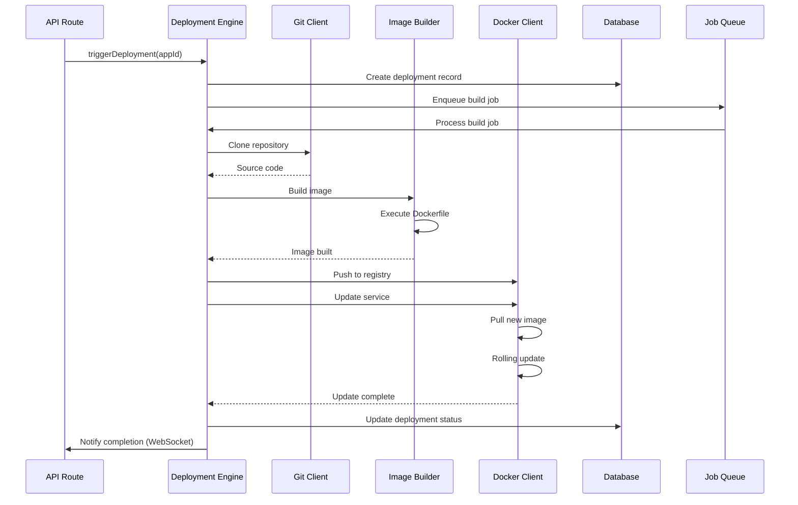
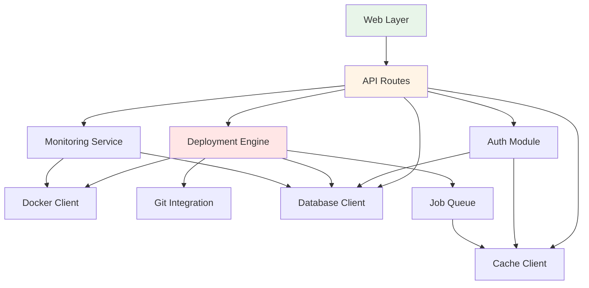

# Application Component Diagram

**Document Type**: Application Architecture  
**Status**: Draft  
**Version**: 1.0  
**Last Updated**: 2024-12-30  
**Owner**: Architecture Team  

---

## Purpose

This document details the internal component structure of the Dokploy application layer, showing how the Next.js application is organized into logical components, their responsibilities, dependencies, and interactions. This provides a more granular view than the Container Diagram, focusing specifically on the application architecture.

---

## Component Architecture Overview



---

## Core Components

### 1. Web Layer

**Technology**: React 18, Next.js 14 App Router, Material UI  
**Location**: `src/app/`, `src/components/`  
**Responsibility**: User interface and client-side application logic



**Key Responsibilities**:
- Render user interface
- Handle user interactions
- Client-side validation
- Real-time updates (WebSocket)
- Responsive design
- Dark mode support

**Key Files/Directories**:
```
src/app/
├── (auth)/              # Authentication pages
│   ├── login/
│   └── register/
├── (dashboard)/         # Main application pages
│   ├── projects/
│   ├── applications/
│   ├── databases/
│   └── deployments/
├── api/                 # API routes (handled by API Layer)
├── layout.tsx           # Root layout
└── page.tsx             # Home page

src/components/
├── ui/                  # Reusable UI components
│   ├── Button/
│   ├── Card/
│   ├── Table/
│   └── Form/
├── features/            # Feature-specific components
│   ├── applications/
│   ├── deployments/
│   └── monitoring/
└── shared/              # Shared utilities
```

**State Management**:
- **SWR**: Data fetching, caching, revalidation
- **Zustand**: Client-side UI state (theme, sidebar)
- **React Context**: User session, permissions

---

### 2. API Routes Layer

**Technology**: Next.js API Routes (App Router)  
**Location**: `src/app/api/`  
**Responsibility**: RESTful API endpoints, webhooks, WebSocket connections



**API Structure**:
```
src/app/api/
├── applications/
│   ├── route.ts                 # GET, POST /api/applications
│   ├── [id]/
│   │   ├── route.ts             # GET, PATCH, DELETE /api/applications/:id
│   │   ├── deploy/route.ts      # POST /api/applications/:id/deploy
│   │   ├── logs/route.ts        # GET /api/applications/:id/logs
│   │   └── metrics/route.ts     # GET /api/applications/:id/metrics
│   └── bulk/route.ts            # POST /api/applications/bulk
├── deployments/
│   ├── route.ts                 # GET /api/deployments
│   ├── [id]/
│   │   ├── route.ts             # GET /api/deployments/:id
│   │   └── rollback/route.ts    # POST /api/deployments/:id/rollback
├── databases/
│   ├── route.ts                 # GET, POST /api/databases
│   └── [id]/route.ts            # GET, PATCH, DELETE /api/databases/:id
├── projects/
│   ├── route.ts                 # GET, POST /api/projects
│   └── [id]/route.ts            # GET, PATCH, DELETE /api/projects/:id
├── webhooks/
│   ├── github/route.ts          # POST /api/webhooks/github
│   ├── gitlab/route.ts          # POST /api/webhooks/gitlab
│   └── docker/route.ts          # POST /api/webhooks/docker
├── metrics/
│   ├── route.ts                 # GET /api/metrics
│   └── prometheus/route.ts      # GET /api/metrics/prometheus
├── auth/
│   ├── login/route.ts           # POST /api/auth/login
│   ├── logout/route.ts          # POST /api/auth/logout
│   ├── register/route.ts        # POST /api/auth/register
│   └── oidc/
│       ├── login/route.ts       # GET /api/auth/oidc/login
│       └── callback/route.ts    # GET /api/auth/oidc/callback
└── ws/
    └── route.ts                 # WebSocket endpoint
```

**Endpoint Examples**:

**GET /api/applications**
```typescript
export async function GET(request: NextRequest) {
  // 1. Authenticate & authorize
  const session = await getSession(request);
  if (!session) return unauthorized();
  
  // 2. Parse query parameters
  const { searchParams } = new URL(request.url);
  const projectId = searchParams.get('projectId');
  
  // 3. Check cache
  const cacheKey = `apps:${session.userId}:${projectId}`;
  const cached = await redis.get(cacheKey);
  if (cached) return Response.json(JSON.parse(cached));
  
  // 4. Query database
  const applications = await prisma.application.findMany({
    where: {
      project: { ownerId: session.userId },
      projectId: projectId || undefined
    },
    include: { deployments: { take: 1, orderBy: { createdAt: 'desc' } } }
  });
  
  // 5. Transform & cache
  const response = applications.map(transformApplication);
  await redis.setex(cacheKey, 300, JSON.stringify(response));
  
  return Response.json(response);
}
```

**POST /api/applications/:id/deploy**
```typescript
export async function POST(
  request: NextRequest,
  { params }: { params: { id: string } }
) {
  // 1. Authenticate & authorize
  const session = await getSession(request);
  if (!session) return unauthorized();
  
  const app = await prisma.application.findUnique({
    where: { id: params.id },
    include: { project: true }
  });
  
  if (!canDeploy(session, app)) return forbidden();
  
  // 2. Validate request
  const body = await request.json();
  const validated = deploySchema.parse(body);
  
  // 3. Create deployment record
  const deployment = await prisma.deployment.create({
    data: {
      applicationId: app.id,
      status: 'pending',
      commitSha: validated.commitSha,
      branch: validated.branch
    }
  });
  
  // 4. Enqueue build job
  await deploymentQueue.add('build', {
    deploymentId: deployment.id,
    applicationId: app.id,
    ...validated
  });
  
  // 5. Invalidate cache
  await invalidateCache(['applications', app.id]);
  
  return Response.json(deployment, { status: 202 });
}
```

---

### 3. Authentication Module

**Technology**: NextAuth.js v5 (Auth.js), bcrypt, jose (JWT)  
**Location**: `src/lib/auth/`  
**Responsibility**: User authentication, session management, authorization



**Components**:

**Session Manager**:
```typescript
// src/lib/auth/session.ts
export class SessionManager {
  async createSession(userId: string): Promise<string> {
    const token = await this.generateJWT({ userId });
    await redis.setex(
      `session:${token}`,
      60 * 60 * 24 * 7, // 7 days
      JSON.stringify({ userId, createdAt: Date.now() })
    );
    return token;
  }
  
  async getSession(token: string): Promise<Session | null> {
    const data = await redis.get(`session:${token}`);
    if (!data) return null;
    
    const session = JSON.parse(data);
    const user = await prisma.user.findUnique({
      where: { id: session.userId },
      include: { roles: true }
    });
    
    return { ...session, user };
  }
  
  async invalidateSession(token: string): Promise<void> {
    await redis.del(`session:${token}`);
    await auditLog.log('session.invalidated', { token });
  }
}
```

**RBAC Engine**:
```typescript
// src/lib/auth/rbac.ts
export class RBACEngine {
  permissions = {
    'application.create': ['owner', 'admin', 'developer'],
    'application.read': ['owner', 'admin', 'developer', 'viewer'],
    'application.update': ['owner', 'admin', 'developer'],
    'application.delete': ['owner', 'admin'],
    'application.deploy': ['owner', 'admin', 'developer'],
    // ... more permissions
  };
  
  can(user: User, action: string, resource?: Resource): boolean {
    // Check system-level roles
    const allowedRoles = this.permissions[action] || [];
    if (user.roles.some(role => allowedRoles.includes(role.name))) {
      // Check resource-level permissions
      if (resource) {
        return this.hasResourceAccess(user, resource);
      }
      return true;
    }
    return false;
  }
  
  private hasResourceAccess(user: User, resource: Resource): boolean {
    // Check project ownership or team membership
    const projectId = resource.projectId;
    const project = await prisma.project.findUnique({
      where: { id: projectId },
      include: { team: { include: { members: true } } }
    });
    
    return project.ownerId === user.id ||
           project.team.members.some(m => m.userId === user.id);
  }
}
```

**Authentication Providers**:
```typescript
// src/lib/auth/config.ts
export const authConfig: NextAuthConfig = {
  providers: [
    CredentialsProvider({
      name: 'credentials',
      credentials: {
        username: { type: 'text' },
        password: { type: 'password' }
      },
      async authorize(credentials) {
        const user = await prisma.user.findUnique({
          where: { username: credentials.username }
        });
        
        if (!user || !user.passwordHash) return null;
        
        const valid = await bcrypt.compare(
          credentials.password,
          user.passwordHash
        );
        
        if (!valid) {
          await auditLog.log('auth.failed', { username: credentials.username });
          return null;
        }
        
        await auditLog.log('auth.success', { userId: user.id });
        return user;
      }
    }),
    
    OIDCProvider({
      id: 'oidc',
      name: 'OpenID Connect',
      type: 'oidc',
      clientId: process.env.OIDC_CLIENT_ID,
      clientSecret: process.env.OIDC_CLIENT_SECRET,
      issuer: process.env.OIDC_ISSUER,
      authorization: { params: { scope: 'openid email profile' } },
      async profile(profile) {
        return {
          id: profile.sub,
          email: profile.email,
          name: profile.name,
          image: profile.picture
        };
      }
    })
  ],
  
  callbacks: {
    async jwt({ token, user }) {
      if (user) token.userId = user.id;
      return token;
    },
    async session({ session, token }) {
      session.userId = token.userId;
      return session;
    }
  }
};
```

---

### 4. Deployment Engine

**Technology**: TypeScript, dockerode, simple-git  
**Location**: `src/lib/deployment/`  
**Responsibility**: Orchestrate application builds and deployments



**Core Classes**:

**DeploymentEngine**:
```typescript
// src/lib/deployment/engine.ts
export class DeploymentEngine {
  constructor(
    private docker: DockerClient,
    private git: GitClient,
    private builder: ImageBuilder,
    private queue: JobQueue
  ) {}
  
  async deploy(deploymentId: string): Promise<void> {
    const deployment = await prisma.deployment.findUnique({
      where: { id: deploymentId },
      include: { application: { include: { gitSource: true } } }
    });
    
    try {
      // 1. Update status
      await this.updateStatus(deploymentId, 'cloning');
      
      // 2. Clone repository
      const sourceDir = await this.git.clone(
        deployment.application.gitSource.repoUrl,
        deployment.branch || 'main',
        deployment.commitSha
      );
      
      // 3. Build image
      await this.updateStatus(deploymentId, 'building');
      const imageName = `${deployment.application.name}:${deployment.commitSha.slice(0, 7)}`;
      await this.builder.build(sourceDir, imageName, {
        buildArgs: deployment.application.buildArgs,
        dockerfile: deployment.application.dockerfile || 'Dockerfile'
      });
      
      // 4. Push to registry
      await this.updateStatus(deploymentId, 'pushing');
      await this.docker.pushImage(imageName);
      
      // 5. Deploy to Swarm
      await this.updateStatus(deploymentId, 'deploying');
      await this.docker.updateService(
        deployment.application.serviceName,
        imageName,
        {
          envVars: deployment.application.envVars,
          replicas: deployment.application.replicas,
          healthCheck: deployment.application.healthCheck
        }
      );
      
      // 6. Wait for health checks
      await this.waitForHealthy(deployment.application.serviceName);
      
      // 7. Success
      await this.updateStatus(deploymentId, 'success');
      await this.notifySuccess(deploymentId);
      
    } catch (error) {
      await this.handleFailure(deploymentId, error);
      throw error;
    } finally {
      await this.cleanup(sourceDir);
    }
  }
  
  async rollback(deploymentId: string): Promise<void> {
    const deployment = await prisma.deployment.findUnique({
      where: { id: deploymentId },
      include: {
        application: true,
        previous: true // Previous successful deployment
      }
    });
    
    if (!deployment.previous) {
      throw new Error('No previous deployment to rollback to');
    }
    
    await this.docker.updateService(
      deployment.application.serviceName,
      deployment.previous.image,
      { replicas: deployment.application.replicas }
    );
    
    await prisma.deployment.update({
      where: { id: deploymentId },
      data: { status: 'rolled_back' }
    });
  }
  
  private async updateStatus(id: string, status: string): Promise<void> {
    await prisma.deployment.update({
      where: { id },
      data: { status, updatedAt: new Date() }
    });
    
    // Emit WebSocket event
    await this.emitStatusChange(id, status);
  }
}
```

**Image Builder**:
```typescript
// src/lib/deployment/builder.ts
export class ImageBuilder {
  constructor(private docker: Docker) {}
  
  async build(
    contextDir: string,
    imageName: string,
    options: BuildOptions
  ): Promise<void> {
    const stream = await this.docker.buildImage(
      {
        context: contextDir,
        src: ['.']
      },
      {
        t: imageName,
        dockerfile: options.dockerfile,
        buildargs: options.buildArgs,
        // Multi-stage build support
        target: options.target,
        // Build cache
        nocache: false,
        pull: true
      }
    );
    
    // Stream build logs
    await new Promise((resolve, reject) => {
      this.docker.modem.followProgress(
        stream,
        (err, res) => (err ? reject(err) : resolve(res)),
        (event) => {
          if (event.stream) {
            this.logBuildOutput(imageName, event.stream);
          }
          if (event.error) {
            this.logBuildError(imageName, event.error);
          }
        }
      );
    });
  }
}
```

---

### 5. Docker Client

**Technology**: dockerode  
**Location**: `src/lib/docker/`  
**Responsibility**: Interface with Docker Swarm API

```typescript
// src/lib/docker/client.ts
export class DockerClient {
  private docker: Docker;
  
  constructor() {
    this.docker = new Docker({
      socketPath: '/var/run/docker.sock'
    });
  }
  
  async createService(config: ServiceConfig): Promise<Service> {
    const service = await this.docker.createService({
      Name: config.name,
      TaskTemplate: {
        ContainerSpec: {
          Image: config.image,
          Env: this.formatEnvVars(config.envVars),
          Mounts: config.volumes.map(v => ({
            Type: 'volume',
            Source: v.source,
            Target: v.target
          })),
          HealthCheck: config.healthCheck ? {
            Test: ['CMD-SHELL', config.healthCheck.command],
            Interval: config.healthCheck.interval * 1e9,
            Timeout: config.healthCheck.timeout * 1e9,
            Retries: config.healthCheck.retries
          } : undefined
        },
        Resources: {
          Limits: {
            MemoryBytes: config.memoryLimit * 1024 * 1024,
            NanoCPUs: config.cpuLimit * 1e9
          }
        },
        RestartPolicy: {
          Condition: 'on-failure',
          MaxAttempts: 3
        }
      },
      Mode: {
        Replicated: {
          Replicas: config.replicas
        }
      },
      Networks: [{ Target: 'dokploy-network' }],
      Labels: {
        'dokploy.application': config.applicationId,
        'dokploy.project': config.projectId,
        'traefik.enable': 'true',
        ...config.labels
      }
    });
    
    return service;
  }
  
  async updateService(
    serviceName: string,
    image: string,
    updates: Partial<ServiceConfig>
  ): Promise<void> {
    const service = await this.docker.getService(serviceName);
    const spec = await service.inspect();
    
    // Update image
    spec.Spec.TaskTemplate.ContainerSpec.Image = image;
    
    // Update env vars
    if (updates.envVars) {
      spec.Spec.TaskTemplate.ContainerSpec.Env = 
        this.formatEnvVars(updates.envVars);
    }
    
    // Update replicas
    if (updates.replicas !== undefined) {
      spec.Spec.Mode.Replicated.Replicas = updates.replicas;
    }
    
    // Perform rolling update
    await service.update({
      version: spec.Version.Index,
      ...spec.Spec,
      UpdateConfig: {
        Parallelism: 1,
        Delay: 10e9, // 10 seconds
        FailureAction: 'rollback',
        Monitor: 30e9 // 30 seconds
      }
    });
  }
  
  async getServiceLogs(serviceName: string, options: LogOptions): Promise<string[]> {
    const service = await this.docker.getService(serviceName);
    const stream = await service.logs({
      stdout: true,
      stderr: true,
      timestamps: true,
      tail: options.tail || 100,
      since: options.since || 0
    });
    
    return this.parseLogStream(stream);
  }
  
  async getServiceStats(serviceName: string): Promise<ServiceStats> {
    const tasks = await this.docker.listTasks({
      filters: { service: [serviceName] }
    });
    
    const stats = await Promise.all(
      tasks.map(async task => {
        const container = this.docker.getContainer(task.Status.ContainerStatus.ContainerID);
        return await container.stats({ stream: false });
      })
    );
    
    return this.aggregateStats(stats);
  }
}
```

---

### 6. Monitoring Service

**Technology**: TypeScript, Prometheus client  
**Location**: `src/lib/monitoring/`  
**Responsibility**: Collect and aggregate application and infrastructure metrics

```typescript
// src/lib/monitoring/service.ts
export class MonitoringService {
  private prometheus: PromClient;
  
  async collectMetrics(applicationId: string): Promise<Metrics> {
    const application = await prisma.application.findUnique({
      where: { id: applicationId }
    });
    
    // Query Prometheus
    const queries = {
      cpu: `rate(container_cpu_usage_seconds_total{service="${application.serviceName}"}[5m])`,
      memory: `container_memory_usage_bytes{service="${application.serviceName}"}`,
      network_rx: `rate(container_network_receive_bytes_total{service="${application.serviceName}"}[5m])`,
      network_tx: `rate(container_network_transmit_bytes_total{service="${application.serviceName}"}[5m])`,
      requests: `rate(http_requests_total{service="${application.serviceName}"}[5m])`,
      errors: `rate(http_requests_total{service="${application.serviceName}",status=~"5.."}[5m])`
    };
    
    const results = await Promise.all(
      Object.entries(queries).map(async ([metric, query]) => {
        const result = await this.prometheus.query(query);
        return [metric, this.parseQueryResult(result)];
      })
    );
    
    return Object.fromEntries(results);
  }
  
  async getResourceUsage(projectId: string): Promise<ResourceUsage> {
    const applications = await prisma.application.findMany({
      where: { projectId }
    });
    
    const usage = await Promise.all(
      applications.map(app => this.collectMetrics(app.id))
    );
    
    return {
      totalCpu: usage.reduce((sum, m) => sum + m.cpu, 0),
      totalMemory: usage.reduce((sum, m) => sum + m.memory, 0),
      totalNetwork: usage.reduce((sum, m) => sum + m.network_rx + m.network_tx, 0),
      applications: usage
    };
  }
}
```

---

### 7. Database Client (Prisma ORM)

**Technology**: Prisma 5  
**Location**: `prisma/schema.prisma`, `src/lib/db/`  
**Responsibility**: Type-safe database access layer

```typescript
// src/lib/db/client.ts
import { PrismaClient } from '@prisma/client';

export const prisma = new PrismaClient({
  log: process.env.NODE_ENV === 'development' 
    ? ['query', 'error', 'warn'] 
    : ['error'],
  errorFormat: 'pretty'
});

// Connection pool configuration
prisma.$connect();

// Middleware: Logging
prisma.$use(async (params, next) => {
  const before = Date.now();
  const result = await next(params);
  const after = Date.now();
  
  console.log(`Query ${params.model}.${params.action} took ${after - before}ms`);
  return result;
});

// Middleware: Soft delete
prisma.$use(async (params, next) => {
  if (params.action === 'delete') {
    params.action = 'update';
    params.args['data'] = { deletedAt: new Date() };
  }
  
  if (params.action === 'deleteMany') {
    params.action = 'updateMany';
    params.args['data'] = { deletedAt: new Date() };
  }
  
  return next(params);
});

// Repository pattern (optional)
export class ApplicationRepository {
  async findByProject(projectId: string): Promise<Application[]> {
    return prisma.application.findMany({
      where: { projectId, deletedAt: null },
      include: {
        deployments: {
          take: 5,
          orderBy: { createdAt: 'desc' }
        },
        envVars: { where: { isSecret: false } },
        domains: true
      }
    });
  }
  
  async createWithDefaults(data: CreateApplicationInput): Promise<Application> {
    return prisma.application.create({
      data: {
        ...data,
        status: 'pending',
        replicas: data.replicas || 1,
        healthCheck: data.healthCheck || {
          command: 'curl -f http://localhost/ || exit 1',
          interval: 30,
          timeout: 10,
          retries: 3
        }
      }
    });
  }
}
```

---

### 8. Cache Client (Redis)

**Technology**: ioredis  
**Location**: `src/lib/cache/`  
**Responsibility**: Caching and session storage

```typescript
// src/lib/cache/client.ts
import Redis from 'ioredis';

export const redis = new Redis({
  host: process.env.REDIS_HOST || 'localhost',
  port: parseInt(process.env.REDIS_PORT || '6379'),
  password: process.env.REDIS_PASSWORD,
  retryStrategy: (times) => Math.min(times * 50, 2000),
  maxRetriesPerRequest: 3
});

// Cache wrapper
export class CacheService {
  async get<T>(key: string): Promise<T | null> {
    const value = await redis.get(key);
    return value ? JSON.parse(value) : null;
  }
  
  async set<T>(key: string, value: T, ttl?: number): Promise<void> {
    const serialized = JSON.stringify(value);
    if (ttl) {
      await redis.setex(key, ttl, serialized);
    } else {
      await redis.set(key, serialized);
    }
  }
  
  async invalidate(pattern: string): Promise<void> {
    const keys = await redis.keys(pattern);
    if (keys.length > 0) {
      await redis.del(...keys);
    }
  }
  
  async remember<T>(
    key: string,
    ttl: number,
    fn: () => Promise<T>
  ): Promise<T> {
    const cached = await this.get<T>(key);
    if (cached !== null) return cached;
    
    const value = await fn();
    await this.set(key, value, ttl);
    return value;
  }
}
```

---

### 9. Job Queue (BullMQ)

**Technology**: BullMQ  
**Location**: `src/lib/queue/`  
**Responsibility**: Background job processing

```typescript
// src/lib/queue/deployment.ts
import { Queue, Worker, Job } from 'bullmq';

export const deploymentQueue = new Queue('deployments', {
  connection: {
    host: process.env.REDIS_HOST,
    port: parseInt(process.env.REDIS_PORT || '6379')
  }
});

export const deploymentWorker = new Worker(
  'deployments',
  async (job: Job) => {
    const { deploymentId } = job.data;
    const engine = new DeploymentEngine();
    
    job.updateProgress(0);
    await engine.deploy(deploymentId);
    job.updateProgress(100);
  },
  {
    connection: {
      host: process.env.REDIS_HOST,
      port: parseInt(process.env.REDIS_PORT || '6379')
    },
    concurrency: 3, // Process 3 deployments concurrently
    limiter: {
      max: 10, // Max 10 jobs per interval
      duration: 60000 // 1 minute
    }
  }
);

// Job lifecycle events
deploymentWorker.on('completed', async (job) => {
  console.log(`Deployment ${job.data.deploymentId} completed`);
  await notifyDeploymentComplete(job.data.deploymentId);
});

deploymentWorker.on('failed', async (job, err) => {
  console.error(`Deployment ${job.data.deploymentId} failed:`, err);
  await notifyDeploymentFailed(job.data.deploymentId, err.message);
});
```

---

## Component Dependencies



**Dependency Rules**:
1. **Web Layer** depends only on API Routes (no direct DB/Docker access)
2. **API Routes** orchestrates other components
3. **No circular dependencies** between components
4. **Shared utilities** (DB, Cache) are leaf nodes

---

## Component Communication Patterns

### 1. Synchronous API Calls

Used for: Real-time user requests

```typescript
// API Route calls Deployment Engine
const deployment = await deploymentEngine.deploy(applicationId);
return Response.json(deployment);
```

### 2. Asynchronous Job Queue

Used for: Long-running tasks

```typescript
// API enqueues job, returns immediately
await deploymentQueue.add('build', { deploymentId });
return Response.json({ status: 'queued' }, { status: 202 });

// Worker processes job
deploymentWorker.process(async (job) => {
  await deploymentEngine.deploy(job.data.deploymentId);
});
```

### 3. WebSocket Real-time Updates

Used for: Live updates to UI

```typescript
// Server-side: Emit event
websocket.emit('deployment.status', {
  deploymentId,
  status: 'building',
  progress: 45
});

// Client-side: Listen for events
socket.on('deployment.status', (data) => {
  updateUI(data);
});
```

### 4. Event Bus (Redis Pub/Sub)

Used for: Inter-component communication

```typescript
// Publisher
redis.publish('cache.invalidate', JSON.stringify({
  pattern: 'apps:*'
}));

// Subscriber
redis.subscribe('cache.invalidate', (message) => {
  const { pattern } = JSON.parse(message);
  cacheService.invalidate(pattern);
});
```

---

## Testing Strategy

### Unit Tests

**Example: Deployment Engine**
```typescript
describe('DeploymentEngine', () => {
  it('should deploy application successfully', async () => {
    const engine = new DeploymentEngine(mockDocker, mockGit);
    const result = await engine.deploy('deployment-123');
    
    expect(result.status).toBe('success');
    expect(mockDocker.updateService).toHaveBeenCalledWith(
      'myapp',
      expect.stringContaining('myapp:'),
      expect.any(Object)
    );
  });
  
  it('should rollback on failure', async () => {
    mockDocker.updateService.mockRejectedValueOnce(new Error('Deploy failed'));
    
    await expect(engine.deploy('deployment-123')).rejects.toThrow();
    expect(mockDocker.updateService).toHaveBeenCalledTimes(2); // Initial + rollback
  });
});
```

### Integration Tests

**Example: API Endpoint**
```typescript
describe('POST /api/applications/:id/deploy', () => {
  it('should trigger deployment', async () => {
    const response = await request(app)
      .post('/api/applications/app-123/deploy')
      .set('Authorization', `Bearer ${authToken}`)
      .send({ branch: 'main' });
    
    expect(response.status).toBe(202);
    expect(response.body).toHaveProperty('deploymentId');
    
    // Verify job was enqueued
    const jobs = await deploymentQueue.getJobs(['waiting']);
    expect(jobs).toHaveLength(1);
    expect(jobs[0].data.applicationId).toBe('app-123');
  });
});
```

### E2E Tests

**Example: Full Deployment Flow**
```typescript
describe('Application Deployment Flow', () => {
  it('should deploy from webhook to running service', async () => {
    // 1. Trigger webhook
    await webhookHandler.handle({
      repository: 'user/myapp',
      ref: 'refs/heads/main',
      after: 'abc123'
    });
    
    // 2. Wait for deployment to complete
    await waitFor(() => {
      const deployment = getDeployment();
      return deployment.status === 'success';
    });
    
    // 3. Verify service is running
    const service = await dockerClient.getService('myapp');
    expect(service.Spec.TaskTemplate.ContainerSpec.Image)
      .toContain('abc123');
  });
});
```

---

## Performance Considerations

### 1. Database Query Optimization
- Use connection pooling (Prisma default: 10 connections)
- Implement query result caching for expensive queries
- Use database indexes on frequently queried fields

### 2. Caching Strategy
- Cache API responses (5 min TTL for lists, 2 min for details)
- Cache Docker service information (30 sec TTL)
- Cache user sessions in Redis

### 3. Async Processing
- Offload long-running tasks to job queue
- Use background workers for deployments, backups
- Implement job retries with exponential backoff

### 4. Resource Limits
- Limit concurrent deployments (3 max)
- Rate limit API endpoints (100 req/min per user)
- Implement request timeouts (30s for API, 30min for deployments)

---

## Security Considerations

### 1. Input Validation
- Validate all user inputs with Zod schemas
- Sanitize file paths and command arguments
- Prevent injection attacks (SQL, command, path traversal)

### 2. Authentication & Authorization
- Enforce authentication on all protected routes
- Implement RBAC for fine-grained access control
- Use secure session management (HTTP-only cookies, CSRF protection)

### 3. Secret Management
- Encrypt secrets at rest (AES-256-GCM)
- Never log secrets
- Use Docker secrets for sensitive configuration

### 4. Docker Security
- Run containers as non-root user
- Limit container capabilities
- Use read-only file systems where possible
- Scan images for vulnerabilities

---

## Related Documents

- **Container Diagram**: High-level system containers and interactions
- **Data Model**: Database schema and entity relationships
- **Security View**: Security zones, authentication, and encryption
- **ADR-002**: Next.js framework selection and rationale
- **API Specification**: Detailed API endpoint documentation

---

**Document Version**: 1.0  
**Last Updated**: 2024-12-30  
**Next Review**: 2025-03-30  
**Reviewed By**: Architecture Team, Development Team
