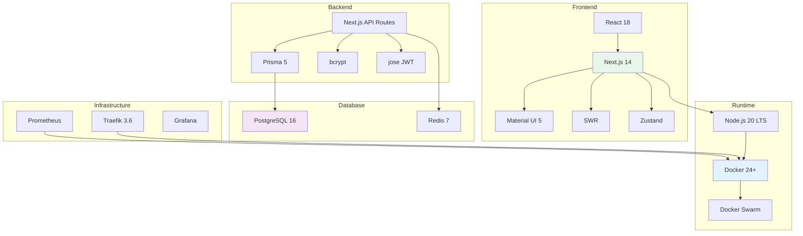

# Technology Stack

**Document Type**: Technology Architecture  
**Status**: Draft  
**Version**: 1.0  
**Last Updated**: 2024-12-30  
**Owner**: Architecture Team, Platform Team  

---

## Purpose

This document provides a comprehensive inventory of all technologies used in Dokploy, including versions, purposes, licensing, and update strategies. This serves as the definitive reference for technology decisions and dependencies.

---

## Stack Overview



---

## Core Platform

### Runtime Environment

#### Node.js
- **Version**: 20.x LTS (Hydrogen)
- **Release Date**: 2023-10-24
- **LTS Until**: 2026-04-30
- **Purpose**: JavaScript runtime for Next.js application
- **Installation**: via nvm or system package manager
- **Configuration**:
  ```bash
  NODE_ENV=production
  NODE_OPTIONS=--max-old-space-size=4096
  ```
- **Rationale**: LTS support, performance, ecosystem compatibility
- **Alternative Considered**: Bun (too early, limited ecosystem)
- **Update Strategy**: Update to latest LTS within 30 days of release

#### Docker Engine
- **Version**: 24.0+ (Community Edition)
- **Release Date**: 2023-05-16
- **Purpose**: Container runtime and orchestration
- **Required Features**:
  - Docker Swarm mode
  - BuildKit
  - Multi-stage builds
  - Secrets management
- **Installation**:
  ```bash
  curl -fsSL https://get.docker.com | sh
  ```
- **Configuration**:
  ```json
  {
    "features": {
      "buildkit": true
    },
    "log-driver": "json-file",
    "log-opts": {
      "max-size": "10m",
      "max-file": "3"
    }
  }
  ```
- **Rationale**: Industry standard, mature, extensive ecosystem
- **Alternative Considered**: Podman (lacks Swarm equivalent)
- **Update Strategy**: Update to stable within 30 days

#### Docker Swarm
- **Version**: Included with Docker 24.0+
- **Purpose**: Container orchestration
- **Advantages**:
  - Built into Docker
  - Simple setup
  - Low resource overhead
  - Native Docker Compose support
- **Limitations**:
  - Less features than Kubernetes
  - Smaller ecosystem
  - Limited cloud provider support
- **Rationale**: See ADR-001
- **Update Strategy**: Follows Docker Engine version

---

## Frontend Stack

### Core Framework

#### React
- **Version**: 18.2.0
- **Release Date**: 2023-03-22
- **Purpose**: UI library for component-based architecture
- **Key Features Used**:
  - Hooks (useState, useEffect, useContext)
  - Concurrent features (Suspense, lazy)
  - Server Components (via Next.js)
- **Bundle Size**: ~45KB (minified + gzipped)
- **License**: MIT
- **Update Strategy**: Update to minor versions within 60 days

#### Next.js
- **Version**: 14.0.4
- **Release Date**: 2023-10-26
- **Purpose**: React framework with SSR, SSG, API routes
- **Architecture**: App Router (not Pages Router)
- **Key Features Used**:
  - App Router
  - Server Components
  - API Routes
  - Image Optimization
  - Built-in Font Optimization
  - Incremental Static Regeneration
- **Bundle Size**: Variable (code splitting)
- **License**: MIT
- **Rationale**: See ADR-002
- **Update Strategy**: Update to minor versions within 30 days

### UI Components

#### Material UI (MUI)
- **Version**: 5.15.0
- **Release Date**: 2023-12-15
- **Purpose**: React component library
- **Components Used**:
  - Layout: Box, Container, Grid, Stack
  - Inputs: Button, TextField, Select, Checkbox
  - Data Display: Table, Card, Chip, Avatar
  - Feedback: Alert, Dialog, Snackbar
  - Navigation: Drawer, AppBar, Tabs
- **Theme**: Custom theme with dark mode support
- **Bundle Size**: ~100KB (tree-shaken)
- **License**: MIT
- **Rationale**: Comprehensive, accessible, themeable
- **Alternative Considered**: Chakra UI (less feature-complete)
- **Update Strategy**: Update to minor versions within 60 days

#### Material Icons
- **Version**: 5.15.0
- **Purpose**: Icon library
- **Icons Used**: ~50 icons
- **Bundle Size**: ~5KB (tree-shaken)
- **License**: Apache 2.0

### State Management

#### SWR
- **Version**: 2.2.4
- **Release Date**: 2023-11-08
- **Purpose**: Data fetching and caching
- **Features Used**:
  - Automatic revalidation
  - Optimistic updates
  - Mutation
  - Pagination
  - Real-time updates
- **Bundle Size**: ~5KB
- **License**: MIT
- **Configuration**:
  ```typescript
  {
    revalidateOnFocus: false,
    revalidateOnReconnect: true,
    dedupingInterval: 2000,
    errorRetryCount: 3
  }
  ```

#### Zustand
- **Version**: 4.4.7
- **Release Date**: 2023-11-20
- **Purpose**: Lightweight state management
- **Use Cases**:
  - UI state (sidebar, theme)
  - Client-side preferences
  - Temporary form state
- **Bundle Size**: ~1KB
- **License**: MIT
- **Rationale**: Simpler than Redux, better DX than Context

### Form Handling

#### React Hook Form
- **Version**: 7.49.2
- **Release Date**: 2023-12-10
- **Purpose**: Form state management and validation
- **Bundle Size**: ~9KB
- **License**: MIT

#### Zod
- **Version**: 3.22.4
- **Release Date**: 2023-11-15
- **Purpose**: Schema validation
- **Bundle Size**: ~12KB
- **License**: MIT
- **Example**:
  ```typescript
  const schema = z.object({
    name: z.string().min(3).max(50),
    email: z.string().email()
  });
  ```

---

## Backend Stack

### API Layer

#### Next.js API Routes
- **Version**: 14.0.4 (same as frontend)
- **Purpose**: RESTful API endpoints
- **Architecture**: File-based routing in `app/api/`
- **Middleware**: Authentication, RBAC, rate limiting
- **Response Format**: JSON
- **Error Handling**: Standardized error responses

### Authentication

#### NextAuth.js
- **Version**: 5.0.0-beta.4
- **Release Date**: 2023-12-01
- **Purpose**: Authentication framework
- **Providers**:
  - Credentials (local authentication)
  - OIDC (generic OpenID Connect)
- **Session**: JWT + Redis
- **License**: ISC

#### bcrypt
- **Version**: 5.1.1
- **Release Date**: 2023-08-19
- **Purpose**: Password hashing
- **Configuration**: Cost factor 12
- **License**: MIT

#### jose
- **Version**: 5.1.3
- **Release Date**: 2023-11-28
- **Purpose**: JWT generation and verification
- **Algorithm**: HS256/RS256
- **License**: MIT

### Database Access

#### Prisma ORM
- **Version**: 5.7.1
- **Release Date**: 2023-12-14
- **Purpose**: Type-safe database client
- **Features Used**:
  - Type generation
  - Migrations
  - Query builder
  - Connection pooling
  - Middleware
- **Database**: PostgreSQL
- **License**: Apache 2.0
- **Configuration**:
  ```prisma
  datasource db {
    provider = "postgresql"
    url      = env("DATABASE_URL")
  }
  
  generator client {
    provider = "prisma-client-js"
    previewFeatures = ["fullTextSearch"]
  }
  ```

### Caching & Queue

#### ioredis
- **Version**: 5.3.2
- **Release Date**: 2023-06-15
- **Purpose**: Redis client
- **Features Used**:
  - Key-value operations
  - Pub/Sub
  - Pipeline
  - Cluster support
- **License**: MIT

#### BullMQ
- **Version**: 5.1.1
- **Release Date**: 2023-11-30
- **Purpose**: Job queue management
- **Features Used**:
  - Job scheduling
  - Retry logic
  - Priority queues
  - Job lifecycle events
- **License**: MIT
- **Use Cases**:
  - Build jobs
  - Deployment orchestration
  - Backup tasks

### Docker Integration

#### dockerode
- **Version**: 4.0.0
- **Release Date**: 2023-10-12
- **Purpose**: Docker API client
- **Features Used**:
  - Container management
  - Image building
  - Service management (Swarm)
  - Volume management
  - Network management
- **License**: Apache 2.0

#### simple-git
- **Version**: 3.21.0
- **Release Date**: 2023-11-22
- **Purpose**: Git operations
- **Features Used**:
  - Clone repositories
  - Checkout branches
  - Pull updates
  - Get commit info
- **License**: MIT

---

## Database Layer

### Primary Database

#### PostgreSQL
- **Version**: 16.1
- **Release Date**: 2023-11-09
- **End of Life**: 2028-11-09
- **Purpose**: Primary relational database
- **Key Features Used**:
  - JSONB columns
  - Full-text search
  - Row-level security
  - Partitioning
  - Replication
- **Extensions**:
  - `uuid-ossp`: UUID generation
  - `pg_trgm`: Trigram similarity search
  - `pg_stat_statements`: Query statistics
- **Configuration**:
  ```ini
  max_connections = 100
  shared_buffers = 256MB
  effective_cache_size = 1GB
  maintenance_work_mem = 64MB
  work_mem = 4MB
  ```
- **License**: PostgreSQL License (similar to MIT/BSD)
- **Rationale**: See ADR-003
- **Update Strategy**: Update to minor versions within 60 days

### Cache & Session Store

#### Redis
- **Version**: 7.2.3
- **Release Date**: 2023-10-18
- **Purpose**: Caching, session storage, job queue
- **Data Structures Used**:
  - String (cache values)
  - Hash (session data)
  - List (job queues)
  - Set (unique collections)
- **Persistence**: AOF + RDB snapshots
- **Configuration**:
  ```ini
  maxmemory 512mb
  maxmemory-policy allkeys-lru
  save 900 1
  save 300 10
  ```
- **License**: BSD-3-Clause (changed from Redis license in v7.4)
- **Update Strategy**: Update to stable within 60 days

---

## Infrastructure Layer

### Reverse Proxy & Load Balancer

#### Traefik
- **Version**: 3.6.1
- **Release Date**: 2023-12-05
- **Purpose**: Reverse proxy, load balancer, TLS termination
- **Key Features Used**:
  - Dynamic configuration
  - Let's Encrypt integration
  - Docker provider
  - Middleware (auth, rate limiting, compression)
  - Metrics (Prometheus)
  - Access logs
- **Configuration**: File-based + Docker labels
- **License**: MIT
- **Rationale**: Dynamic configuration, Docker-native, automatic TLS
- **Alternative Considered**: Nginx (requires manual config updates)
- **Update Strategy**: Update to minor versions within 30 days

### Monitoring

#### Prometheus
- **Version**: 2.48.0
- **Release Date**: 2023-11-16
- **Purpose**: Metrics collection and storage
- **Scraped Targets**:
  - Traefik
  - Node Exporter
  - cAdvisor
  - Application metrics
- **Retention**: 15 days
- **Storage**: Local time-series database
- **License**: Apache 2.0

#### Grafana
- **Version**: 10.2.2
- **Release Date**: 2023-11-21
- **Purpose**: Metrics visualization
- **Dashboards**:
  - System overview
  - Application metrics
  - Docker Swarm status
  - Traefik metrics
- **Data Source**: Prometheus
- **License**: AGPL 3.0 (OSS edition)

#### Node Exporter
- **Version**: 1.7.0
- **Release Date**: 2023-11-11
- **Purpose**: System metrics collection
- **Metrics**: CPU, memory, disk, network
- **License**: Apache 2.0

#### cAdvisor
- **Version**: 0.47.2
- **Release Date**: 2023-08-30
- **Purpose**: Container metrics
- **Metrics**: Container CPU, memory, network, filesystem
- **License**: Apache 2.0

---

## Development Tools

### Version Control

#### Git
- **Version**: 2.43+
- **Purpose**: Source control
- **Hosting**: GitHub / GitLab
- **License**: GPL 2.0

#### GitHub Actions
- **Purpose**: CI/CD automation
- **Workflows**:
  - Build and test
  - Docker image build
  - Release automation
- **License**: GitHub Terms

### Build Tools

#### Docker BuildKit
- **Version**: Included with Docker 24+
- **Purpose**: Advanced image building
- **Features Used**:
  - Multi-stage builds
  - Build cache
  - Secrets mounting
  - Parallel builds
- **Configuration**:
  ```dockerfile
  # syntax=docker/dockerfile:1.4
  FROM node:20-alpine AS builder
  ...
  ```

#### esbuild
- **Version**: Included with Next.js
- **Purpose**: JavaScript bundling
- **Performance**: 10-100x faster than Webpack
- **License**: MIT

### Testing

#### Jest
- **Version**: 29.7.0
- **Release Date**: 2023-09-13
- **Purpose**: Unit testing framework
- **Configuration**:
  ```javascript
  {
    testEnvironment: 'node',
    collectCoverage: true,
    coverageThreshold: {
      global: { branches: 80, functions: 80, lines: 80 }
    }
  }
  ```
- **License**: MIT

#### React Testing Library
- **Version**: 14.1.2
- **Release Date**: 2023-11-08
- **Purpose**: React component testing
- **License**: MIT

#### Playwright
- **Version**: 1.40.1
- **Release Date**: 2023-12-06
- **Purpose**: End-to-end testing
- **Browsers**: Chromium, Firefox, WebKit
- **License**: Apache 2.0

### Code Quality

#### ESLint
- **Version**: 8.56.0
- **Release Date**: 2023-12-15
- **Purpose**: JavaScript linting
- **Config**: Next.js recommended
- **License**: MIT

#### Prettier
- **Version**: 3.1.1
- **Release Date**: 2023-12-05
- **Purpose**: Code formatting
- **License**: MIT

#### TypeScript
- **Version**: 5.3.3
- **Release Date**: 2023-11-16
- **Purpose**: Type checking
- **Configuration**:
  ```json
  {
    "compilerOptions": {
      "target": "ES2022",
      "lib": ["ES2022"],
      "strict": true,
      "esModuleInterop": true,
      "skipLibCheck": true,
      "forceConsistentCasingInFileNames": true
    }
  }
  ```
- **License**: Apache 2.0

---

## Storage

### Docker Volumes
- **Purpose**: Persistent data storage
- **Driver**: local
- **Volumes**:
  - `postgres-data`: PostgreSQL data directory
  - `redis-data`: Redis persistence
  - `traefik-certs`: TLS certificates
  - `app-volumes`: Application data

### S3-Compatible Storage (Optional)
- **Providers**: AWS S3, MinIO, Backblaze B2, DigitalOcean Spaces
- **Purpose**: Backup storage
- **Protocol**: S3 API
- **Client**: AWS SDK for JavaScript

---

## Security

### TLS/SSL

#### Let's Encrypt
- **Purpose**: Free TLS certificates
- **ACME Protocol**: HTTP-01, TLS-ALPN-01
- **Renewal**: Automatic via Traefik
- **Rate Limits**: 50 certificates/week per domain

### Secrets Management

#### Docker Secrets
- **Purpose**: Sensitive data storage
- **Scope**: Swarm services
- **Storage**: Encrypted in Swarm raft log
- **Secrets**:
  - Database passwords
  - JWT signing keys
  - API keys
  - OIDC client secrets

---

## Version Matrix

| Component | Current Version | Release Date | EOL/LTS Until | Update Priority |
|-----------|----------------|--------------|---------------|-----------------|
| Node.js | 20.x LTS | 2023-10-24 | 2026-04-30 | Medium |
| Docker | 24.0+ | 2023-05-16 | Active | High |
| PostgreSQL | 16.1 | 2023-11-09 | 2028-11-09 | Medium |
| Redis | 7.2.3 | 2023-10-18 | Active | Medium |
| Next.js | 14.0.4 | 2023-10-26 | Active | High |
| React | 18.2.0 | 2023-03-22 | Active | Medium |
| Traefik | 3.6.1 | 2023-12-05 | Active | High |
| Prisma | 5.7.1 | 2023-12-14 | Active | Medium |
| TypeScript | 5.3.3 | 2023-11-16 | Active | Medium |
| Material UI | 5.15.0 | 2023-12-15 | Active | Low |

---

## License Compliance

### License Types

| License | Components | Commercial Use | Attribution Required | Copyleft |
|---------|-----------|----------------|---------------------|----------|
| MIT | Next.js, React, Prisma, Traefik, many others | ✅ Yes | ⚠️ Optional | ❌ No |
| Apache 2.0 | PostgreSQL driver, dockerode, TypeScript | ✅ Yes | ⚠️ Optional | ❌ No |
| BSD-3-Clause | Redis | ✅ Yes | ✅ Yes | ❌ No |
| ISC | NextAuth.js | ✅ Yes | ⚠️ Optional | ❌ No |
| AGPL 3.0 | Grafana (OSS) | ⚠️ Restricted | ✅ Yes | ✅ Yes |

### Compliance Notes

1. **MIT & Apache 2.0**: Most permissive, safe for commercial use
2. **BSD-3-Clause**: Requires attribution, but permissive
3. **AGPL 3.0** (Grafana): Network copyleft - modifications must be open source if hosted
   - **Mitigation**: Use as-is without modifications, or use proprietary Grafana Enterprise

### License File
All licenses compiled in: `/licenses/THIRD_PARTY_LICENSES.md`

---

## Dependency Management

### Package Managers

#### npm
- **Version**: 10.x (included with Node.js 20)
- **Purpose**: JavaScript package management
- **Lock File**: `package-lock.json`
- **Scripts**:
  ```json
  {
    "dev": "next dev",
    "build": "next build",
    "start": "next start",
    "test": "jest",
    "lint": "eslint .",
    "format": "prettier --write ."
  }
  ```

### Dependency Security

#### npm audit
- **Frequency**: Weekly automated scan
- **Action**: Fix critical/high vulnerabilities within 48 hours

#### Dependabot
- **Provider**: GitHub
- **Configuration**:
  ```yaml
  version: 2
  updates:
    - package-ecosystem: "npm"
      directory: "/"
      schedule:
        interval: "weekly"
      open-pull-requests-limit: 10
  ```

#### Snyk (Optional)
- **Purpose**: Vulnerability scanning
- **Integration**: GitHub Actions

---

## Update Strategy

### Critical Security Patches
- **Timeline**: Within 48 hours
- **Process**:
  1. Assess vulnerability impact
  2. Test in staging
  3. Deploy to production
  4. Notify users if necessary

### Node.js LTS Updates
- **Timeline**: Within 30 days of LTS release
- **Process**:
  1. Update Docker base image
  2. Test compatibility
  3. Update CI/CD
  4. Deploy

### PostgreSQL Minor Updates
- **Timeline**: Within 60 days
- **Process**:
  1. Test on staging database
  2. Create backup
  3. Update production
  4. Verify migrations

### Docker Engine Updates
- **Timeline**: Within 30 days of stable release
- **Process**:
  1. Test on staging swarm
  2. Rolling update of workers
  3. Update managers one at a time

### Frontend Dependencies
- **Timeline**: Quarterly review
- **Process**:
  1. Review changelogs
  2. Update in development
  3. Run full test suite
  4. Deploy after QA approval

---

## Performance Benchmarks

### Build Times
- **Development build**: ~5 seconds (hot reload)
- **Production build**: ~45 seconds (full optimization)
- **Docker image build**: 2-5 minutes (with cache)

### Bundle Sizes
- **Initial JavaScript**: ~120KB (gzipped)
- **Initial CSS**: ~15KB (gzipped)
- **First Contentful Paint**: <1.5s
- **Time to Interactive**: <3s

### Database Performance
- **PostgreSQL**:
  - Simple queries: <5ms
  - Complex joins: <50ms
  - Full-text search: <100ms
- **Redis**:
  - GET operations: <1ms
  - SET operations: <1ms

---

## Cloud Provider Compatibility

### Tested Platforms

| Provider | Compatibility | Notes |
|----------|--------------|-------|
| AWS | ✅ Full | EC2, RDS, ElastiCache, ALB |
| DigitalOcean | ✅ Full | Droplets, Managed Databases, Load Balancers |
| Hetzner | ✅ Full | Cloud Servers, excellent price/performance |
| Azure | ✅ Full | VMs, Azure Database, Azure Cache |
| GCP | ✅ Full | Compute Engine, Cloud SQL, Memorystore |
| Linode | ✅ Full | Compute Instances, Managed Databases |
| Vultr | ✅ Full | Cloud Compute, Managed Databases |
| OVH | ⚠️ Partial | Limited managed services |
| Bare Metal | ✅ Full | Any Linux server with Docker |

### Minimum Requirements
- **CPU**: 2 cores (4+ recommended)
- **RAM**: 2GB (4GB+ recommended)
- **Disk**: 20GB SSD (40GB+ recommended)
- **Network**: 1Gbps (10Gbps+ for high traffic)

---

## Related Documents

- **ADR-001**: Docker Swarm technology selection
- **ADR-002**: Next.js framework selection
- **ADR-003**: PostgreSQL database selection
- **Component Diagram**: Application architecture
- **Deployment Diagram**: Infrastructure topology
- **API Specification**: API technology details

---

**Document Version**: 1.0  
**Last Updated**: 2024-12-30  
**Next Review**: 2025-03-30  
**Reviewed By**: Architecture Team, Platform Team, Security Team
