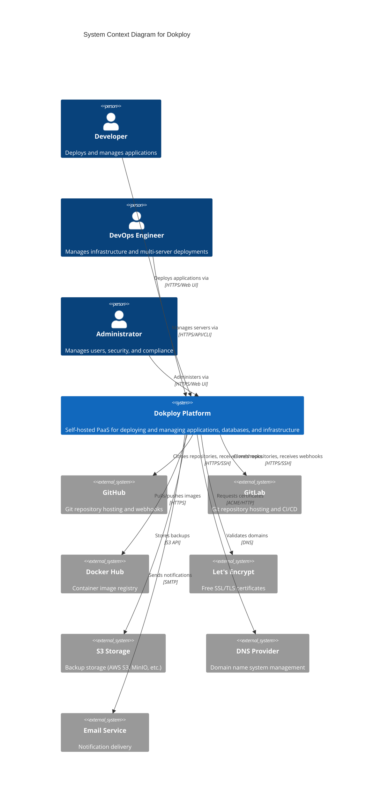

# C4 Context Diagram - Dokploy System

**Document Type**: Architecture View - Context Level  
**C4 Model Level**: Level 1 - System Context  
**Version**: 1.0  
**Date**: 2024-12-30  

---

## Overview

This diagram shows the Dokploy system at the highest level of abstraction, illustrating how it fits into the world around it. It shows the key users/actors and the external systems that Dokploy integrates with.

## System Context Diagram

## Actors

### Primary Users

| Actor | Description | Responsibilities |
|-------|-------------|------------------|
| **Developer** | Software developers deploying applications | - Deploy applications from Git - Configure domains and SSL - View logs and metrics - Manage environment variables |
| **DevOps Engineer** | Infrastructure and operations specialists | - Configure remote servers - Manage multi-server deployments - Monitor system health - Perform backups and recovery |
| **Administrator** | System administrators and security officers | - Manage user accounts and permissions - Configure security settings - Review audit logs - Ensure compliance |

## External Systems

### Integration Points

#### Git Providers
- **GitHub**: Primary Git hosting, OAuth authentication, webhooks
- **GitLab**: Self-hosted and cloud Git, CI/CD integration
- **Bitbucket**: Git hosting for Atlassian users
- **Gitea**: Self-hosted lightweight Git service

**Integration Type**: Pull (clone repos), Push (webhooks)  
**Protocol**: HTTPS, SSH, Git  
**Authentication**: OAuth, SSH keys, personal access tokens

#### Container Registries
- **Docker Hub**: Public and private image registry
- **GitHub Container Registry**: GitHub-integrated registry
- **GitLab Container Registry**: GitLab-integrated registry
- **Private Registries**: Self-hosted registries

**Integration Type**: Pull/Push  
**Protocol**: Docker Registry API v2  
**Authentication**: Username/password, tokens

#### Certificate Authorities
- **Let's Encrypt**: Free automated SSL/TLS certificates
- **ZeroSSL**: Alternative free CA
- **Custom CA**: Enterprise certificate authorities

**Integration Type**: Certificate issuance and renewal  
**Protocol**: ACME (HTTP-01, DNS-01)  
**Authentication**: Domain validation

#### Backup Storage
- **AWS S3**: Amazon cloud object storage
- **MinIO**: S3-compatible self-hosted storage
- **Backblaze B2**: Cost-effective cloud storage
- **DigitalOcean Spaces**: S3-compatible storage

**Integration Type**: Backup upload/download  
**Protocol**: S3 API  
**Authentication**: Access keys, IAM

#### DNS Providers
- **Cloudflare**: DNS management and CDN
- **Route53**: AWS DNS service
- **Custom DNS**: Any DNS provider

**Integration Type**: Domain validation  
**Protocol**: DNS queries  
**Authentication**: API keys (for DNS-01 challenge)

#### Notification Services
- **SMTP Services**: Email delivery
- **Slack**: Team messaging
- **Discord**: Community chat
- **Microsoft Teams**: Enterprise communication
- **Telegram**: Instant messaging
- **Webhooks**: Custom integrations

**Integration Type**: Push notifications  
**Protocol**: SMTP, Webhooks, REST APIs  
**Authentication**: API tokens, SMTP credentials

## Key Interactions

### Deployment Flow
1. **Developer** pushes code to **GitHub**
2. **GitHub** sends webhook to **Dokploy**
3. **Dokploy** clones repository from **GitHub**
4. **Dokploy** builds and deploys application
5. **Dokploy** pulls base images from **Docker Hub**
6. **Dokploy** requests SSL certificate from **Let's Encrypt**
7. Application is accessible to end users

### Backup Flow
1. **Administrator** schedules backup via **Dokploy**
2. **Dokploy** creates database dump
3. **Dokploy** uploads backup to **S3 Storage**
4. **Dokploy** sends confirmation via **Email Service**

### Multi-Server Deployment
1. **DevOps Engineer** adds remote server to **Dokploy**
2. **Dokploy** connects via SSH
3. **Dokploy** installs Docker if needed
4. **Dokploy** deploys application to remote server
5. **Dokploy** configures load balancing via Traefik

## System Boundaries

### Dokploy Platform Responsibilities
- Application lifecycle management
- Database creation and management
- SSL certificate automation
- Multi-server orchestration
- Monitoring and logging
- User authentication and authorization
- Backup scheduling and execution

### External System Responsibilities
- Source code hosting (Git providers)
- Container image storage (registries)
- Certificate issuance (Let's Encrypt)
- Backup storage (S3)
- DNS management (DNS providers)
- Email delivery (SMTP services)

## Network Protocols

| Protocol | Usage | Port |
|----------|-------|------|
| HTTPS | Web UI, API, Webhooks | 443 |
| HTTP | Development, redirects | 80 |
| SSH | Git clone, remote servers | 22 |
| Git | Repository operations | 9418 |
| Docker Registry | Image push/pull | 443 |
| ACME | Certificate issuance | 443/80 |
| SMTP | Email notifications | 587/465 |

## Security Boundaries

### Trust Zones

1. **Internal Zone**: Dokploy platform components
   - Next.js application
   - PostgreSQL database
   - Redis queue
   - Traefik proxy

2. **External Zone**: Third-party services
   - Git providers
   - Container registries
   - Certificate authorities
   - Backup storage

3. **User Zone**: Application users
   - Developers
   - DevOps engineers
   - Administrators

### Authentication Methods

- **UI Access**: Session-based authentication with 2FA
- **API Access**: API key authentication, JWT tokens
- **Git Access**: OAuth, SSH keys, personal access tokens
- **Registry Access**: Username/password, tokens
- **Backup Access**: S3 access keys, IAM roles

## Constraints and Assumptions

### Assumptions
1. Users have access to a Git provider (GitHub, GitLab, etc.)
2. Users manage their own DNS configuration
3. Internet connectivity is available for external integrations
4. Users provide their own S3-compatible storage for backups
5. SMTP service is optional (notifications can be disabled)

### Constraints
1. Must support standard Git protocol (HTTPS, SSH)
2. Must comply with Let's Encrypt rate limits
3. Must respect Docker registry API standards
4. Must use S3-compatible API for backup storage
5. Must support standard ACME protocol for SSL

## Related Diagrams

- **Container Diagram**: Shows internal structure of Dokploy system
- **Component Diagram**: Details components within containers
- **Deployment Diagram**: Physical deployment architecture
- **Security View**: Detailed security architecture

---

**Document Owner**: Architecture Team  
**Related Standards**: C4 Model, TOGAF ADM Phase C  
**Next Level**: Container Diagram  
**Review Cycle**: Quarterly
