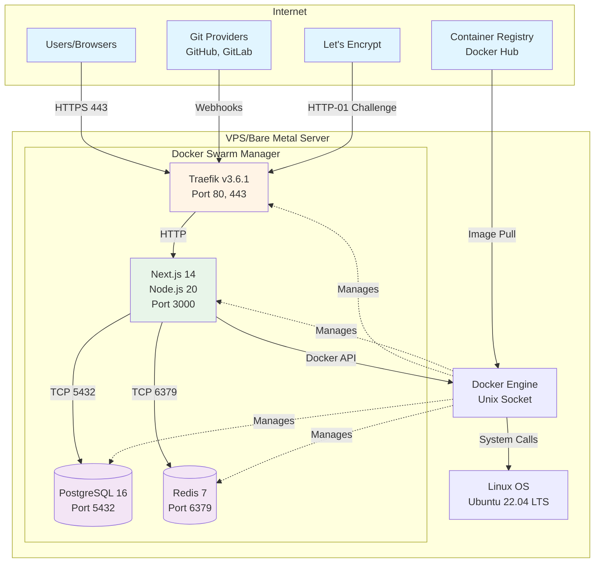
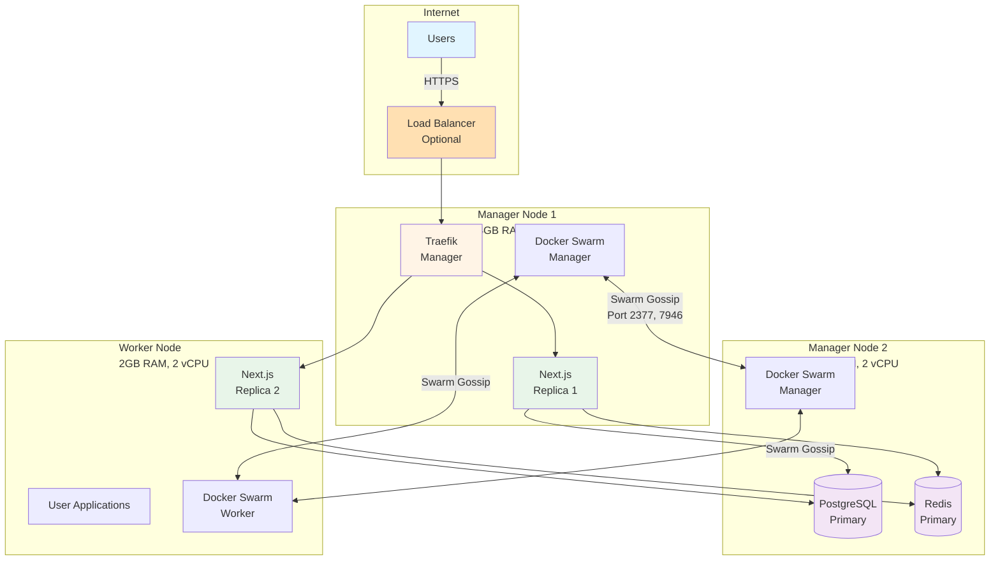
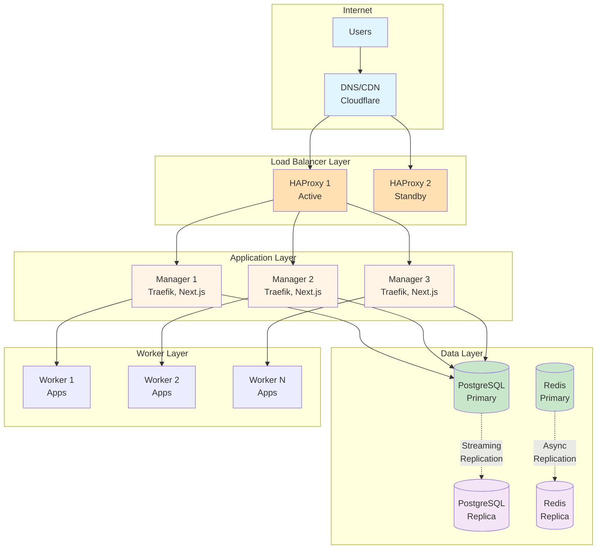

# Deployment Architecture Diagram

**Document Type**: Architecture View  
**Status**: Draft  
**Version**: 1.0  
**Last Updated**: 2024-12-30  
**Owner**: Architecture Team  

---

## Purpose

This document illustrates how Dokploy components are deployed onto physical and virtual infrastructure. It shows the mapping of software containers to hardware/virtual machines, network topology, and deployment patterns for different scales.

---

## Deployment Overview

Dokploy supports three primary deployment patterns:
1. **Single-Server** (Recommended start): All components on one host
2. **Multi-Server** (Scaling): Distributed across multiple nodes
3. **High-Availability** (Enterprise): Redundant components with failover

---

## Single-Server Deployment

### Topology



### Infrastructure Specifications

**Minimum Requirements**:
- **CPU**: 2 vCPU cores
- **RAM**: 2GB (4GB recommended)
- **Disk**: 40GB SSD
- **Network**: 1 Gbps, public IPv4
- **OS**: Linux (Ubuntu 22.04 LTS, Debian 12, RHEL 9)

**Recommended VPS Providers**:
- DigitalOcean: Basic Droplet ($12/month)
- Hetzner: CX21 ($5/month)
- Vultr: Regular Performance ($6/month)
- Linode: Nanode 2GB ($12/month)

### Network Configuration

**Firewall Rules**:
```bash
# Incoming
22/tcp   - SSH (management, restrict to admin IPs)
80/tcp   - HTTP (redirect to HTTPS)
443/tcp  - HTTPS (Traefik)

# Outgoing
80/tcp   - Package updates, container registries
443/tcp  - GitHub, GitLab, Let's Encrypt

# Internal (Docker overlay network)
All traffic allowed between containers
```

**DNS Requirements**:
- A record: `dokploy.yourdomain.com` → Server IP
- Wildcard: `*.dokploy.yourdomain.com` → Server IP (optional, for app subdomains)

### Resource Allocation

```yaml
# Docker Compose resource limits
services:
  traefik:
    deploy:
      resources:
        limits:
          memory: 128M
          cpus: '0.2'
        reservations:
          memory: 64M
  
  dokploy:
    deploy:
      resources:
        limits:
          memory: 512M
          cpus: '0.5'
        reservations:
          memory: 256M
  
  postgres:
    deploy:
      resources:
        limits:
          memory: 512M
          cpus: '0.5'
        reservations:
          memory: 256M
  
  redis:
    deploy:
      resources:
        limits:
          memory: 128M
          cpus: '0.2'
        reservations:
          memory: 64M

# Total: ~1.3GB RAM, 1.4 CPUs
# Leaves headroom for user applications
```

### Storage Layout

```
/
├── /var/lib/docker/              # Docker data
│   ├── volumes/
│   │   ├── dokploy_postgres/     # PostgreSQL data (~100MB-10GB)
│   │   ├── dokploy_redis/        # Redis persistence (~10-100MB)
│   │   └── traefik_certs/        # TLS certificates (~10MB)
│   ├── overlay2/                 # Container layers
│   └── swarm/                    # Swarm state
├── /var/backups/dokploy/         # Database backups
└── /var/log/dokploy/             # Application logs
```

---

## Multi-Server Deployment (3-Node Cluster)

### Topology



### Node Roles

**Manager Nodes (Quorum: 2)**:
- Run control plane
- Manage Swarm state
- Can run workloads
- Recommend 3 or 5 managers for HA

**Worker Nodes**:
- Run user applications
- No control plane overhead
- Can scale horizontally
- Join via token from manager

### Network Requirements

**Ports Between Nodes**:
```
2377/tcp  - Swarm management (manager to manager)
7946/tcp  - Container network discovery (all nodes)
7946/udp  - Container network discovery (all nodes)
4789/udp  - Overlay network traffic (all nodes)
```

**Overlay Networks**:
```yaml
networks:
  dokploy-ingress:
    driver: overlay
    attachable: true
    ipam:
      config:
        - subnet: 10.0.10.0/24
  
  dokploy-app:
    driver: overlay
    internal: false
    ipam:
      config:
        - subnet: 10.0.20.0/24
  
  dokploy-data:
    driver: overlay
    internal: true
    ipam:
      config:
        - subnet: 10.0.30.0/24
```

### Service Distribution

```yaml
# Traefik: Only on manager nodes with public IP
traefik:
  deploy:
    placement:
      constraints:
        - node.role == manager
        - node.labels.public_ip == true
    replicas: 2

# Next.js: Distribute across all nodes
dokploy:
  deploy:
    placement:
      constraints:
        - node.role == manager || node.role == worker
    replicas: 3
    update_config:
      parallelism: 1
      delay: 10s

# PostgreSQL: Pin to specific manager node
postgres:
  deploy:
    placement:
      constraints:
        - node.labels.db == primary
    replicas: 1

# Redis: Pin to same node as PostgreSQL
redis:
  deploy:
    placement:
      constraints:
        - node.labels.db == primary
    replicas: 1

# User apps: Workers only (isolate from control plane)
user-app:
  deploy:
    placement:
      constraints:
        - node.role == worker
```

---

## High-Availability Deployment

### Topology



### High-Availability Features

**Load Balancer**:
- Active-passive HAProxy pair with Keepalived
- Virtual IP (VIP) failover
- Health check every 5 seconds
- Automatic failover <10 seconds

**Application Layer**:
- 3+ Swarm manager nodes (maintains quorum if 1 fails)
- Traefik replicas on each manager
- Next.js scaled to 3+ replicas
- Rolling updates with 1 replica at a time

**Data Layer**:
- PostgreSQL streaming replication (sync or async)
- Redis replication (optional, for session persistence)
- Automated backups to S3-compatible storage
- Point-in-time recovery enabled

**Worker Layer**:
- N workers for horizontal scaling
- Automatic rescheduling on node failure
- Isolated from control plane

### Failover Scenarios

**Scenario 1: Single Manager Failure**
- Swarm quorum maintained (2 of 3 alive)
- Workloads automatically rescheduled
- No manual intervention required
- Recovery time: <30 seconds

**Scenario 2: Database Primary Failure**
- Promote replica to primary (manual or automated)
- Update connection strings
- Recovery time: 1-5 minutes (manual), <1 minute (automated)

**Scenario 3: Load Balancer Failure**
- Keepalived detects failure via health check
- VIP moves to standby load balancer
- Recovery time: <10 seconds

**Scenario 4: Worker Node Failure**
- Swarm detects failure (heartbeat timeout)
- Reschedules tasks on healthy workers
- Recovery time: 30-60 seconds

---

## Deployment Environments

### Development

**Purpose**: Local development and testing

```yaml
# docker-compose.dev.yml
services:
  dokploy:
    build: .
    volumes:
      - ./src:/app/src  # Hot reload
      - /var/run/docker.sock:/var/run/docker.sock
    environment:
      - NODE_ENV=development
      - LOG_LEVEL=debug
    ports:
      - "3000:3000"  # Expose for local access
  
  postgres:
    image: postgres:16-alpine
    ports:
      - "5432:5432"  # Expose for debugging
    environment:
      - POSTGRES_DB=dokploy_dev
```

**Characteristics**:
- Hot reload enabled
- Debug logging
- Ports exposed to host
- No TLS required
- Ephemeral data (okay to lose)

### Staging

**Purpose**: Pre-production testing, QA

**Infrastructure**:
- Single VPS (2GB RAM)
- Matches production architecture
- TLS enabled (Let's Encrypt staging)
- Separate domain: `staging.dokploy.yourdomain.com`

**Characteristics**:
- Production-like environment
- Smaller resource allocation
- Automated deployments from `develop` branch
- Can reset/destroy without impact

### Production

**Purpose**: Live user traffic

**Infrastructure**:
- Multi-server or HA deployment
- Full monitoring and alerting
- Automated backups
- TLS enabled (Let's Encrypt production)
- Domain: `dokploy.yourdomain.com`

**Characteristics**:
- Maximum reliability
- Performance optimized
- Security hardened
- Change control process
- Automated deployments from `main` branch

---

## Cloud Provider Mappings

### AWS Deployment

```yaml
# Infrastructure
- EC2 Instances: t3.medium (2 vCPU, 4GB RAM)
- EBS Volumes: gp3 (100 IOPS/GB)
- Elastic IP: Static IP for each manager
- Security Groups: Firewall rules
- VPC: Private network (10.0.0.0/16)

# Optional
- RDS PostgreSQL: Managed database (HA)
- ElastiCache: Managed Redis
- ALB: Application Load Balancer (instead of Traefik)
- Route 53: DNS management
```

### Azure Deployment

```yaml
# Infrastructure
- Virtual Machines: Standard_B2s (2 vCPU, 4GB RAM)
- Managed Disks: Premium SSD
- Public IP: Static IP per manager
- Network Security Groups: Firewall rules
- Virtual Network: 10.0.0.0/16

# Optional
- Azure Database for PostgreSQL: Managed DB
- Azure Cache for Redis: Managed Redis
- Application Gateway: Load balancer
- Azure DNS: DNS management
```

### Google Cloud Deployment

```yaml
# Infrastructure
- Compute Engine: e2-medium (2 vCPU, 4GB RAM)
- Persistent Disk: SSD (pd-ssd)
- Static IP: Reserve per manager
- Firewall Rules: VPC rules
- VPC Network: 10.0.0.0/16

# Optional
- Cloud SQL: Managed PostgreSQL
- Memorystore: Managed Redis
- Cloud Load Balancing: L7 load balancer
- Cloud DNS: DNS management
```

### DigitalOcean Deployment

```yaml
# Infrastructure
- Droplets: Basic 2GB ($12/month each)
- Block Storage: Volumes for data
- Reserved IP: Static IP per manager
- Firewall: Cloud firewall rules
- VPC: Private network

# Optional
- Managed Database: PostgreSQL cluster
- Load Balancer: DigitalOcean LB ($12/month)
- Spaces: Object storage (backups)
```

---

## Installation Process

### Single-Server Installation

```bash
# 1. Prepare server (Ubuntu 22.04)
sudo apt update && sudo apt upgrade -y

# 2. Install Docker
curl -fsSL https://get.docker.com | sh
sudo usermod -aG docker $USER

# 3. Initialize Swarm
docker swarm init --advertise-addr $(hostname -I | awk '{print $1}')

# 4. Install Dokploy
curl -sSL https://dokploy.com/install.sh | sudo bash

# 5. Configure domain
dokploy config set domain dokploy.yourdomain.com

# 6. Generate TLS certificate
dokploy ssl enable --email admin@yourdomain.com

# 7. Create admin user
dokploy user create admin --email admin@yourdomain.com

# 8. Access dashboard
echo "Visit: https://dokploy.yourdomain.com"
```

### Multi-Server Installation

```bash
# Manager Node 1 (First manager)
docker swarm init --advertise-addr <MANAGER1_IP>
docker swarm join-token manager  # Save token for other managers
docker swarm join-token worker   # Save token for workers

# Manager Node 2 & 3
docker swarm join --token <MANAGER_TOKEN> <MANAGER1_IP>:2377

# Worker Nodes
docker swarm join --token <WORKER_TOKEN> <MANAGER1_IP>:2377

# Install Dokploy on Manager 1
curl -sSL https://dokploy.com/install.sh | sudo bash --multi-server

# Label nodes
docker node update --label-add db=primary manager2
docker node update --label-add public_ip=true manager1
```

---

## Monitoring and Observability

### Metrics Collection

```yaml
# Prometheus exporters
- Docker metrics: Built-in Docker API
- Node metrics: node-exporter
- Application metrics: /metrics endpoint (Next.js)
- PostgreSQL metrics: postgres-exporter
```

### Dashboards

- **Grafana Dashboards**:
  - Dokploy Overview
  - Container Resource Usage
  - Swarm Cluster Health
  - PostgreSQL Performance
  - Application Metrics

### Alerting Rules

```yaml
alerts:
  - name: HighMemoryUsage
    condition: container_memory_usage > 90%
    action: Notify ops team
  
  - name: ServiceDown
    condition: service_replicas < expected_replicas
    action: Immediate page
  
  - name: DatabaseConnectionErrors
    condition: postgres_connection_errors > 10
    action: Notify ops team
```

---

## Backup and Disaster Recovery

### Backup Strategy

```bash
# Automated daily backups
#!/bin/bash
# /etc/cron.daily/dokploy-backup

# Database
docker exec postgres pg_dump -Fc dokploy > /backup/dokploy-$(date +%Y%m%d).dump

# Docker volumes
docker run --rm -v dokploy_postgres:/data -v /backup:/backup \
  alpine tar czf /backup/volumes-$(date +%Y%m%d).tar.gz /data

# Upload to S3
aws s3 sync /backup s3://dokploy-backups/$(hostname)/

# Retention: Keep 7 days local, 30 days remote
find /backup -mtime +7 -delete
```

### Recovery Procedures

**Full System Recovery**:
1. Provision new server
2. Install Docker and Dokploy
3. Restore latest database backup
4. Restore configuration secrets
5. Verify all services healthy
6. Update DNS if IP changed

**Estimated Recovery Time**: 15-30 minutes

---

## Security Hardening

### OS Level

```bash
# Firewall (UFW)
ufw default deny incoming
ufw default allow outgoing
ufw allow 22/tcp   # SSH
ufw allow 80/tcp   # HTTP
ufw allow 443/tcp  # HTTPS
ufw allow 2377/tcp # Swarm (from trusted IPs only)
ufw enable

# Automatic security updates
apt install unattended-upgrades
dpkg-reconfigure -plow unattended-upgrades

# Fail2ban
apt install fail2ban
systemctl enable fail2ban
```

### Docker Level

```bash
# Enable AppArmor/SELinux
aa-enforce /etc/apparmor.d/*

# Limit Docker socket access
chmod 660 /var/run/docker.sock
chown root:docker /var/run/docker.sock

# Enable userns-remap (user namespacing)
# /etc/docker/daemon.json
{
  "userns-remap": "default"
}
```

---

## Performance Tuning

### PostgreSQL

```conf
# /var/lib/postgresql/data/postgresql.conf
shared_buffers = 1GB              # 25% of RAM
effective_cache_size = 3GB        # 75% of RAM
maintenance_work_mem = 256MB
work_mem = 10MB
max_connections = 100
checkpoint_completion_target = 0.9
```

### Redis

```conf
# /usr/local/etc/redis/redis.conf
maxmemory 128mb
maxmemory-policy allkeys-lru
save 900 1    # Backup every 15 min if 1 key changed
save 300 10
save 60 10000
```

### Traefik

```yaml
# traefik.yml
entryPoints:
  web:
    address: ":80"
    http:
      redirections:
        entryPoint:
          to: websecure
          scheme: https
  websecure:
    address: ":443"
    http:
      tls:
        certResolver: letsencrypt

# Connection limits
api:
  dashboard: true

metrics:
  prometheus: {}
```

---

## Related Documents

- **Container Diagram**: Shows software containers and communication
- **Security View**: Security zones and trust boundaries
- **ADR-001**: Docker Swarm orchestration decision
- **ADR-003**: PostgreSQL deployment considerations

---

**Document Version**: 1.0  
**Last Updated**: 2024-12-30  
**Next Review**: 2025-03-30  
**Reviewed By**: Architecture Team, Operations Team
