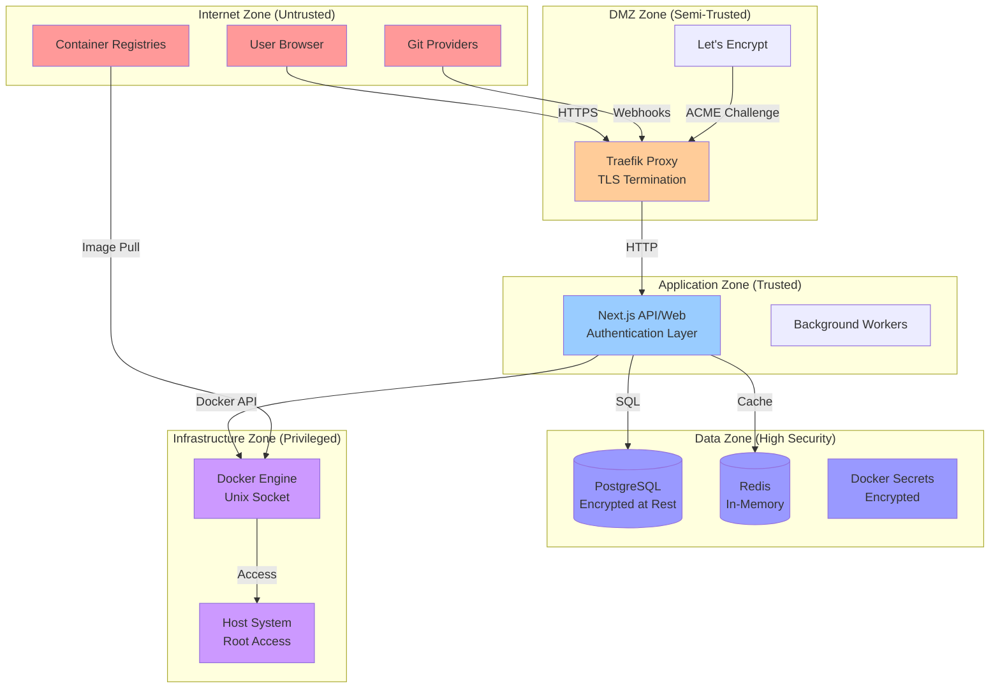
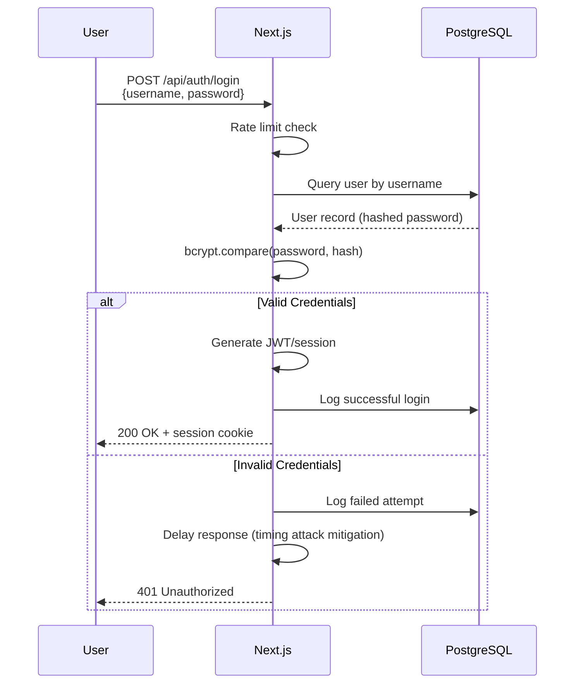
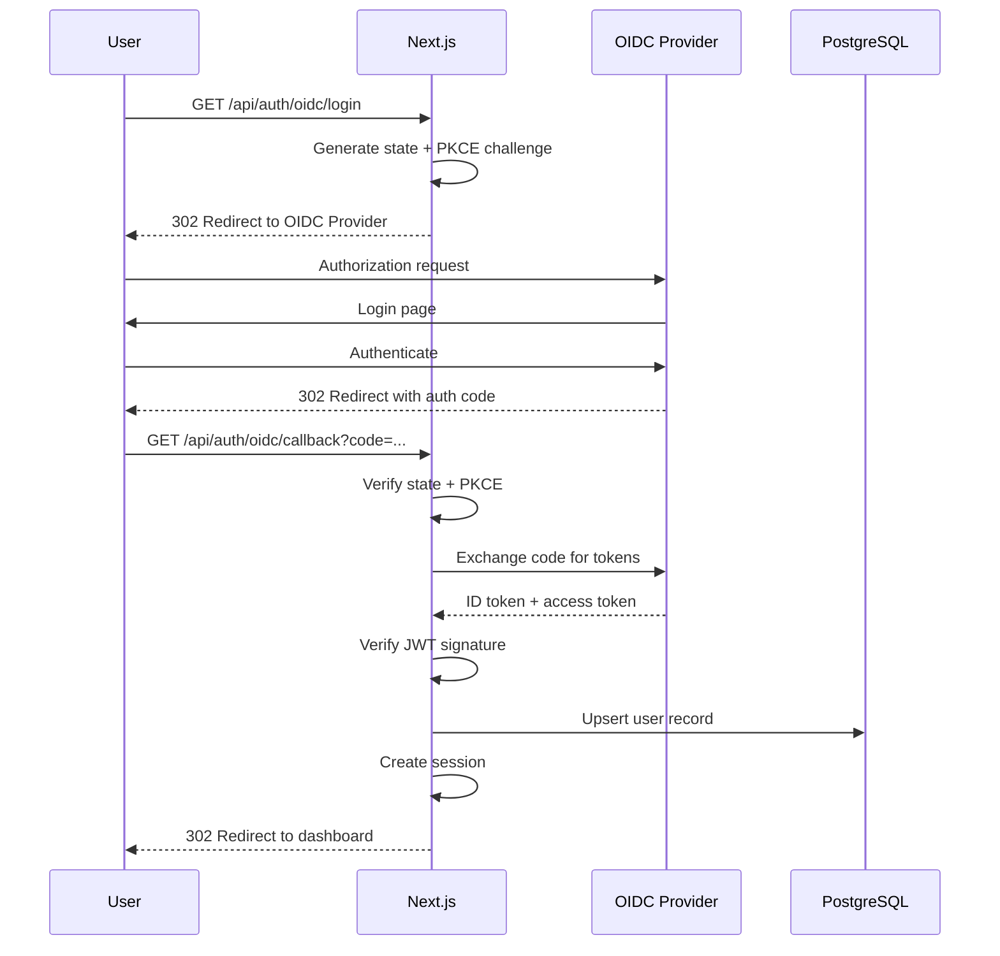
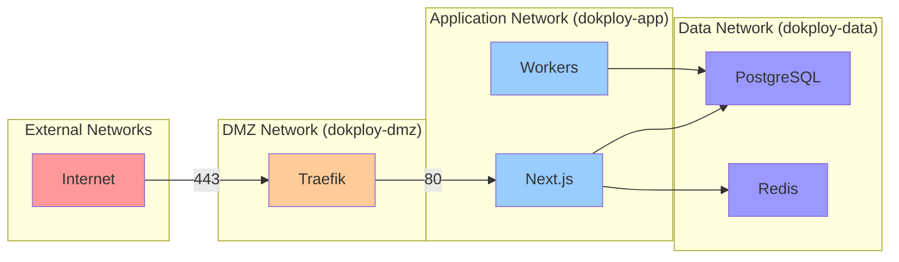

# Security Architecture View

**Document Type**: Architecture View  
**Status**: Draft  
**Version**: 1.0  
**Last Updated**: 2024-12-30  
**Owner**: Architecture Team  

---

## Purpose

This document defines the security architecture for Dokploy, including security zones, trust boundaries, authentication and authorization mechanisms, data protection strategies, and threat mitigation approaches. It serves as the authoritative reference for all security-related design decisions.

---

## Security Principles

### 1. Defense in Depth
Multiple layers of security controls to protect against single point of failure.

### 2. Least Privilege
Users and services granted minimum permissions necessary for their function.

### 3. Zero Trust
No implicit trust; verify every request regardless of source.

### 4. Secure by Default
Security features enabled out-of-box; insecure options require explicit opt-in.

### 5. Privacy by Design
Data minimization, encryption, and user control over personal information.

### 6. Fail Securely
Security failures deny access rather than granting it.

---

## Security Zones



### Zone Descriptions

#### Internet Zone (Untrusted)
- **Trust Level**: None
- **Components**: User browsers, Git providers (GitHub, GitLab), container registries
- **Threats**: MITM attacks, credential theft, malicious payloads
- **Controls**: HTTPS only, webhook signature verification, content validation

#### DMZ Zone (Semi-Trusted)
- **Trust Level**: Limited
- **Components**: Traefik reverse proxy, Let's Encrypt
- **Threats**: DDoS, TLS downgrade, certificate theft
- **Controls**: Rate limiting, TLS 1.2+ only, HSTS, security headers

#### Application Zone (Trusted)
- **Trust Level**: High
- **Components**: Next.js application, background workers
- **Threats**: Injection attacks, privilege escalation, logic bugs
- **Controls**: Authentication, authorization, input validation, CSRF protection

#### Data Zone (High Security)
- **Trust Level**: Very High
- **Components**: PostgreSQL, Redis, Docker Secrets
- **Threats**: Data exfiltration, unauthorized access, data tampering
- **Controls**: Encryption at rest, network isolation, access control, audit logging

#### Infrastructure Zone (Privileged)
- **Trust Level**: Maximum
- **Components**: Docker Engine, host OS
- **Threats**: Container escape, host compromise, privilege escalation
- **Controls**: AppArmor/SELinux, resource limits, security updates, minimal attack surface

---

## Trust Boundaries

### Boundary 1: Internet → DMZ
- **Protection**: TLS encryption, certificate validation, rate limiting
- **Validation**: Origin verification, webhook signatures, CORS policies
- **Monitoring**: Access logs, failed authentication attempts, suspicious patterns

### Boundary 2: DMZ → Application
- **Protection**: Internal network, authentication required, session management
- **Validation**: JWT/session tokens, CSRF tokens, request sanitization
- **Monitoring**: API usage, error rates, authentication failures

### Boundary 3: Application → Data
- **Protection**: Connection pooling, parameterized queries, encryption in transit
- **Validation**: Data type validation, foreign key constraints, transaction isolation
- **Monitoring**: Query performance, connection counts, failed queries

### Boundary 4: Application → Infrastructure
- **Protection**: Unix socket permissions, API authentication, resource limits
- **Validation**: Container image verification, config validation, namespace isolation
- **Monitoring**: Docker events, resource usage, container lifecycle

---

## Authentication Architecture

### Local Authentication



**Security Features**:
- Password hashing: bcrypt with cost factor 12
- Rate limiting: 5 attempts per 15 minutes per IP
- Account lockout: After 10 failed attempts (1 hour lockout)
- Timing attack mitigation: Constant-time comparison
- Session expiry: 7 days idle, 30 days absolute
- Secure cookies: httpOnly, secure, sameSite=strict

### OIDC Authentication



**Security Features**:
- PKCE (Proof Key for Code Exchange)
- State parameter (CSRF protection)
- JWT signature verification (RS256)
- Token replay prevention
- Issuer validation
- Audience validation
- Automatic token refresh

---

## Authorization Architecture

### Role-Based Access Control (RBAC)

```
User
  └─ has role ─> Role (admin, user, viewer)
       └─ has permissions ─> Permissions
            └─ on ─> Resource (project, application, database)
```

### Roles

| Role | Permissions | Use Case |
|------|-------------|----------|
| `super-admin` | All permissions, manage users, system settings | Platform owner |
| `admin` | Full access to owned projects, create projects | Team leads |
| `developer` | Deploy apps, view logs, manage env vars | Development team |
| `viewer` | Read-only access to projects | Stakeholders, auditors |

### Permission Model

```typescript path=null start=null
interface Permission {
  resource: 'project' | 'application' | 'database' | 'user' | 'system'
  action: 'create' | 'read' | 'update' | 'delete' | 'deploy' | 'scale'
  scope: 'all' | 'owned' | 'team' | 'specific'
}

// Example permissions
const permissions = {
  'admin': [
    { resource: 'project', action: 'create', scope: 'all' },
    { resource: 'project', action: 'read', scope: 'all' },
    { resource: 'application', action: 'deploy', scope: 'owned' },
  ],
  'developer': [
    { resource: 'application', action: 'read', scope: 'team' },
    { resource: 'application', action: 'deploy', scope: 'team' },
    { resource: 'application', action: 'update', scope: 'team' },
  ],
  'viewer': [
    { resource: 'project', action: 'read', scope: 'team' },
    { resource: 'application', action: 'read', scope: 'team' },
  ],
}
```

### Authorization Middleware

```typescript path=null start=null
// Next.js API route protection
import { getServerSession } from 'next-auth'
import { hasPermission } from '@/lib/rbac'

export async function POST(request: Request) {
  const session = await getServerSession()
  
  if (!session) {
    return Response.json({ error: 'Unauthorized' }, { status: 401 })
  }
  
  // Check permission
  if (!hasPermission(session.user, 'application', 'deploy')) {
    return Response.json({ error: 'Forbidden' }, { status: 403 })
  }
  
  // Proceed with deployment
}
```

### Row-Level Security (PostgreSQL)

```sql path=null start=null
-- Enable RLS on projects table
ALTER TABLE projects ENABLE ROW LEVEL SECURITY;

-- Policy: Users can view projects they own or are members of
CREATE POLICY projects_select_policy ON projects
  FOR SELECT
  USING (
    owner_id = current_setting('app.user_id')::uuid
    OR id IN (
      SELECT project_id FROM project_members
      WHERE user_id = current_setting('app.user_id')::uuid
    )
  );

-- Policy: Only owners can delete projects
CREATE POLICY projects_delete_policy ON projects
  FOR DELETE
  USING (owner_id = current_setting('app.user_id')::uuid);
```

---

## Data Protection

### Encryption at Rest

**PostgreSQL**:
- Filesystem encryption: LUKS (Linux Unified Key Setup)
- Transparent Data Encryption (TDE): pgcrypto extension
- Backup encryption: GPG-encrypted dumps

**Docker Secrets**:
- Encrypted by default (Swarm secrets)
- Stored in Raft log (encrypted)
- Decrypted only on authorized nodes

**Application Secrets**:
- Environment variables: Stored as Docker secrets
- API keys: Encrypted in PostgreSQL (AES-256-GCM)
- Passwords: bcrypt hashed (cost factor 12)

### Encryption in Transit

**External Communication**:
- TLS 1.2+ only (TLS 1.3 preferred)
- Strong cipher suites: ECDHE-RSA-AES256-GCM-SHA384
- HSTS: max-age=31536000; includeSubDomains; preload
- Certificate pinning: For critical integrations

**Internal Communication**:
- PostgreSQL: TLS required (`sslmode=require`)
- Redis: TLS optional (localhost only by default)
- Docker API: Unix socket (local only)

### Data Sanitization

**Input Validation**:
```typescript path=null start=null
import { z } from 'zod'

const createAppSchema = z.object({
  name: z.string().min(3).max(50).regex(/^[a-z0-9-]+$/),
  image: z.string().min(1).max(500),
  envVars: z.record(z.string(), z.string()).optional(),
  replicas: z.number().int().min(0).max(100),
})

export async function POST(request: Request) {
  const body = await request.json()
  
  // Validate and sanitize
  const validated = createAppSchema.parse(body)
  
  // Proceed with validated data
}
```

**Output Encoding**:
- HTML: React automatic escaping
- SQL: Parameterized queries (Prisma)
- Shell: No direct shell execution
- Logs: Redact sensitive fields (passwords, tokens)

---

## Network Security

### Network Topology



### Docker Network Configuration

```yaml path=null start=null
networks:
  dokploy-dmz:
    driver: overlay
    ipam:
      config:
        - subnet: 10.0.1.0/24
  
  dokploy-app:
    driver: overlay
    internal: false  # Can reach external registries
    ipam:
      config:
        - subnet: 10.0.2.0/24
  
  dokploy-data:
    driver: overlay
    internal: true  # No external access
    ipam:
      config:
        - subnet: 10.0.3.0/24
```

### Firewall Rules

**Host Firewall (iptables/firewalld)**:
```bash path=null start=null
# Allow SSH (management)
iptables -A INPUT -p tcp --dport 22 -j ACCEPT

# Allow HTTP/HTTPS
iptables -A INPUT -p tcp --dport 80 -j ACCEPT
iptables -A INPUT -p tcp --dport 443 -j ACCEPT

# Allow Docker Swarm
iptables -A INPUT -p tcp --dport 2377 -j ACCEPT  # Management
iptables -A INPUT -p tcp --dport 7946 -j ACCEPT  # Overlay
iptables -A INPUT -p udp --dport 7946 -j ACCEPT
iptables -A INPUT -p udp --dport 4789 -j ACCEPT  # VXLAN

# Drop all other incoming
iptables -P INPUT DROP
```

### Rate Limiting

**Traefik Configuration**:
```yaml path=null start=null
http:
  middlewares:
    rate-limit:
      rateLimit:
        average: 100  # requests per second
        burst: 200
        period: 1s
    
    api-rate-limit:
      rateLimit:
        average: 10
        burst: 20
        period: 1s
```

---

## Secrets Management

### Docker Swarm Secrets

```bash path=null start=null
# Create secret from file
docker secret create postgres_password /path/to/password.txt

# Create secret from stdin
echo "my-secret-value" | docker secret create api_key -

# Use in service
docker service create \
  --name dokploy \
  --secret postgres_password \
  --secret api_key \
  dokploy:latest
```

**Access in Application**:
```typescript path=null start=null
import { readFileSync } from 'fs'

// Secrets mounted at /run/secrets/<secret_name>
const postgresPassword = readFileSync('/run/secrets/postgres_password', 'utf8').trim()
```

### Environment Variable Security

**Prohibited**:
```bash path=null start=null
# ❌ Never expose secrets in environment
POSTGRES_PASSWORD=supersecret  # Bad!
```

**Recommended**:
```bash path=null start=null
# ✅ Use Docker secrets or _FILE suffix
POSTGRES_PASSWORD_FILE=/run/secrets/postgres_password
```

### Secret Rotation

```bash path=null start=null
#!/bin/bash
# rotate-secret.sh

SECRET_NAME=$1
NEW_VALUE=$2

# Create new secret version
echo "$NEW_VALUE" | docker secret create "${SECRET_NAME}_v2" -

# Update service to use new secret
docker service update \
  --secret-rm "${SECRET_NAME}" \
  --secret-add "source=${SECRET_NAME}_v2,target=${SECRET_NAME}" \
  dokploy

# Remove old secret (after validation)
docker secret rm "${SECRET_NAME}"
```

---

## Audit Logging

### What to Log

**Authentication Events**:
- Login attempts (success/failure)
- Logout events
- Password changes
- MFA enrollment/removal
- Session creation/expiration

**Authorization Events**:
- Permission grants/revokes
- Role changes
- Access denied events

**Resource Changes**:
- Application deployments
- Configuration changes
- Database operations (create/delete)
- Secret access

**Security Events**:
- Failed authentication (brute force detection)
- Privilege escalation attempts
- Unusual access patterns
- Security policy violations

### Log Format

```json
{
  "timestamp": "2024-12-30T12:34:56.789Z",
  "level": "info",
  "event": "application.deploy",
  "user_id": "550e8400-e29b-41d4-a716-446655440000",
  "username": "john.doe",
  "ip_address": "192.168.1.100",
  "user_agent": "Mozilla/5.0...",
  "resource_type": "application",
  "resource_id": "app-123",
  "action": "deploy",
  "result": "success",
  "metadata": {
    "image": "myapp:v1.2.3",
    "replicas": 3
  }
}
```

### Log Storage

- **Retention**: 90 days standard, 1 year for security events
- **Location**: PostgreSQL `audit_logs` table
- **Access**: Admin and auditor roles only
- **Integrity**: Append-only table, tamper detection via checksums

---

## Vulnerability Management

### Dependency Scanning

```bash path=null start=null
# Node.js dependencies
npm audit --audit-level=moderate

# Docker images
docker scan dokploy:latest

# Container vulnerability database
trivy image dokploy:latest
```

### Update Policy

- **Critical vulnerabilities**: Patch within 24 hours
- **High vulnerabilities**: Patch within 7 days
- **Moderate vulnerabilities**: Patch within 30 days
- **Low vulnerabilities**: Patch in next release

### Security Patching Process

1. Monitor security advisories (GitHub, NPM, Docker Hub)
2. Assess impact and exploitability
3. Test patch in development
4. Deploy to staging
5. Deploy to production (with rollback plan)
6. Notify users of security update

---

## Threat Modeling

### STRIDE Analysis

| Threat | Mitigation |
|--------|-----------|
| **Spoofing** | Authentication (JWT, OIDC), TLS certificates |
| **Tampering** | Input validation, CSRF tokens, integrity checks |
| **Repudiation** | Audit logging, digital signatures |
| **Information Disclosure** | Encryption (TLS, at-rest), access control |
| **Denial of Service** | Rate limiting, resource quotas, health checks |
| **Elevation of Privilege** | RBAC, least privilege, container isolation |

### Attack Scenarios

#### Scenario 1: Credential Theft
**Threat**: Attacker steals user credentials
**Mitigations**:
- Password hashing (bcrypt)
- Rate limiting on login
- Account lockout
- MFA (future)
- Session expiry

#### Scenario 2: Container Escape
**Threat**: Attacker escapes container to host
**Mitigations**:
- AppArmor/SELinux profiles
- Minimal base images
- Read-only root filesystem
- Drop capabilities
- Resource limits

#### Scenario 3: SQL Injection
**Threat**: Attacker injects malicious SQL
**Mitigations**:
- Parameterized queries (Prisma ORM)
- Input validation (Zod schemas)
- Least privilege DB user
- Query monitoring

#### Scenario 4: Secrets Exposure
**Threat**: Secrets leaked in logs or environment
**Mitigations**:
- Docker Swarm secrets
- Log sanitization
- No secrets in env vars
- Secret rotation

---

## Compliance

### GDPR Requirements

- ✅ Data minimization (collect only necessary data)
- ✅ Encryption at rest and in transit
- ✅ Right to access (API endpoint for user data export)
- ✅ Right to erasure (cascade delete on user removal)
- ✅ Data breach notification (audit logging)
- ✅ Privacy by design (default secure settings)

### OWASP Top 10 Coverage

| Risk | Status | Mitigation |
|------|--------|-----------|
| A01: Broken Access Control | ✅ | RBAC, session management, authorization middleware |
| A02: Cryptographic Failures | ✅ | TLS, encryption at rest, secure password storage |
| A03: Injection | ✅ | Parameterized queries, input validation |
| A04: Insecure Design | ✅ | Threat modeling, security architecture review |
| A05: Security Misconfiguration | ✅ | Secure defaults, hardening guides |
| A06: Vulnerable Components | ✅ | Dependency scanning, update policy |
| A07: Auth Failures | ✅ | Strong authentication, rate limiting, MFA (future) |
| A08: Software/Data Integrity | ✅ | Audit logging, image verification, checksums |
| A09: Logging Failures | ✅ | Comprehensive audit logging, monitoring |
| A10: SSRF | ✅ | Input validation, URL allowlisting |

---

## Security Checklist

### Deployment Security

- [ ] TLS certificates configured
- [ ] HSTS enabled
- [ ] Security headers configured (CSP, X-Frame-Options, etc.)
- [ ] Rate limiting enabled
- [ ] Firewall rules configured
- [ ] SSH key-based auth (no password)
- [ ] Automatic security updates enabled
- [ ] Docker secrets configured (no env var secrets)
- [ ] Audit logging enabled
- [ ] Backup encryption enabled

### Application Security

- [ ] Authentication required for all protected routes
- [ ] Authorization checks on all API endpoints
- [ ] CSRF protection enabled
- [ ] Input validation on all user inputs
- [ ] Parameterized SQL queries only
- [ ] No secrets in code or logs
- [ ] Error messages don't leak sensitive info
- [ ] Session timeout configured
- [ ] Password complexity requirements
- [ ] Account lockout after failed attempts

### Operational Security

- [ ] Security monitoring alerts configured
- [ ] Incident response plan documented
- [ ] Security contacts designated
- [ ] Vulnerability disclosure policy published
- [ ] Regular security audits scheduled
- [ ] Penetration testing planned
- [ ] Security training for team
- [ ] Backup and recovery tested

---

## Related Documents

- **ADR-002**: Next.js (authentication implementation)
- **ADR-003**: PostgreSQL (row-level security, audit logging)
- **Container Diagram**: Shows security boundaries between components
- **PRD**: Security requirements (authentication, authorization, audit)

---

**Document Version**: 1.0  
**Last Security Review**: 2024-12-30  
**Next Review**: 2025-03-30  
**Reviewed By**: Architecture Team
