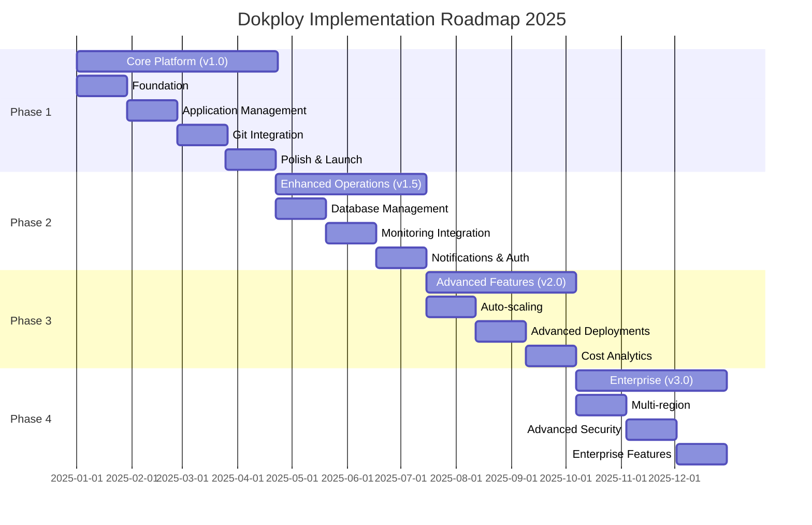
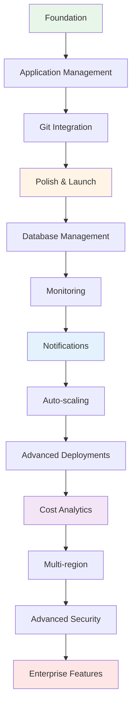

# Implementation Roadmap

**Document Type**: Implementation Planning  
**Status**: Draft  
**Version**: 1.0  
**Last Updated**: 2024-12-30  
**Owner**: Product Management, Architecture Team  

---

## Purpose

This document outlines the phased implementation plan for Dokploy, including milestones, timelines, dependencies, resource allocation, and risk mitigation strategies. This roadmap serves as the execution plan for delivering Dokploy's architecture vision.

---

## Roadmap Principles

1. **Deliver value incrementally**: Release working features early and often
2. **Minimize risk**: De-risk technical challenges early in the process
3. **Early feedback loops**: Beta testing in each phase
4. **Foundation first**: Build solid core before advanced features
5. **Maintain stability**: No breaking changes within major versions

---

## Timeline Overview



---

## Phase 1: Core Platform (v1.0)

### Timeline: January - April 2025 (16 weeks)

### Objectives
- Launch MVP with core PaaS functionality
- Support single-server deployments
- Enable basic Docker application management
- Establish foundation for future features

### Sprint 1-2 (Weeks 1-4): Foundation

**Goal**: Basic infrastructure and authentication working

**Features**:
- ✅ User authentication (local with bcrypt)
- ✅ PostgreSQL database setup with Prisma
- ✅ Redis cache and session store
- ✅ Basic UI framework (Next.js + Material UI)
- ✅ Docker Swarm initialization
- ✅ Traefik reverse proxy setup

**Technical Tasks**:
```
- Set up monorepo structure
- Configure TypeScript + ESLint
- Database schema design (17 entities)
- Authentication middleware
- Docker Swarm mode enablement
- Basic CI/CD pipeline
```

**Dependencies**: None (starting point)

**Success Criteria**:
- User can register and login
- Database migrations run successfully
- Docker Swarm cluster initialized
- UI loads and is responsive

**Team**: 2 developers + 1 DevOps

---

### Sprint 3-4 (Weeks 5-8): Application Management

**Goal**: Core CRUD operations for applications

**Features**:
- ✅ Create application from Docker image
- ✅ Configure environment variables
- ✅ Set resource limits (CPU, memory)
- ✅ List and filter applications
- ✅ Update application configuration
- ✅ Delete application (with cleanup)
- ✅ Basic health checks

**Technical Tasks**:
```
- dockerode integration
- Service creation/update APIs
- Environment variable encryption
- Volume management
- Health check implementation
- Application dashboard UI
```

**Dependencies**:
- Sprint 1-2 foundation complete

**Success Criteria**:
- User can deploy nginx from Docker Hub
- Application shows in dashboard with status
- Health checks report application state
- Environment variables are encrypted
- Resource limits are enforced

**Team**: 2 developers + 1 DevOps

---

### Sprint 5-6 (Weeks 9-12): Git Integration

**Goal**: Deploy applications from Git repositories

**Features**:
- ✅ Connect Git repository (GitHub, GitLab)
- ✅ Configure webhooks
- ✅ Build worker with BullMQ
- ✅ Docker image building (BuildKit)
- ✅ Private registry support
- ✅ Automated deployment on push
- ✅ Build logs streaming

**Technical Tasks**:
```
- simple-git integration
- Webhook signature verification
- Job queue implementation
- Build context preparation
- Multi-stage Dockerfile support
- Image registry authentication
- WebSocket for live logs
```

**Dependencies**:
- Sprint 3-4 application management complete

**Success Criteria**:
- Git push triggers automatic deployment
- Build logs visible in real-time
- 95% deployment success rate
- Failed builds roll back automatically
- Webhooks work for GitHub and GitLab

**Risks**:
- Build performance on large repositories
  - **Mitigation**: Build cache, incremental builds
- Webhook reliability
  - **Mitigation**: Retry mechanism, manual trigger fallback

**Team**: 2 developers + 1 DevOps

---

### Sprint 7-8 (Weeks 13-16): Polish & Launch

**Goal**: Production-ready v1.0 release

**Features**:
- ✅ HTTPS/TLS with Let's Encrypt
- ✅ Custom domain management
- ✅ Team collaboration
- ✅ Audit logging
- ✅ Comprehensive documentation
- ✅ Deployment rollback
- ✅ Application logs viewer

**Technical Tasks**:
```
- Traefik Let's Encrypt integration
- DNS challenge implementation
- Team RBAC implementation
- Audit log storage (PostgreSQL)
- MkDocs documentation site
- Error handling improvements
- Performance optimization
- Security audit
```

**Dependencies**:
- All previous sprints complete

**Success Criteria**:
- 10 beta users deploying applications
- Security audit passed (no critical issues)
- Documentation covers all features
- 99%+ uptime during beta period
- <5 min average deployment time

**Launch Checklist**:
```
[ ] Security audit complete
[ ] Documentation published
[ ] Marketing site live
[ ] GitHub repo public
[ ] v1.0.0 release tagged
[ ] Docker Hub image published
[ ] Announcement on social media
```

**Team**: 2 developers + 1 DevOps + 1 PM + 1 designer

---

## Phase 2: Enhanced Operations (v1.5)

### Timeline: April - July 2025 (12 weeks)

### Objectives
- Managed database services
- Production-grade monitoring
- Enhanced authentication
- Backup and disaster recovery

### Sprint 9-10 (Weeks 17-20): Database Management

**Goal**: One-click database provisioning

**Features**:
- ✅ PostgreSQL database creation
- ✅ MySQL database creation
- ✅ MongoDB database creation
- ✅ Redis database creation
- ✅ Connection string management
- ✅ Database resource allocation
- ✅ Database configuration UI

**Technical Tasks**:
```
- Database Docker images selection
- Volume persistence implementation
- Connection pool configuration
- Database backup scripts
- Secrets management for credentials
```

**Success Criteria**:
- User can create database in <2 minutes
- Databases are isolated per project
- Connection strings are secure
- Databases persist through restarts

**Team**: 2 developers + 1 DevOps

---

### Sprint 11-12 (Weeks 21-24): Monitoring Integration

**Goal**: Production-grade observability

**Features**:
- ✅ Prometheus metrics collection
- ✅ Grafana dashboard integration
- ✅ Pre-built dashboards
- ✅ Custom metrics support
- ✅ Alert rules configuration
- ✅ Metrics retention policies

**Technical Tasks**:
```
- Prometheus deployment
- Grafana deployment
- cAdvisor integration
- Node Exporter setup
- Dashboard templates
- Alert manager configuration
```

**Success Criteria**:
- All applications export metrics
- System metrics visible in Grafana
- Alerts fire for critical conditions
- Metrics retained for 15 days

**Team**: 1 developer + 1 DevOps

---

### Sprint 13-14 (Weeks 25-28): Notifications & Auth

**Goal**: Enhanced authentication and notifications

**Features**:
- ✅ Email notifications
- ✅ OIDC authentication
- ✅ Slack webhooks
- ✅ Discord webhooks
- ✅ Deployment notifications
- ✅ Alert notifications

**Technical Tasks**:
```
- SMTP integration
- NextAuth OIDC provider
- Webhook delivery system
- Notification preferences UI
- Email templates
```

**Success Criteria**:
- Users receive deployment notifications
- OIDC login works with Google/GitHub
- Webhooks deliver reliably (99%+)
- Users can customize notification preferences

**Milestone**: v1.5.0 Release (End of July 2025)

---

## Phase 3: Advanced Features (v2.0)

### Timeline: July - October 2025 (12 weeks)

### Objectives
- Automatic scaling
- Advanced deployment strategies
- Cost optimization
- Performance enhancements

### Sprint 15-16 (Weeks 29-32): Auto-scaling

**Goal**: Automatic resource scaling

**Features**:
- ✅ Horizontal pod autoscaling
- ✅ Metric-based scaling rules
- ✅ Scheduled scaling
- ✅ Min/max replica configuration
- ✅ Cool-down periods

**Technical Tasks**:
```
- Metrics-based decision engine
- Docker Swarm service scaling API
- Scaling history tracking
- Cost impact estimation
- UI for scaling configuration
```

**Success Criteria**:
- Applications scale up under load
- Applications scale down when idle
- Scaling decisions logged
- No thrashing (rapid scale up/down)

**Risks**:
- Docker Swarm autoscaling limitations
  - **Mitigation**: Consider Kubernetes evaluation for v3.0

---

### Sprint 17-18 (Weeks 33-36): Advanced Deployments

**Goal**: Zero-downtime deployment strategies

**Features**:
- ✅ Blue-green deployments
- ✅ Canary deployments
- ✅ A/B testing support
- ✅ Traffic splitting
- ✅ Deployment strategies UI

**Technical Tasks**:
```
- Traefik weighted routing
- Service versioning
- Traffic analytics
- Automated rollback on errors
- Deployment comparison UI
```

**Success Criteria**:
- Zero downtime during deployments
- Canary deployments work reliably
- Automatic rollback on high error rate
- Traffic split visualization

---

### Sprint 19-20 (Weeks 37-40): Cost Analytics

**Goal**: Cost visibility and optimization

**Features**:
- ✅ Resource usage tracking
- ✅ Cost estimation per application
- ✅ Cost trends and forecasting
- ✅ Idle resource detection
- ✅ Cost optimization recommendations

**Technical Tasks**:
```
- Resource usage aggregation
- Cost calculation algorithms
- Time-series data analysis
- Reporting dashboards
- Recommendation engine
```

**Success Criteria**:
- Accurate resource usage reporting
- Cost estimates within 10% of actual
- Actionable optimization recommendations
- Cost alerts for budget overruns

**Milestone**: v2.0.0 Release (End of October 2025)

---

## Phase 4: Enterprise Features (v3.0)

### Timeline: October 2025 - January 2026 (12 weeks)

### Objectives
- Enterprise-grade security
- Multi-region support
- Advanced RBAC
- SLA monitoring

### Sprint 21-22 (Weeks 41-44): Multi-region

**Goal**: Deploy applications across multiple regions

**Features**:
- ✅ Multi-region cluster management
- ✅ Cross-region networking
- ✅ Region selection UI
- ✅ Geo-routing
- ✅ Data replication

**Technical Tasks**:
```
- Multi-cluster Docker Swarm
- VPN/WireGuard setup
- DNS-based routing
- Database replication
- Cross-region monitoring
```

**Success Criteria**:
- Applications deployed in 2+ regions
- Sub-100ms inter-region latency
- Automatic failover working
- Data consistency maintained

**Risks**:
- Docker Swarm multi-cluster complexity
  - **Mitigation**: Evaluate Kubernetes migration

---

### Sprint 23-24 (Weeks 45-48): Advanced Security

**Goal**: Enterprise security features

**Features**:
- ✅ Multi-factor authentication
- ✅ SSO with SAML
- ✅ LDAP/Active Directory
- ✅ Advanced audit logging
- ✅ Compliance reports
- ✅ Security scanning

**Technical Tasks**:
```
- TOTP implementation
- SAML 2.0 integration
- LDAP connector
- Detailed audit trail
- Compliance dashboards
- Image vulnerability scanning
```

**Success Criteria**:
- MFA available for all users
- SAML/LDAP authentication working
- Audit logs immutable
- SOC 2 compliance ready

---

### Sprint 25-26 (Weeks 49-52): Enterprise Features

**Goal**: Enterprise operational features

**Features**:
- ✅ Advanced RBAC with custom roles
- ✅ SLA monitoring and reporting
- ✅ Priority support
- ✅ Dedicated resources
- ✅ Custom branding
- ✅ Onboarding assistance

**Technical Tasks**:
```
- Custom role builder UI
- SLA tracking system
- Support ticket system
- Resource reservation
- White-labeling support
```

**Success Criteria**:
- Custom roles definable
- SLA compliance tracked
- Support response <4 hours
- Enterprise pilot customers onboarded

**Milestone**: v3.0.0 Release (End of January 2026)

---

## Risk Management

### High Risks

#### 1. Docker Swarm Adoption
**Risk Level**: High  
**Impact**: Platform adoption  
**Probability**: Medium  

**Mitigation**:
- Provide excellent documentation comparing to Kubernetes
- Highlight simplicity and lower resource usage
- Plan Kubernetes support in v4.0
- Ensure easy migration path

**Contingency**:
- Accelerate Kubernetes evaluation
- Offer dual orchestration support

---

#### 2. Build Performance
**Risk Level**: High  
**Impact**: User experience  
**Probability**: High  

**Mitigation**:
- Aggressive build caching (Docker BuildKit)
- Incremental builds where possible
- Build time monitoring and alerts
- Distributed build workers (v2.0)

**Contingency**:
- Integration with external build services
- Pre-built base images

---

#### 3. Resource Constraints
**Risk Level**: Medium  
**Impact**: Timeline  
**Probability**: Medium  

**Mitigation**:
- Ruthless prioritization
- Maintain 20% buffer in estimates
- Cut scope, not quality
- Open source community contributions

**Contingency**:
- Delay non-critical features
- Extend timelines if necessary

---

#### 4. Security Vulnerabilities
**Risk Level**: High  
**Impact**: Trust, adoption  
**Probability**: Low  

**Mitigation**:
- Security audit before each major release
- Automated dependency scanning
- Bug bounty program (v2.0+)
- Rapid security patch process

**Contingency**:
- Emergency patch releases
- Transparent communication
- Post-mortem and remediation

---

### Medium Risks

#### 5. Third-party Service Dependencies
**Risk Level**: Medium  
**Impact**: Availability  
**Probability**: Low  

**Examples**:
- Let's Encrypt outages
- Docker Hub rate limiting
- Git provider downtime

**Mitigation**:
- Graceful degradation
- Fallback mechanisms
- Caching where possible
- Alternative providers

---

#### 6. Database Migration Complexity
**Risk Level**: Medium  
**Impact**: Upgrades  
**Probability**: Medium  

**Mitigation**:
- Thorough migration testing
- Backup before migrations
- Rollback procedures
- Blue-green database strategy

---

## Resource Plan

### Team Composition

#### Phase 1 (v1.0)
- **2 Full-stack Developers**: Core platform development
- **1 DevOps Engineer**: Infrastructure, CI/CD, Docker
- **1 Product Manager** (part-time): Roadmap, priorities, beta program
- **1 UI/UX Designer** (part-time): UI design, user research

#### Phase 2 (v1.5)
- **3 Full-stack Developers** (add 1)
- **1 DevOps Engineer**
- **1 Product Manager** (full-time)
- **1 Technical Writer** (part-time): Documentation

#### Phase 3-4 (v2.0-v3.0)
- **4 Full-stack Developers** (add 1)
- **2 DevOps Engineers** (add 1)
- **1 Product Manager**
- **1 QA Engineer**
- **1 Technical Writer**

### Budget Estimate

| Phase | Duration | Team Cost | Infrastructure | Total |
|-------|----------|-----------|----------------|-------|
| Phase 1 | 16 weeks | $160,000 | $2,000 | $162,000 |
| Phase 2 | 12 weeks | $144,000 | $3,000 | $147,000 |
| Phase 3 | 12 weeks | $168,000 | $4,000 | $172,000 |
| Phase 4 | 12 weeks | $192,000 | $5,000 | $197,000 |
| **Total** | **52 weeks** | **$664,000** | **$14,000** | **$678,000** |

*Assumptions*: Average $10,000/week team cost, infrastructure for testing/staging

---

## Dependencies

### External Dependencies

#### Critical
- **Docker Engine**: Must remain stable and supported
- **Let's Encrypt**: For TLS certificates
- **PostgreSQL**: Database stability and performance
- **Git Providers**: GitHub, GitLab APIs

#### Important
- **Docker Hub**: For base images (have fallbacks)
- **npm Registry**: For JavaScript packages
- **Cloud Providers**: For testing deployment targets

### Internal Dependencies



---

## Success Metrics

### Key Performance Indicators (KPIs)

#### Phase 1 (v1.0)
- **User Acquisition**: 100 beta users
- **Deployment Success Rate**: >95%
- **Average Deployment Time**: <5 minutes
- **System Uptime**: >99%
- **Documentation Coverage**: 100% of features

#### Phase 2 (v1.5)
- **Active Users**: 500+
- **Applications Deployed**: 1,000+
- **Database Instances**: 200+
- **User Retention**: >70% (30-day)

#### Phase 3 (v2.0)
- **Active Users**: 2,000+
- **Applications Deployed**: 5,000+
- **Auto-scaling Adoption**: >40% of users
- **Cost Savings**: 20% average reduction

#### Phase 4 (v3.0)
- **Enterprise Customers**: 10+
- **Active Users**: 5,000+
- **Multi-region Adoption**: >25% of enterprise
- **SLA Compliance**: >99.9%

### Quality Metrics
- **Test Coverage**: >80%
- **Critical Bugs**: <5 per release
- **Security Vulnerabilities**: 0 critical
- **API Uptime**: >99.9%
- **Documentation Quality Score**: >4.5/5

---

## Go-to-Market Strategy

### Beta Program (Phase 1)
- **Target**: 100 early adopters
- **Channels**: Dev.to, Hacker News, Product Hunt
- **Incentive**: Free usage, priority support
- **Feedback**: Weekly surveys, Discord community

### v1.0 Launch
- **Announcement**: Blog post, social media, press release
- **Channels**: Product Hunt, Hacker News, Reddit
- **Content**: Tutorial videos, migration guides
- **Events**: Virtual launch event, AMA

### Growth (Phase 2-3)
- **Content Marketing**: Blog posts, case studies
- **Community**: Discord, GitHub Discussions
- **Integrations**: GitHub Marketplace, DigitalOcean
- **Partnerships**: Cloud providers, dev tools

### Enterprise (Phase 4)
- **Direct Sales**: Enterprise sales team
- **Channels**: LinkedIn, industry events
- **Proof Points**: Case studies, ROI calculators
- **Support**: Dedicated account managers

---

## Post-Launch Support

### Maintenance Windows
- **Minor Updates**: Weekly (Sundays 02:00-04:00 UTC)
- **Major Updates**: Quarterly
- **Security Patches**: Within 48 hours (any time)

### Support Tiers

#### Community (Free)
- GitHub Issues
- Documentation
- Community Discord
- Best-effort response

#### Professional ($99/month)
- Email support
- 24-hour response time
- Priority bug fixes
- Monthly office hours

#### Enterprise (Custom)
- Dedicated support channel
- 4-hour response time
- Custom SLAs
- Onboarding assistance
- Architecture reviews

---

## Appendix

### Feature Comparison Matrix

| Feature | v1.0 | v1.5 | v2.0 | v3.0 |
|---------|------|------|------|------|
| Docker deployments | ✅ | ✅ | ✅ | ✅ |
| Git integration | ✅ | ✅ | ✅ | ✅ |
| Custom domains | ✅ | ✅ | ✅ | ✅ |
| Let's Encrypt TLS | ✅ | ✅ | ✅ | ✅ |
| Team collaboration | ✅ | ✅ | ✅ | ✅ |
| Managed databases | ❌ | ✅ | ✅ | ✅ |
| Monitoring | Basic | ✅ | ✅ | ✅ |
| OIDC auth | ❌ | ✅ | ✅ | ✅ |
| Auto-scaling | ❌ | ❌ | ✅ | ✅ |
| Blue-green deploy | ❌ | ❌ | ✅ | ✅ |
| Cost analytics | ❌ | ❌ | ✅ | ✅ |
| Multi-region | ❌ | ❌ | ❌ | ✅ |
| SAML/LDAP | ❌ | ❌ | ❌ | ✅ |
| Custom RBAC | ❌ | ❌ | ❌ | ✅ |

---

## Related Documents

- **Architecture Vision**: Strategic goals and principles
- **Business Capability Model**: Capability-feature mapping
- **Value Stream Mapping**: Value delivery flows
- **Stakeholder Analysis**: Stakeholder needs and priorities
- **Technology Stack**: Technical implementation details
- **Deployment Diagram**: Infrastructure architecture

---

**Document Version**: 1.0  
**Last Updated**: 2024-12-30  
**Next Review**: 2025-01-31  
**Approved By**: Product Management, Architecture Team, Executive Team
