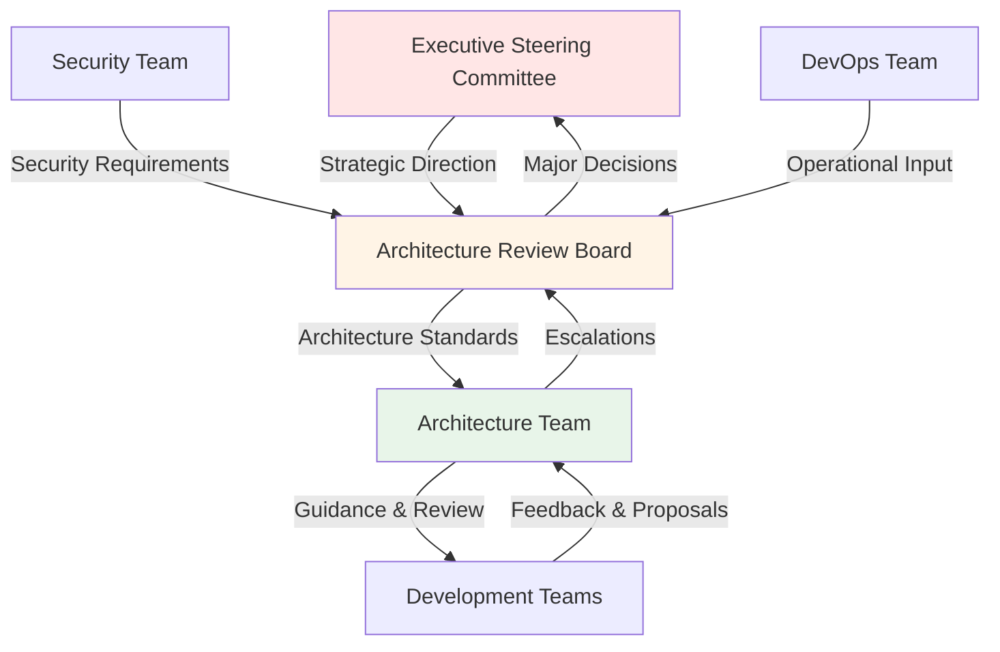
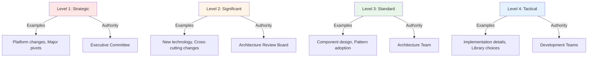
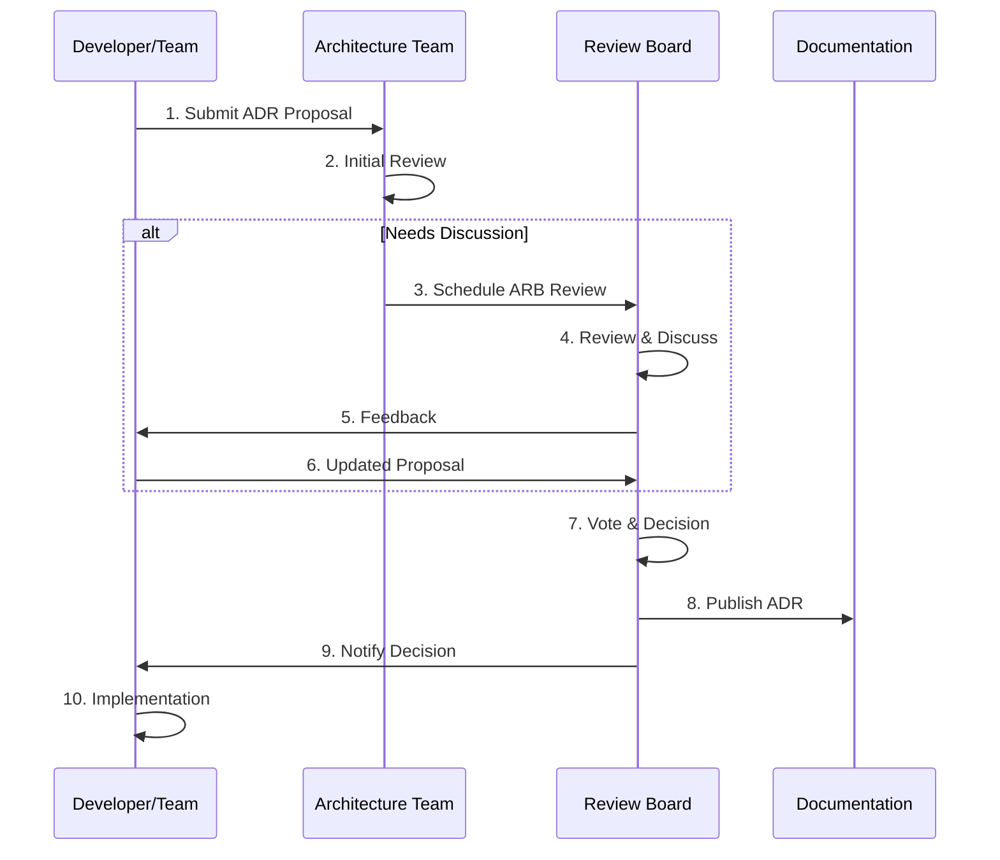
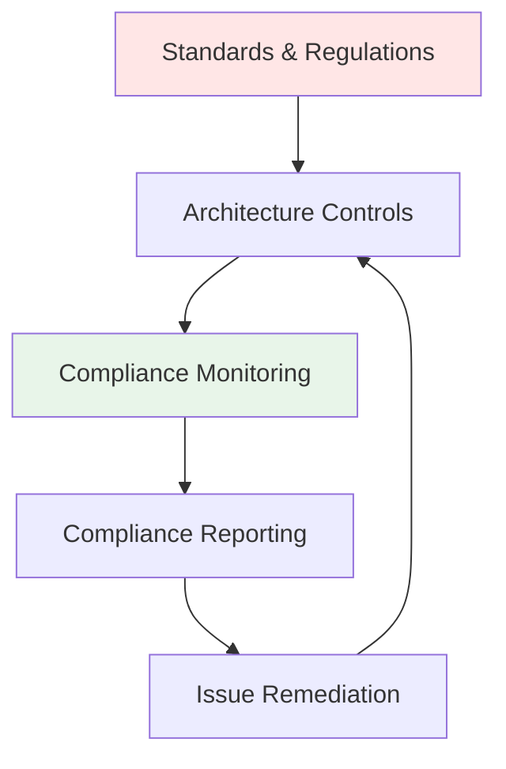
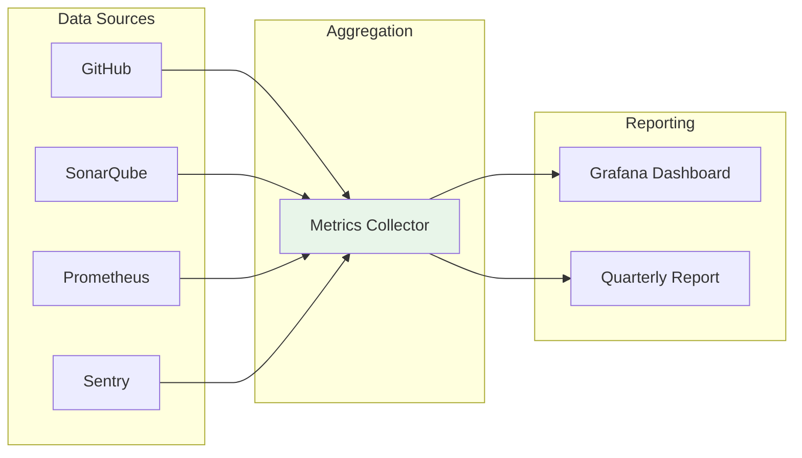
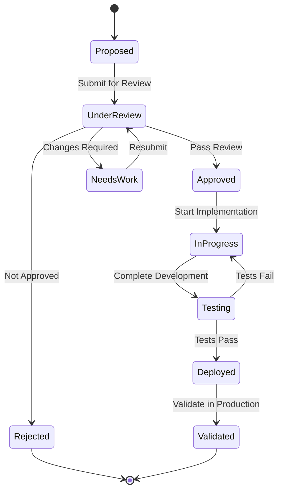

# Architecture Governance Model

**Document Type**: Architecture Governance  
**Status**: Draft  
**Version**: 1.0  
**Last Updated**: 2024-12-30  
**Owner**: Architecture Team, Executive Leadership  

---

## Purpose

This document defines the architecture governance framework for Dokploy, establishing processes, roles, responsibilities, and decision-making authorities to ensure architectural integrity, compliance, and continuous improvement throughout the product lifecycle.

---

## Governance Principles

### 1. Transparency
All architectural decisions are documented, communicated, and accessible to relevant stakeholders.

### 2. Accountability
Clear ownership and responsibility for architectural decisions and outcomes.

### 3. Continuous Improvement
Regular review and refinement of architecture based on learnings and feedback.

### 4. Risk-Based Approach
Governance activities proportional to risk and impact.

### 5. Lightweight Process
Minimum necessary governance to maintain quality without impeding velocity.

---

## Governance Structure



---

## Governance Bodies

### Executive Steering Committee

**Composition**:
- CEO/CTO
- Product VP
- Engineering VP
- Community Lead (for open source)

**Responsibilities**:
- Set strategic architecture direction
- Approve major architecture changes (>$50k impact)
- Resolve conflicts between ARB and business needs
- Review quarterly architecture health reports

**Meeting Cadence**: Quarterly + ad-hoc for major decisions

**Decision Authority**: Final authority on:
- Platform strategy changes
- Major technology pivots
- Multi-phase initiatives
- Budget allocation for architecture work

---

### Architecture Review Board (ARB)

**Composition**:
- Lead Architect (Chair)
- Senior Backend Engineer
- Senior Frontend Engineer
- DevOps Lead
- Security Lead
- Product Manager

**Responsibilities**:
- Review and approve Architecture Decision Records (ADRs)
- Evaluate architectural compliance
- Approve exceptions to architecture standards
- Review architecture evolution proposals
- Ensure alignment with principles and standards

**Meeting Cadence**: Weekly (1 hour) + ad-hoc for urgent reviews

**Decision Authority**:
- All ADRs and significant architectural decisions
- Technology stack additions/changes
- Architecture standard exceptions
- Design pattern adoption
- Cross-cutting concerns

**Quorum**: 4 members (including Lead Architect)

---

### Architecture Team

**Composition**:
- Lead Architect
- Solution Architects (as needed)
- Technical Leads from each team

**Responsibilities**:
- Create and maintain architecture documentation
- Develop architecture standards and guidelines
- Provide architecture consultation to teams
- Conduct architecture reviews
- Identify technical debt and improvement opportunities
- Monitor architecture compliance

**Meeting Cadence**: 
- Weekly sync (30 min)
- Monthly deep dive (2 hours)

---

## Decision-Making Framework

### Decision Levels



### Level 1: Strategic Decisions
**Authority**: Executive Steering Committee  
**Examples**:
- Switch from Docker Swarm to Kubernetes
- Change primary programming language
- Major platform pivot (e.g., multi-cloud to single-cloud)
- Acquisitions affecting architecture

**Process**: 
1. Proposal with business case
2. ARB review and recommendation
3. Executive committee approval
4. Formal communication plan

**Timeline**: 2-4 weeks

---

### Level 2: Significant Decisions
**Authority**: Architecture Review Board  
**Examples**:
- Add new database technology (e.g., add MongoDB)
- Change authentication framework
- Adopt new architectural pattern
- Major version upgrade with breaking changes

**Process**:
1. ADR proposal submitted
2. ARB review meeting
3. Feedback period (1 week)
4. ARB decision
5. Documentation update

**Timeline**: 1-2 weeks

**Approval Criteria**:
- ✅ Aligned with architecture principles
- ✅ Addresses clear need/problem
- ✅ Alternatives evaluated
- ✅ Risks identified and mitigated
- ✅ Implementation plan defined
- ✅ No unresolved objections

---

### Level 3: Standard Decisions
**Authority**: Architecture Team  
**Examples**:
- Component interface design
- API endpoint design patterns
- Data model changes
- Security implementation approach

**Process**:
1. Design proposal
2. Peer review (async)
3. Architecture team approval
4. Implementation

**Timeline**: 2-5 days

---

### Level 4: Tactical Decisions
**Authority**: Development Teams  
**Examples**:
- Library selection within approved stack
- Implementation details
- UI component choices
- Test strategies

**Process**:
1. Team decision
2. Document in code/PR
3. No formal approval needed

**Timeline**: Same day

---

## Architecture Decision Records (ADRs)

### ADR Process



### ADR Template

```markdown
# ADR-XXX: [Decision Title]

**Status**: Proposed | Accepted | Rejected | Superseded | Deprecated  
**Date**: YYYY-MM-DD  
**Decision Makers**: [Names]  
**Consulted**: [Names]  

## Context
[What is the issue we're addressing?]

## Decision
[What we've decided to do]

## Rationale
[Why this decision was made]

## Consequences
### Positive
- [Benefit 1]
- [Benefit 2]

### Negative
- [Drawback 1]
- [Drawback 2]

### Risks
- [Risk 1]: Mitigation: [...]
- [Risk 2]: Mitigation: [...]

## Alternatives Considered
### Option A: [Alternative Name]
- Pros: [...]
- Cons: [...]
- Why not chosen: [...]

## Implementation
- Timeline: [...]
- Effort: [...]
- Dependencies: [...]

## Validation
- Success criteria: [...]
- Monitoring: [...]

## References
- [Related ADRs]
- [Documentation]
```

### ADR Lifecycle States

| State | Meaning | Next States |
|-------|---------|-------------|
| **Proposed** | Under consideration | Accepted, Rejected |
| **Accepted** | Approved and active | Superseded, Deprecated |
| **Rejected** | Not approved | - |
| **Superseded** | Replaced by newer ADR | - |
| **Deprecated** | No longer recommended | - |

---

## Architecture Review Process

### Pre-Implementation Review

**Trigger**: Before starting implementation of significant features

**Process**:
1. **Request Submission** (Dev Team)
   - Feature description
   - Proposed design
   - Architecture impacts
   
2. **Initial Triage** (Architecture Team - 1 day)
   - Classify review level
   - Identify reviewers
   - Schedule if needed

3. **Review Meeting** (if needed - 1 hour)
   - Present design
   - Q&A
   - Feedback

4. **Approval Decision** (1-2 days)
   - Approved: Proceed
   - Conditional: Changes required
   - Rejected: Alternative needed

**Review Checklist**:
```
Architecture Principles
[ ] Open Source First
[ ] Self-Hosting Capable
[ ] Security by Design
[ ] Developer Experience Focus
[ ] Cloud-Native Architecture
[ ] API-First Design
[ ] Cost-Effectiveness
[ ] Observability Built-In

Technical Quality
[ ] Scalable design
[ ] Maintainable code structure
[ ] Adequate error handling
[ ] Security considerations addressed
[ ] Performance implications understood
[ ] Testing strategy defined

Documentation
[ ] Architecture documentation updated
[ ] API documentation provided
[ ] ADR created (if applicable)
```

---

### Post-Implementation Review

**Trigger**: After completing significant features (quarterly)

**Process**:
1. **Review Preparation** (1 week)
   - Gather metrics
   - Collect feedback
   - Document learnings

2. **Review Session** (2 hours)
   - Present outcomes
   - Compare to predictions
   - Identify improvements

3. **Actions** (ongoing)
   - Document learnings
   - Update standards
   - Plan improvements

**Review Areas**:
- Architecture decision outcomes
- Performance vs. targets
- Security incidents
- Technical debt growth
- Developer experience feedback

---

## Compliance Management

### Compliance Framework



### Applicable Standards

| Standard | Scope | Compliance Status | Owner |
|----------|-------|-------------------|-------|
| **OWASP Top 10** | Security | ✅ Compliant | Security Team |
| **CIS Docker Benchmark** | Container Security | ✅ Compliant | DevOps Team |
| **GDPR** | Data Privacy | ✅ Compliant | Legal + Arch |
| **SOC 2 Type II** | Enterprise Security | 🚧 In Progress | Security Team |
| **ISO 27001** | Information Security | 📋 Planned v3.0 | Security Team |
| **WCAG 2.1 AA** | Accessibility | 🚧 In Progress | Frontend Team |

### Compliance Controls

#### Security Controls
- Automated security scanning (Snyk, npm audit)
- Dependency vulnerability monitoring
- Container image scanning
- Code review requirements
- Penetration testing (annually)

#### Data Privacy Controls
- Data classification framework
- Encryption at rest and in transit
- Data retention policies
- Right to deletion implementation
- Privacy impact assessments

#### Operational Controls
- Change management process
- Incident response procedures
- Backup and recovery
- Business continuity planning
- Disaster recovery testing

---

## Architecture Standards

### Mandatory Standards

#### Code Standards
```yaml
Language: TypeScript
  - Version: 5.3+
  - Strict mode: Required
  - ESLint: Required
  - Prettier: Required

Testing:
  - Unit test coverage: ≥80%
  - Integration tests: Required for APIs
  - E2E tests: Required for critical flows

Documentation:
  - JSDoc: Required for public APIs
  - README: Required per component
  - ADR: Required for significant decisions
```

#### API Standards
```yaml
Style: RESTful
Format: JSON
Versioning: URL-based (/api/v1/)
Authentication: JWT Bearer tokens
Rate Limiting: Required
Error Format: RFC 7807 (Problem Details)
Documentation: OpenAPI 3.1+
```

#### Security Standards
```yaml
Secrets: Docker Secrets or env vars
Encryption: AES-256-GCM minimum
TLS: 1.3 minimum
Password Hashing: bcrypt (cost 12)
JWT: RS256 or HS256
Input Validation: Zod schemas
SQL: Parameterized queries only
```

#### Database Standards
```yaml
ORM: Prisma required
Migrations: Version controlled
Indexes: Required for frequent queries
Foreign Keys: Required
Naming: snake_case tables/columns
Backups: Daily minimum
```

---

## Exception Process

### When Exceptions Are Needed
- Temporary workaround for urgent issue
- Legacy system integration
- Third-party constraints
- Performance optimization
- Proof of concept

### Exception Request Process

1. **Submit Exception Request**
   ```markdown
   Standard being violated: [...]
   Reason for exception: [...]
   Duration: Temporary | Permanent
   Risk assessment: [...]
   Mitigation plan: [...]
   Alternatives considered: [...]
   ```

2. **Review by Architecture Team**
   - Evaluate risk
   - Consider alternatives
   - Recommend decision

3. **ARB Approval** (if high risk)
   - Present in ARB meeting
   - Vote on approval
   - Document decision

4. **Documentation**
   - Exception logged
   - Review date set (if temporary)
   - Tracking in backlog

5. **Monitoring**
   - Regular review
   - Remediation planning
   - Eventual compliance

### Exception Approval Authority

| Risk Level | Approval Authority | Max Duration |
|------------|-------------------|--------------|
| Low | Architecture Team | 1 year |
| Medium | ARB | 6 months |
| High | ARB + Executive | 3 months |
| Critical | Not permitted | N/A |

---

## Metrics & Monitoring

### Architecture Health Metrics

#### Quality Metrics
| Metric | Target | Current | Trend | Owner |
|--------|--------|---------|-------|-------|
| Test Coverage | ≥80% | 85% | ↑ | Dev Teams |
| Security Vulnerabilities (Critical) | 0 | 0 | → | Security |
| API Response Time (p95) | <200ms | 150ms | ↑ | Backend |
| Deployment Success Rate | ≥95% | 97% | ↑ | DevOps |
| System Uptime | ≥99.9% | 99.95% | → | DevOps |

#### Technical Debt Metrics
| Metric | Target | Current | Trend |
|--------|--------|---------|-------|
| Code Smells (SonarQube) | <100 | 45 | ↓ |
| Outdated Dependencies | <5% | 3% | → |
| TODO Comments | <50 | 38 | ↓ |
| Deprecated API Usage | 0 | 2 | → |

#### Compliance Metrics
| Metric | Target | Current |
|--------|--------|---------|
| ADRs for Major Decisions | 100% | 100% |
| Architecture Reviews Completed | 100% | 100% |
| Standards Compliance | ≥95% | 98% |
| Exception Remediation Rate | ≥80% | 85% |

### Monitoring Dashboard



---

## Change Management

### Architecture Change Process



### Change Categories

#### Category 1: Breaking Changes
**Examples**: API version changes, major refactoring  
**Approval**: ARB required  
**Communication**: All stakeholders, 2 week notice  
**Testing**: Full regression suite

#### Category 2: Additive Changes
**Examples**: New features, new APIs  
**Approval**: Architecture Team  
**Communication**: Development team  
**Testing**: Feature + integration tests

#### Category 3: Minor Changes
**Examples**: Bug fixes, optimizations  
**Approval**: Code review  
**Communication**: Team sync  
**Testing**: Unit + affected tests

---

## Risk Management

### Architecture Risk Register

| Risk ID | Risk Description | Probability | Impact | Mitigation | Owner |
|---------|-----------------|-------------|---------|------------|-------|
| AR-001 | Docker Swarm adoption concerns | Medium | High | Plan K8s support v4.0, excellent docs | Lead Arch |
| AR-002 | Build performance degradation | High | Medium | Cache optimization, monitoring | DevOps |
| AR-003 | Security vulnerability exposure | Low | Critical | Automated scanning, rapid patching | Security |
| AR-004 | Technical debt accumulation | Medium | Medium | Quarterly debt reduction sprints | Dev Teams |
| AR-005 | Third-party dependency issues | Medium | Medium | Regular updates, fallback options | Arch Team |
| AR-006 | Scalability limits | Low | High | Load testing, scaling plan | Arch Team |
| AR-007 | Data loss | Low | Critical | Backup automation, DR testing | DevOps |

### Risk Assessment Matrix

| Probability/Impact | Low | Medium | High | Critical |
|-------------------|-----|--------|------|----------|
| **High** | 🟨 Monitor | 🟧 Mitigate | 🟥 Urgent | 🟥 Urgent |
| **Medium** | 🟩 Accept | 🟨 Monitor | 🟧 Mitigate | 🟥 Urgent |
| **Low** | 🟩 Accept | 🟩 Accept | 🟨 Monitor | 🟧 Mitigate |

### Risk Review Cadence
- **High/Critical**: Weekly review
- **Medium**: Monthly review
- **Low**: Quarterly review

---

## Communication & Reporting

### Stakeholder Communication Plan

| Stakeholder | Content | Frequency | Channel |
|-------------|---------|-----------|---------|
| Executive Team | Strategic decisions, health metrics | Quarterly | Written report + presentation |
| Development Teams | Standards, ADRs, guidance | Weekly | Slack, wiki, meetings |
| Product Management | Architecture roadmap, capabilities | Monthly | Meeting |
| Open Source Community | Major decisions, roadmap | Per release | GitHub, blog, Discord |

### Quarterly Architecture Report

**Contents**:
1. **Executive Summary** (1 page)
   - Key decisions made
   - Major changes
   - Strategic recommendations

2. **Architecture Health** (2 pages)
   - Metrics dashboard
   - Compliance status
   - Technical debt status

3. **Decisions Made** (1-2 pages)
   - ADRs approved
   - Major changes implemented
   - Exceptions granted

4. **Looking Forward** (1 page)
   - Planned changes
   - Emerging risks
   - Resource needs

---

## Continuous Improvement

### Retrospective Process

**Cadence**: After each phase/major release

**Process**:
1. **Gather Feedback** (1 week)
   - Developer surveys
   - Stakeholder interviews
   - Metrics review

2. **Retrospective Meeting** (2 hours)
   - What went well
   - What didn't go well
   - Actions for improvement

3. **Action Planning** (1 week)
   - Prioritize improvements
   - Assign owners
   - Set deadlines

4. **Implementation** (ongoing)
   - Track progress
   - Report on improvements

### Areas for Review
- Architecture process effectiveness
- Decision-making speed
- Documentation quality
- Standard adherence
- Tool effectiveness
- Communication clarity

---

## Tool Support

### Governance Tools

| Tool | Purpose | Owner |
|------|---------|-------|
| **GitHub** | Code review, PR approvals | Dev Teams |
| **SonarQube** | Code quality, security scanning | DevOps |
| **Snyk** | Dependency vulnerability scanning | Security |
| **Grafana** | Architecture metrics dashboard | DevOps |
| **Confluence/Wiki** | Architecture documentation | Arch Team |
| **Slack** | Communication, notifications | All |
| **Jira** | ADR tracking, exception tracking | Arch Team |

### Automation
- **Pre-commit hooks**: Linting, formatting
- **CI/CD gates**: Tests, security scans, coverage
- **Automated ADR creation**: Template generation
- **Metrics collection**: Automated dashboard updates
- **Compliance checks**: Automated standard verification

---

## Training & Onboarding

### Architecture Onboarding

**New Team Members**:
1. Architecture overview presentation (2 hours)
2. Documentation reading (self-paced)
3. Shadow architecture review (1 session)
4. Architecture office hours (ongoing)

**Content**:
- Architecture principles
- ADR process
- Key decisions and rationale
- Standards and guidelines
- Review process

### Ongoing Training
- **Monthly Architecture Workshop** (1 hour)
  - Deep dive on specific topics
  - New patterns and practices
  - Q&A session

- **Quarterly Standards Update** (30 min)
  - New standards
  - Updated guidelines
  - Tool changes

---

## Governance Maturity Model

### Current State: Level 3 (Managed)

| Level | Description | Status |
|-------|-------------|--------|
| 1. Initial | Ad-hoc, reactive | ✅ Passed |
| 2. Developing | Some processes defined | ✅ Passed |
| 3. Managed | Documented processes, consistent execution | ✅ **Current** |
| 4. Optimized | Measured, monitored, improved | 🎯 Target (12 months) |
| 5. Leading | Industry best practices, innovation | 📋 Future |

### Path to Level 4 (Next 12 Months)
- [ ] Automated compliance monitoring
- [ ] Predictive risk analytics
- [ ] Architecture fitness functions
- [ ] Continuous documentation validation
- [ ] AI-assisted architecture reviews

---

## Related Documents

- **Architecture Principles**: Core principles governing decisions
- **ADR-001, ADR-002, ADR-003**: Example architecture decisions
- **Implementation Roadmap**: Delivery timeline and phases
- **Requirements Traceability Matrix**: Requirements compliance
- **Security View**: Security governance aspects

---

## Document Maintenance

**Review Schedule**: Quarterly  
**Owner**: Lead Architect  
**Approver**: Executive Steering Committee  

**Version History**:
| Version | Date | Changes | Author |
|---------|------|---------|--------|
| 1.0 | 2024-12-30 | Initial governance model | Architecture Team |

---

**Document Version**: 1.0  
**Last Updated**: 2024-12-30  
**Next Review**: 2025-03-30  
**Approved By**: Executive Team, Architecture Review Board
